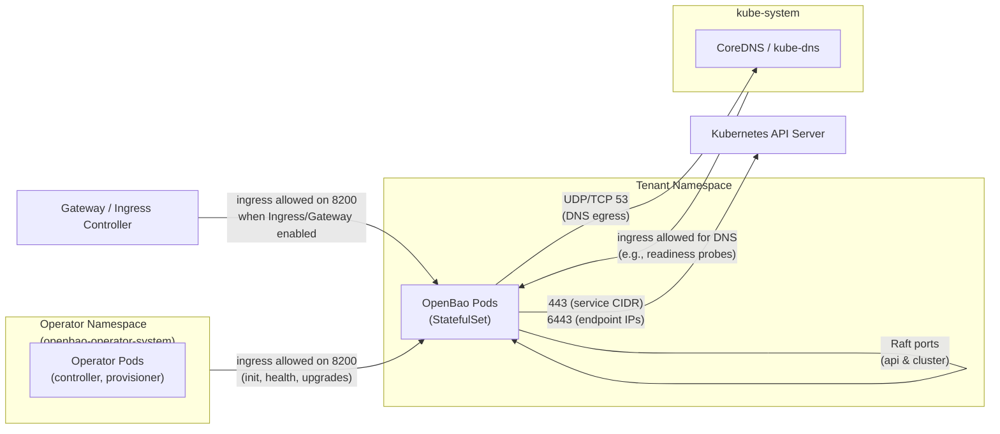

# Network Configuration

## Prerequisites

- **CNI Plugin**: A CNI that supports NetworkPolicies (e.g., Cilium, Calico) is recommended but not required.
- **Permissions**: Access to read Services in `default` namespace (optional, for auto-detection).

## Default NetworkPolicy Topology



## API Server CIDR Fallback

### Overview

In restricted multi-tenant environments, the operator may not have permissions to read Services/Endpoints in the `default` namespace, which prevents auto-detection of the Kubernetes API server CIDR for NetworkPolicy egress rules.

You can manually configure the API server CIDR as a fallback:

```yaml
apiVersion: openbao.org/v1alpha1
kind: OpenBaoCluster
metadata:
  name: restricted-cluster
spec:
  profile: Development
  # ... other spec fields ...
  network:
    # Manual API server CIDR configuration (fallback when auto-detection fails)
    apiServerCIDR: "10.43.0.0/16"  # Service network CIDR
    # Or for self-managed clusters:
    # apiServerCIDR: "192.168.1.0/24"  # Control plane node CIDR
```

**When to Use:**

- The operator lacks permissions to read the `kubernetes` Service in the `default` namespace
- Auto-detection fails due to network restrictions
- You want to explicitly control the NetworkPolicy egress rules

**How to Determine the CIDR:**

- **Managed clusters (EKS, GKE, AKS)**: Use the service network CIDR (e.g., `10.43.0.0/16`). You can find this by checking the ClusterIP of the `kubernetes` Service: `kubectl get svc kubernetes -n default -o jsonpath='{.spec.clusterIP}'`
- **Self-managed clusters (k3d, kubeadm)**: Use the control plane node CIDR or the specific API server endpoint IP with `/32` (e.g., `192.168.1.100/32`)

### 11.2 API Server Endpoint IPs

For some CNI implementations (e.g., k3d), egress enforcement happens on the post-NAT destination (the API server endpoint) rather than the Kubernetes Service IP. In these cases, you can specify the API server endpoint IPs directly:

```yaml
apiVersion: openbao.org/v1alpha1
kind: OpenBaoCluster
metadata:
  name: k3d-cluster
spec:
  profile: Development
  # ... other spec fields ...
  network:
    apiServerEndpointIPs:
      - "192.168.166.2"  # k3d API server endpoint IP
```

**When to Use:**

- Using CNI implementations where egress enforcement happens on post-NAT destinations
- Auto-detection of API server endpoints fails
- You want explicit control over which API server endpoints are allowed

### 11.3 Custom Ingress and Egress Rules

The operator automatically creates NetworkPolicies with default ingress and egress rules for essential cluster operations. However, you may need to allow additional network access for:

- **Transit seal backends** in other namespaces
- **Object storage endpoints** for backups (if not using backup jobs)
- **Monitoring tools** that need to reach OpenBao pods
- **Other external dependencies**

You can add custom ingress and egress rules that will be merged with the operator-managed rules:

```yaml
apiVersion: openbao.org/v1alpha1
kind: OpenBaoCluster
metadata:
  name: custom-network-cluster
spec:
  profile: Development
  # ... other spec fields ...
  network:
    # Custom egress rules (merged with operator-managed rules)
    egressRules:
      # Allow egress to transit seal backend in operator namespace
      - to:
          - namespaceSelector:
              matchLabels:
                kubernetes.io/metadata.name: openbao-operator-system
        ports:
          - protocol: TCP
            port: 8200
      # Allow egress to object storage endpoint
      - to:
          - ipBlock:
              cidr: 192.168.100.0/24
        ports:
          - protocol: TCP
            port: 443
    
    # Custom ingress rules (merged with operator-managed rules)
    ingressRules:
      # Allow ingress from monitoring namespace
      - from:
          - namespaceSelector:
              matchLabels:
                kubernetes.io/metadata.name: monitoring
        ports:
          - protocol: TCP
            port: 8200
```

**Important Notes:**

- Operator-managed rules (DNS, API server, cluster pods, etc.) are **always included** and cannot be overridden
- User-provided rules are **appended** to the operator-managed rules
- Rules follow standard Kubernetes NetworkPolicy semantics
- For backup operations, consider using backup jobs (which are excluded from the NetworkPolicy) rather than adding broad egress rules

**Example: Transit Seal Backend**

When using a transit seal backend in another namespace (e.g., the operator namespace), you need to allow egress to that namespace:

```yaml
apiVersion: openbao.org/v1alpha1
kind: OpenBaoCluster
metadata:
  name: transit-seal-cluster
spec:
  profile: Development
  unseal:
    type: transit
    transit:
      address: "http://infra-bao.openbao-operator-system.svc:8200"
      # ... other transit configuration ...
  network:
    egressRules:
      - to:
          - namespaceSelector:
              matchLabels:
                kubernetes.io/metadata.name: openbao-operator-system
        ports:
          - protocol: TCP
            port: 8200
```
