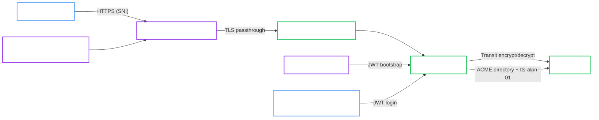

# k3d Hardened with Transit and Internal ACME

This validated architecture describes the hardened local k3d lane that uses `infra-bao` for both Transit auto-unseal and ACME issuance.

It is the reference shape for:

- `spec.profile: Hardened`
- Transit auto-unseal through `infra-bao`
- `spec.tls.mode: ACME`
- OpenBao-managed certificate issuance from an internal ACME CA
- user-managed TCP passthrough through Traefik CRDs

!!! success "Validation status"
    This architecture matches the local ACME validation lane in `openbao-operator-test` and aligns with the native ACME lifecycle covered by the in-repo E2E suite.

## Intended use

Use this architecture when you want to validate the full OpenBao-native ACME flow locally without depending on a public ACME CA.

It is useful for:

- rehearsing ACME readiness and probe behavior locally
- validating the interaction between Transit unseal and ACME trust material
- testing passthrough without cloud load balancers

## Topology

## Architecture decisions

### Internal ACME CA

The local ACME lane uses `infra-bao` as the ACME directory. That removes public internet dependency while still exercising OpenBao-native ACME issuance.

### CoreDNS rewrite is part of the design

The local ACME CA validates `tls-alpn-01` by dialing the configured hostname from inside the cluster. The validated path therefore includes a CoreDNS rewrite so `bao-acme.adfinis.test` resolves back to the Traefik service.

### Passthrough remains user-managed

Like the external-TLS hardened lane, passthrough is expressed through Traefik CRDs instead of `spec.gateway`. That avoids conflicts with the shared terminating listener in the local test cluster.

## Required invariants

Keep these assumptions if you want to stay on the validated path:

- Use `spec.profile: Hardened`.
- Keep `infra-bao` reachable for both Transit and the ACME directory.
- Keep the CoreDNS rewrite for the ACME hostname in place.
- Keep the passthrough route targeting the ACME Service on port `443`.
- Disable AppArmor in the manifest if your k3d or k3s nodes do not support it.

## Validated operations

This local lane is used for:

- Hardened cluster bootstrap with self-init
- Transit auto-unseal through `infra-bao`
- OpenBao-managed ACME issuance from an internal CA
- JWT login for a human admin `ServiceAccount`
- passthrough access to the OpenBao ACME endpoint

## Known constraints

- This architecture is intentionally local and depends on CoreDNS rewrite rules that would not be appropriate in a public environment.
- `GatewayIntegrationReady` is not the primary success signal because the passthrough route is user-managed.
- The certificate trust model is private and local to the validation environment.

## Related recipe

Use the deployment flow in [Hardened Transit with ACME TLS](../../recipes/local/hardened-transit-acme-tls.md).
