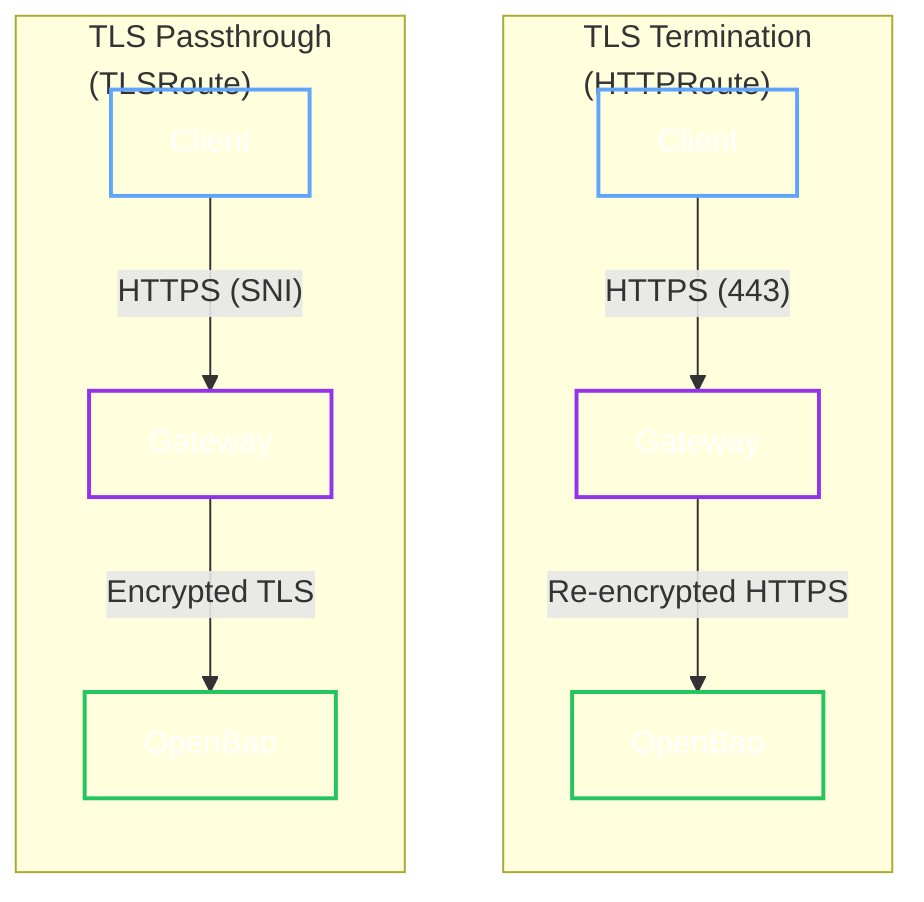

# Gateway API Support

The Operator provides first-class support for [Kubernetes Gateway API](https://gateway-api.sigs.k8s.io/), enabling standardized, portable, and expressive external access.

## Architecture

The Operator supports two primary modes: **Termination** (HTTPS at Gateway) and **Passthrough** (End-to-End Encryption).



## Configuration

Choose your deployment mode.

=== "TLS Termination (Default)"
    **Best for:** Standard web traffic, WAF integration, Certificate management at Gateway.

    The Gateway terminates TLS, and the Operator (optionally) configures a secure link to the backend.

    ```yaml
    spec:
      gateway:
        enabled: true
        hostname: bao.example.com
        gatewayRef:
          name: main-gateway
          namespace: gateway-system
    ```

    **What happens:**
    1. Operator creates an `HTTPRoute` referencing the Gateway.
    2. Operator creates a `BackendTLSPolicy` to encrypt traffic between the Gateway and OpenBao (re-encryption).

    ??? note "Generated BackendTLSPolicy"
        The operator automatically creates a policy to validate the OpenBao backend certificate:

        ```yaml
        apiVersion: gateway.networking.k8s.io/v1
        kind: BackendTLSPolicy
        metadata:
          name: my-cluster-backend-tls
        spec:
          targetRefs:
            - kind: Service
              name: my-cluster-public
          validation:
            caCertificateRefs:
              - kind: ConfigMap
                name: my-cluster-tls-ca
            hostname: my-cluster-public.default.svc
        ```

=== "TLS Passthrough"
    **Best for:** Zero Trust, End-to-End Encryption, Compliance, Client Cert Auth.

    The Gateway routes traffic based on SNI without decrypting it. OpenBao terminates TLS.

    ```yaml
    spec:
      gateway:
        enabled: true
        tlsPassthrough: true  # Enables TLSRoute
        hostname: bao.example.com
        gatewayRef:
          name: main-gateway
          namespace: gateway-system
    ```

    **Requirements:**
    - Gateway Listener must be in `Passthrough` mode.
    - `TLSRoute` CRD must be installed (often Experimental channel).
    - If `tls.mode` is `ACME`, passthrough is required; TLS termination at the Gateway prevents OpenBao from completing ACME challenges.

    ??? example "Gateway Listener (TLS Passthrough)"
        The referenced Gateway must expose a `TLS` listener in `Passthrough` mode (controller support varies):

        ```yaml
        apiVersion: gateway.networking.k8s.io/v1
        kind: Gateway
        metadata:
          name: main-gateway
          namespace: gateway-system
        spec:
          gatewayClassName: traefik
          listeners:
            - name: websecure-passthrough
              port: 443
              protocol: TLS
              tls:
                mode: Passthrough
        ```

    !!! warning "Common conflict: existing HTTPS termination"
        Many Gateway controllers expose an `HTTPS` termination listener on `:443` by default. Some
        controllers cannot share the same port for both termination and passthrough. Use a dedicated
        passthrough listener (or a separate port) when required by your controller.

## Comparison Reference

| Feature | Ingress | Gateway API (HTTPRoute) | Gateway API (TLSRoute) |
| :--- | :--- | :--- | :--- |
| **Routing** | Path/Host | Header, Path, Method, Query | SNI (Host) |
| **TLS** | Terminate Only | Terminate | Terminate or Passthrough |
| **Multi-Tenancy** | Weak | Strong (Namespace-scoped routes) | Strong |
| **Resource** | `Ingress` | `HTTPRoute` | `TLSRoute` |

## Advanced Options

| Field | Description | Default |
| :--- | :--- | :--- |
| `gateway.backendTLS.enabled` | Auto-create `BackendTLSPolicy` for secure internal hop. | `true` |
| `gateway.backendTLS.hostname` | Override hostname for internal validation. | Service DNS |
| `gateway.listenerName` | Attach generated Route to a specific Gateway listener (sectionName), e.g. `websecure`. | All matching listeners |
| `gateway.annotations` | Custom annotations for the generated Route. | None |

## Blue/Green Upgrade Integration

When combining Gateway API with [Blue/Green upgrades](../operations/upgrades.md), the Operator keeps the generated `HTTPRoute` stable by targeting the cluster's main external Service (`<cluster>-public`).

During cutover, the operator updates that Service's selector to point at the Green revision.
