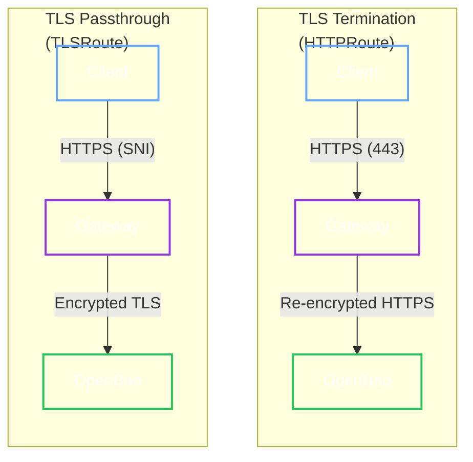

# Gateway API Support

The Operator provides first-class support for [Kubernetes Gateway API](https://gateway-api.sigs.k8s.io/), enabling standardized, portable, and expressive external access.

The preferred OpenBao deployment model is **TLS passthrough**. OpenBao remains the TLS endpoint, and the Gateway routes traffic by SNI without decrypting it. Use Gateway TLS termination only when you specifically need edge HTTP features such as centralized certificate management, WAF integration, or HTTP-aware routing.

## Architecture

The Operator supports two primary modes: **Termination** (HTTPS at Gateway) and **Passthrough** (End-to-End Encryption).


```mermaid
flowchart TB
    subgraph Term["TLS Termination<br>(HTTPRoute)"]
        direction TB
        Ext1[Client] -->|"HTTPS (443)"| GW1[Gateway]
        GW1 -- "Re-encrypted HTTPS" --> Bao1[OpenBao]
    end

    subgraph Pass["TLS Passthrough<br>(TLSRoute)"]
        direction TB
        Ext2[Client] -->|"HTTPS (SNI)"| GW2[Gateway]
        GW2 -- "Encrypted TLS" --> Bao2[OpenBao]
    end

    classDef write fill:transparent,stroke:#22c55e,stroke-width:2px,color:#fff;
    classDef read fill:transparent,stroke:#60a5fa,stroke-width:2px,color:#fff;
    classDef process fill:transparent,stroke:#9333ea,stroke-width:2px,color:#fff;

    class Ext1,Ext2 read;
    class GW1,GW2 process;
    class Bao1,Bao2 write;
```

## Configuration

Choose your deployment mode.

For production, prefer passthrough unless you have a clear requirement for Gateway-side TLS termination. This follows the upstream OpenBao guidance for Kubernetes deployments, which says intermediaries should not terminate TLS.

The operator now reports a dedicated `GatewayIntegrationReady` condition for `spec.gateway`. This condition reflects the operator-owned Gateway contract:

- the referenced `Gateway` exists
- the referenced `GatewayClass` exists and is accepted
- the `GatewayClass` reports a supported Gateway API version
- the selected mode has a compatible listener
- the `GatewayClass` advertises the required feature support when it publishes `status.supportedFeatures`
- the `Gateway` reports `Programmed=True`

If the Gateway controller does not publish feature support, the condition stays `Unknown` instead of assuming compatibility.

=== "TLS Passthrough (Recommended)"
    **Best for:** Default OpenBao deployments, end-to-end TLS, ACME, client certificate auth, and keeping OpenBao as the TLS endpoint.

    The Gateway routes traffic based on SNI without decrypting it. OpenBao terminates TLS.

    ```yaml
    spec:
      gateway:
        enabled: true
        tlsPassthrough: true  # Enables TLSRoute
        hostname: bao.example.com
        gatewayRef:
          name: main-gateway
          namespace: gateway-system
    ```

    **Requirements:**
    - Gateway Listener must be in `Passthrough` mode.
    - `TLSRoute` CRD must be installed (often Experimental channel).
    - If `tls.mode` is `ACME`, passthrough is required; TLS termination at the Gateway prevents OpenBao from completing ACME challenges.
    - The referenced `GatewayClass` must advertise `TLSRoute` support when it publishes `status.supportedFeatures`.

    ??? example "Gateway Listener (TLS Passthrough)"
        The referenced Gateway must expose a `TLS` listener in `Passthrough` mode (controller support varies):

        ```yaml
        apiVersion: gateway.networking.k8s.io/v1
        kind: Gateway
        metadata:
          name: main-gateway
          namespace: gateway-system
        spec:
          gatewayClassName: traefik
          listeners:
            - name: websecure-passthrough
              port: 443
              protocol: TLS
              tls:
                mode: Passthrough
        ```

    !!! warning "Common conflict: existing HTTPS termination"
        Many Gateway controllers expose an `HTTPS` termination listener on `:443` by default. Some
        controllers cannot share the same port for both termination and passthrough. Use a dedicated
        passthrough listener (or a separate port) when required by your controller.

=== "TLS Termination (Alternative)"
    **Best for:** HTTP-aware edge policies, WAF integration, or centralized certificate handling at the Gateway.

    The Gateway terminates TLS, and the Operator (optionally) configures a secure link to the backend.

    ```yaml
    spec:
      gateway:
        enabled: true
        hostname: bao.example.com
        gatewayRef:
          name: main-gateway
          namespace: gateway-system
    ```

    **What happens:**
    1. Operator creates an `HTTPRoute` referencing the Gateway.
    2. Operator creates a `BackendTLSPolicy` to encrypt traffic between the Gateway and OpenBao (re-encryption).

    ??? note "Generated BackendTLSPolicy"
        The operator automatically creates a policy to validate the OpenBao backend certificate:

        ```yaml
        apiVersion: gateway.networking.k8s.io/v1
        kind: BackendTLSPolicy
        metadata:
          name: my-cluster-backend-tls
        spec:
          targetRefs:
            - kind: Service
              name: my-cluster-public
          validation:
            caCertificateRefs:
              - kind: ConfigMap
                name: my-cluster-tls-ca
            hostname: my-cluster-public.default.svc
        ```

## Comparison Reference

| Feature | Ingress | Gateway API (HTTPRoute) | Gateway API (TLSRoute) |
| :--- | :--- | :--- | :--- |
| **Routing** | Path/Host | Header, Path, Method, Query | SNI (Host) |
| **TLS** | Terminate Only | Terminate | Terminate or Passthrough |
| **Multi-Tenancy** | Weak | Strong (Namespace-scoped routes) | Strong |
| **Resource** | `Ingress` | `HTTPRoute` | `TLSRoute` |

## Advanced Options

| Field | Description | Default |
| :--- | :--- | :--- |
| `gateway.backendTLS.enabled` | Auto-create `BackendTLSPolicy` for secure internal hop. | `true` |
| `gateway.backendTLS.hostname` | Override hostname for internal validation. | Service DNS |
| `gateway.listenerName` | Attach generated Route to a specific Gateway listener (sectionName), e.g. `websecure`. | All matching listeners |
| `gateway.annotations` | Custom annotations for the generated Route. | None |

## Controller Compatibility

Gateway API support is not only a CRD check. It also depends on the selected controller.

- Passthrough mode requires `TLSRoute`.
- Termination mode requires `HTTPRoute`.
- Termination mode with backend TLS enabled requires `BackendTLSPolicy`.
- Some controllers publish `status.supportedFeatures`; others do not.

When `GatewayIntegrationReady=False`, inspect the condition reason first. Common reasons are:

- `GatewayReferenceMissing`
- `GatewayClassMissing`
- `GatewayClassNotAccepted`
- `GatewayVersionUnsupported`
- `GatewayFeatureUnsupported`
- `GatewayNotProgrammed`
- `GatewayListenerIncompatible`

When `GatewayIntegrationReady=Unknown`, the controller has not yet reported enough status for the operator to verify compatibility, or it does not publish `status.supportedFeatures`.

## Blue/Green Upgrade Integration

When combining Gateway API with [Blue/Green upgrades](../operations/upgrades.md), the Operator keeps the generated Gateway route stable by targeting the cluster's main external Service (`<cluster>-public`).

This applies to both `TLSRoute` passthrough and `HTTPRoute` termination. During cutover, the operator updates that Service's selector to point at the Green revision.
