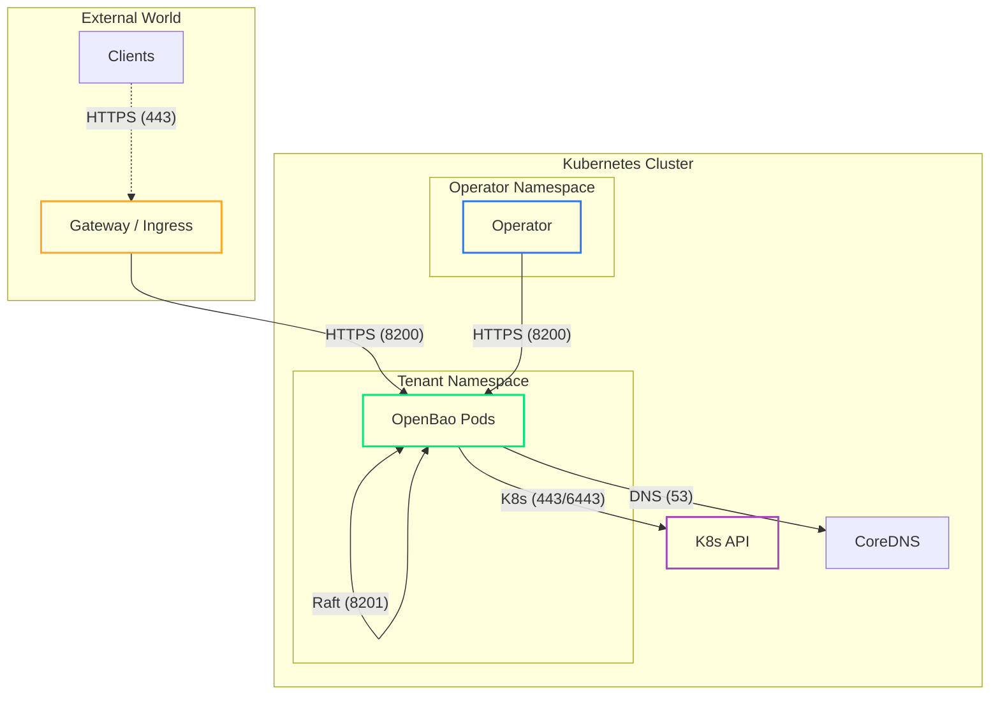

# Network Configuration

OpenBao Operator automatically configures Kubernetes NetworkPolicies to secure your cluster by default using a "Deny All" + "Allow Essential" strategy.

## Default Topology

The following diagram illustrates the allowed traffic flows.



### Default Rules Reference

The Operator ensures these rules always exist to keep the cluster functional.

| Direction | Source / Dest | Port | Purpose |
| :--- | :--- | :--- | :--- |
| **Ingress** | **Operator** | `8200` | Health checks, Initialization, Unsealing. |
| **Ingress** | **Self** | `8201` | Raft consensus replication between peers. |
| **Ingress** | **Gateway/Ingress** | `8200` | External traffic (if Ingress/Gateway is enabled). |
| **Ingress** | **Kube-System** | Any | Readiness probes (often from kubelet/monitoring). |
| **Egress** | **Kube-DNS** | `53` | Service discovery. |
| **Egress** | **K8s API** | `443` | Kubernetes Auth Method validation. |
| **Egress** | **Self** | `8201` | Raft consensus replication. |

## DNS Configuration

By default, the NetworkPolicy allows egress to DNS services in the `kube-system` namespace. If your cluster uses a different namespace for DNS (e.g., `openshift-dns` on OpenShift), you must explicitly configure it.

```yaml
spec:
  network:
    dnsNamespace: "openshift-dns" # (1)!
```

1.  Defaults to `kube-system` if not specified.

!!! warning "DNS Resolution Failure"
    If `dnsNamespace` does not match your cluster's actual DNS namespace, OpenBao pods will fail to resolve addresses (including Cloud KMS or Storage endpoints), leading to crash loops.

## Custom Rules (Advanced)

You can append **additional** rules to the default policy to allow integrations like backups or monitoring.

=== "Egress Rules"
    Allow OpenBao to connect to external services (e.g., Transit Vault, S3, Databases).

    ```yaml
    spec:
      network:
        egressRules:
          # Example: Allow access to Transit Vault in operator namespace
          - to:
              - namespaceSelector:
                  matchLabels:
                    kubernetes.io/metadata.name: openbao-operator-system
            ports:
              - protocol: TCP
                port: 8200
          
          # Example: Allow access to S3 CIDR for Backups
          - to:
              - ipBlock:
                  cidr: 192.168.100.0/24
            ports:
              - protocol: TCP
                port: 443
    ```

=== "Ingress Rules"
    Allow external monitors to scrape OpenBao metrics.

    ```yaml
    spec:
      network:
        ingressRules:
          # Example: Allow Prometheus from monitoring namespace
          - from:
              - namespaceSelector:
                  matchLabels:
                    kubernetes.io/metadata.name: monitoring
            ports:
              - protocol: TCP
                port: 8200
    ```

## Advanced Routing

Configuring how OpenBao reaches the Kubernetes API server for Auth Method validation.

=== "Auto-Detection (Default)"
    The Operator allow-lists the in-cluster Kubernetes service VIP (`KUBERNETES_SERVICE_HOST`) as a single-host CIDR (`/32` for IPv4, `/128` for IPv6) on port `443`.

    This does not require cross-namespace RBAC reads.

=== "Manual CIDR"
    **Use Case:** Override the detected VIP allow-list (for example, if you want to allow a larger CIDR).

    ```yaml
    spec:
      network:
        # Prefer single-host CIDRs when possible (least privilege).
        # Example (k3s): "10.43.0.1/32"
        apiServerCIDR: "10.43.0.1/32"
    ```

=== "Endpoint IPs"
    **Use Case:** CNIs / NetworkPolicy implementations that enforce egress on post-DNAT traffic.

    In these environments, allowing only the Service VIP (port `443`) may not be sufficient because traffic is evaluated against the backing API server endpoint IP (commonly port `6443`).

    The Operator does not auto-detect these endpoint IPs because that would require broader cluster permissions (list/watch).

    ```yaml
    spec:
      network:
        apiServerEndpointIPs:
          - "192.168.166.2" # The IP of the API Server container/node
    ```
