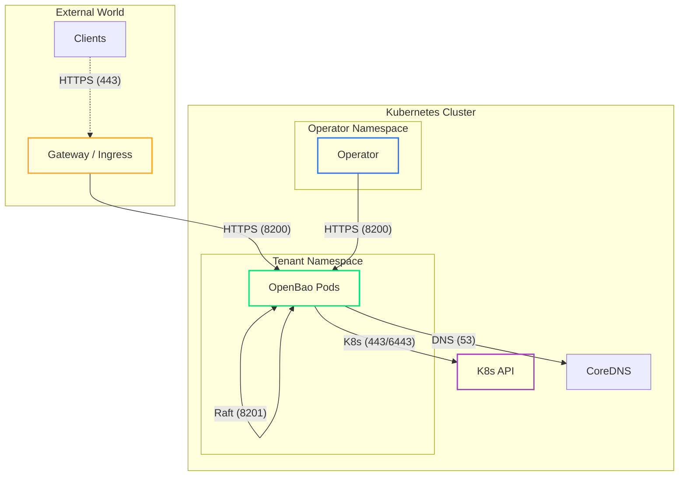

# Network Configuration

OpenBao Operator automatically configures Kubernetes NetworkPolicies to secure your cluster by default using a "Deny All" + "Allow Essential" strategy.

## Default Topology

The following diagram illustrates the allowed traffic flows.



### Default Rules Reference

The Operator ensures these rules always exist to keep the cluster functional.

| Direction | Source / Dest | Port | Purpose |
| :--- | :--- | :--- | :--- |
| **Ingress** | **Operator** | `8200` | Health checks, Initialization, Unsealing. |
| **Ingress** | **Self** | `8201` | Raft consensus replication between peers. |
| **Ingress** | **Gateway/Ingress** | `8200` | External traffic (if Ingress/Gateway is enabled). |
| **Ingress** | **Kube-System** | Any | Readiness probes (often from kubelet/monitoring). |
| **Egress** | **Kube-DNS** | `53` | Service discovery. |
| **Egress** | **K8s API** | `443` | Kubernetes Auth Method validation. |
| **Egress** | **Self** | `8201` | Raft consensus replication. |

## Custom Rules (Advanced)

You can append **additional** rules to the default policy to allow integrations like backups or monitoring.

=== "Egress Rules"
    Allow OpenBao to connect to external services (e.g., Transit Vault, S3, Databases).

    ```yaml
    spec:
      network:
        egressRules:
          # Example: Allow access to Transit Vault in operator namespace
          - to:
              - namespaceSelector:
                  matchLabels:
                    kubernetes.io/metadata.name: openbao-operator-system
            ports:
              - protocol: TCP
                port: 8200
          
          # Example: Allow access to S3 CIDR for Backups
          - to:
              - ipBlock:
                  cidr: 192.168.100.0/24
            ports:
              - protocol: TCP
                port: 443
    ```

=== "Ingress Rules"
    Allow external monitors to scrape OpenBao metrics.

    ```yaml
    spec:
      network:
        ingressRules:
          # Example: Allow Prometheus from monitoring namespace
          - from:
              - namespaceSelector:
                  matchLabels:
                    kubernetes.io/metadata.name: monitoring
            ports:
              - protocol: TCP
                port: 8200
    ```

## Advanced Routing

Configuring how OpenBao reaches the Kubernetes API server for Auth Method validation.

=== "Auto-Detection (Default)"
    The Operator attempts to automatically detect the API Server CIDR by reading the `kubernetes` Service in the `default` namespace.

    **Prerequisite:** The Operator ServiceAccount must have permission to read Services in `default`.

=== "Manual CIDR"
    **Use Case:** Restricted environments where the Operator strictly cannot read `default` namespace.

    ```yaml
    spec:
      network:
        # E.g., EKS (10.100.0.0/16) or GKE (10.0.0.0/16)
        apiServerCIDR: "10.43.0.0/16"
    ```

=== "Endpoint IPs"
    **Use Case:** Local clusters (Kind/k3d/minikube) where CNI enforcement happens *after* NAT (Post-NAT destination), meaning the destination IP is the API Server IP, not the Service CIDR.

    ```yaml
    spec:
      network:
        apiServerEndpointIPs:
          - "192.168.166.2" # The IP of the API Server container/node
    ```
