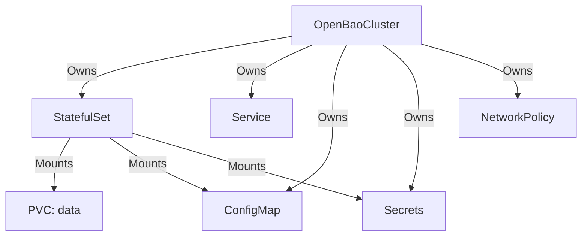

# Managed Resources

## Prerequisites

- **OpenBaoCluster**: An active `OpenBaoCluster` CR.

## Overview

The Operator creates and manages a set of Kubernetes resources to support the OpenBao cluster.



## Core Workload

| Resource Type | Name Pattern | Description |
| :--- | :--- | :--- |
| **StatefulSet** | `<cluster>` | Manages the Pods. Mounts config, secrets, and data PVCs. |
| **Service** | `<cluster>` | Headless Service (ClusterIP `None`) for stable network identity. |
| **ConfigMap** | `<cluster>-config` | Contains rendered `config.hcl` and `init.sh` scripts. |
| **Service** | `<cluster>-public` | (Optional) Created if `spec.service` or `spec.ingress` is enabled. |
| **PVC** | `data-<cluster>-*` | Persistent volume for Raft storage, sized by `spec.storage.size`. |

## Security & Identity

The Operator manages credentials, certificates, and tokens based on the cluster configuration.

### TLS Configuration

=== "Operator Managed (Default)"
    When `spec.tls.mode` is `OperatorManaged` or omitted:

    | Secret Name | Description |
    | :--- | :--- |
    | `<cluster>-tls-ca` | Root CA (`ca.crt`, `ca.key`). Generated and managed by the Operator. |
    | `<cluster>-tls-server` | Server certificates (`tls.crt`, `tls.key`, `ca.crt`). Generated and managed by the Operator. |

=== "External"
    When `spec.tls.mode` is `External`:

    | Secret Name | Requirements |
    | :--- | :--- |
    | `<cluster>-tls-ca` | **User Provided**. Must contain `ca.crt`. |
    | `<cluster>-tls-server` | **User Provided**. Must contain `tls.crt`, `tls.key`, and `ca.crt`. |

=== "ACME"
    When `spec.tls.mode` is `ACME`:

    | Resource | Description |
    | :--- | :--- |
    | `<cluster>-tls-ca` | **User Provided** (optional). Helper CA for clients (e.g. Let's Encrypt Root) if not in system store. |
    | **Internal** | Certificates are requested and managed internally by OpenBao's ACME agent. |

### Operational Secrets

- **Unseal Key:** `<cluster>-unseal-key`
  - Contains the 32-byte raw unseal key.
  - Created only if `spec.unseal.type` is `static` (default).
- **Root Token:** `<cluster>-root-token`
  - Contains the initial root token after initialization.
  - **Note:** Not created if Self-Initialization is used.

## Network Security

The Operator enforces a **Zero Trust** network model using a default `NetworkPolicy`.

### Default Policies

| Direction | Source / Destination | Port | Purpose |
| :--- | :--- | :--- | :--- |
| **Ingress** | **Any** | **-** | **Deny All (Implicit)** |
| Ingress | Within Cluster Matches `openbao.org/cluster=<name>` | Any | Intra-cluster Raft replication & forwarding. |
| Ingress | Namespace `kube-system` | Any | DNS resolution & Kubelet probes. |
| Ingress | OpenBao Operator | 8200 | Leader step-down & health checks. |
| Ingress | Gateway Namespace | Any | (If Gateway API enabled) Ingress traffic. |
| **Egress** | CoreDNS | 53 (UDP/TCP) | Service Discovery. |
| Egress | K8s API Server | 443 | Kubernetes Auto-Join discovery. |
| Egress | Within Cluster | 8200-8201 | Raft Replication. |

!!! tip "Customization"
    You can append custom rules via `spec.network.ingressRules` and `spec.network.egressRules`. The Operator's default rules cannot be disabled. See [Network Configuration](network.md) for details.

!!! warning "Backup Jobs"
    Backup job pods (`openbao.org/component=backup`) are **excluded** from this NetworkPolicy to ensure they can access external Object Storage (S3/GCS/Azure). You may need to create a dedicated NetworkPolicy for backup jobs if you require strict egress filtering.

## Inspection

You can inspect the generated resources for a cluster named `dev-cluster` in namespace `security` with:

```sh
kubectl -n security get statefulsets,svc,cm,secrets,netpol -l openbao.org/cluster=dev-cluster
```
