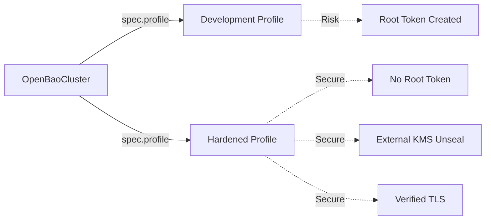

# Security Profiles

Configure the security posture of your OpenBao cluster.

!!! danger "Production Readiness"
    **Always** use the `Hardened` profile for production deployments. The `Development` profile creates root tokens and stores them in Kubernetes Secrets, which is a critical security risk.

## Profile Comparison

The Operator supports two distinct security profiles via `spec.profile`.

| Feature | Development | Hardened (Production) |
| :--- | :--- | :--- |
| **Use Case** | Local Testing, POC | **Production Workloads** |
| **Root Token** | Created & Stored in Secret | **Never Created** |
| **Unseal** | Static (Kubernetes Secret) | **External KMS** (AWS, GCP, Azure, etc.) |
| **TLS** | Optional / Self-Signed | **Mandatory** (External or ACME) |
| **Status** | `ConditionSecurityRisk=True` | Secure by Default |



## Configuration

=== "Hardened (Production)"
    The `Hardened` profile enforces strict security best practices. It is **REQUIRED** for all production environments.

    ```yaml
    apiVersion: openbao.org/v1alpha1
    kind: OpenBaoCluster
    metadata:
      name: prod-cluster
    spec:
      profile: Hardened  # REQUIRED
      replicas: 3          # Minimum 3 for HA (Raft quorum)
      version: "2.4.4"
      tls:
        enabled: true
        mode: External   # Required (or ACME)
      unseal:
        type: awskms     # Required (External KMS)
        awskms:
          region: us-east-1
          kmsKeyID: alias/openbao-unseal
      selfInit:
        enabled: true    # Required
        requests:
          - name: enable-audit
            operation: update
            path: sys/audit/file
            auditDevice:
              type: file
              fileOptions:
                filePath: /tmp/audit.log
    ```

    ### Requirements

    - :material-check: **External TLS**: `spec.tls.mode` MUST be `External` or `ACME`.
    - :material-check: **External KMS**: `spec.unseal.type` MUST use a cloud provider (`awskms`, `gcpckms`, `azurekeyvault`, `transit`).
    - :material-check: **Self-Initialization**: `spec.selfInit.enabled` MUST be `true`.
    - :material-check: **High Availability**: `spec.replicas` MUST be at least `3` for Raft quorum.
    - :material-check: **Secure Network**: If backups are enabled, explicit egress rules are required (fail-closed networking).

    ### Benefits

    - **Zero Trust**: No root tokens are ever generated.
    - **Identity**: Automatic JWT identity bootstrapping when `spec.selfInit.bootstrapJWTAuth` is enabled.
    - **Encryption**: Root of trust is delegated to a hardware-backed KMS, not Kubernetes etcd.

=== "Development"
    The `Development` profile allows relaxed security settings for rapid iteration and testing.

    ```yaml
    apiVersion: openbao.org/v1alpha1
    kind: OpenBaoCluster
    metadata:
      name: dev-cluster
    spec:
      profile: Development
      version: "2.4.4"
      # TLS and Self-Init are optional
    ```

    ### Characteristics

    - :material-alert: **Relaxed TLS**: Allows `OperatorManaged` (self-signed) TLS.
    - :material-alert: **Static Unseal**: Uses a simple Kubernetes Secret for the unseal key.
    - :material-alert: **Root Token**: Generates and stores a root token in a Secret if self-init is disabled.
    - :material-alert: **Risk Indicator**: Sets `ConditionSecurityRisk=True` on the CR status.

    !!! warning "Risk Acceptance"
        By using this profile, you accept the risk of storing sensitive keys and root tokens in the cluster. Do not expose this cluster to public traffic.

## Workload Hardening (AppArmor)

AppArmor support is **opt-in** as it depends on the underlying Kubernetes node OS support.

To enable `RuntimeDefault` AppArmor profiles on all OpenBao Pods:

```yaml
spec:
  workloadHardening:
    appArmorEnabled: true
```
