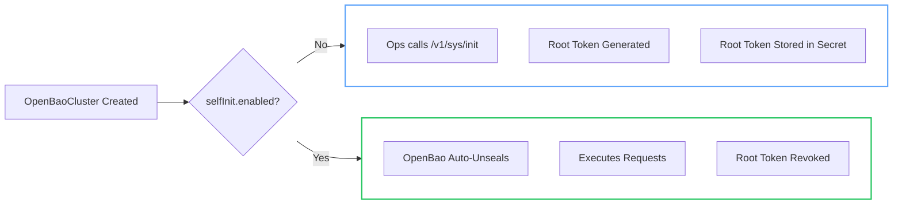

# Self-Initialization

OpenBao supports [self-initialization](https://openbao.org/docs/configuration/self-init/), allowing declarative configuration of the cluster during first startup.

!!! success "GitOps Ready"
    Self-initialization eliminates the need for manual setup scripts or post-install hooks. The entire cluster state (Auth, Secrets, Policies) is defined in your CRD.

## Standard vs Self-Initialization

| Feature | Standard Init | Self-Initialization |
| :--- | :--- | :--- |
| **Root Token** | Created & Stored in Secret | **Auto-Revoked** (Never Stored) |
| **Configuration** | Manual Post-Install Steps | **Declarative** (in CRD) |
| **Recovery** | Root Token | **Cloud KMS** / Other Auth Methods |
| **Security** | :material-alert: Lower (Root Token Risk) | :material-check: **High** (Zero Trust) |



## Configuration

To enable self-initialization, set `spec.selfInit.enabled: true` and define your initial `requests`.

```yaml
spec:
  selfInit:
    enabled: true
    requests:
      - name: enable-audit
        operation: update
        path: sys/audit/file
        auditDevice:
          type: file
          fileOptions:
            filePath: /tmp/audit.log
```

### JWT bootstrap (Optional)

Enable automatic JWT auth bootstrap during self-init.
The OpenBao Operator configures JWT auth, OIDC settings, and the operator policy/role.
It also creates backup and upgrade roles when `spec.backup.jwtAuthRole` or `spec.upgrade.jwtAuthRole` are set.

To bootstrap a restore role, set `spec.restore.jwtAuthRole`.

```yaml
spec:
  selfInit:
    enabled: true
    oidc:
      enabled: true
      # issuer: "https://..." (optional override)
      # audience: "openbao-internal" (optional override)
```

!!! note "OIDC prerequisites"
    The operator must discover the Kubernetes OIDC issuer and JWKS keys at startup.

!!! note "JWT audience"
    The operator uses `OPENBAO_JWT_AUDIENCE` (default: `openbao-internal`) when creating JWT roles.
    Set the same value in any manually managed roles and pass the env var to the operator
    (`controller.extraEnv` and `provisioner.extraEnv` in Helm).

### Request Structure

Each item in `requests[]` maps to an OpenBao API call.

| Field | Description |
| :--- | :--- |
| `name` | Unique ID (e.g., `enable-jwt`). |
| `operation` | `update` (most common), `create`, `delete`. |
| `path` | API Path (e.g., `sys/auth/jwt`). |
| `data` | Raw JSON payload (legacy/generic). |
| `authMethod` | **Structured** config for `sys/auth/*`. |
| `secretEngine` | **Structured** config for `sys/mounts/*`. |
| `auditDevice` | **Structured** config for `sys/audit/*`. |
| `policy` | **Structured** config for `sys/policies/*`. |

!!! warning "Sensitive Data"
    Do not place raw secrets (passwords, tokens) in `data`. Use Kubernetes Secrets and reference them if supported, or use a secure GitOps workflow with sealed secrets.

## Examples

=== "Secret Engines"

    Enable and configure Secret Engines (`sys/mounts/*`).

    ```yaml
    - name: enable-kv-v2
      operation: update
      path: sys/mounts/secret
      secretEngine:
        type: kv
        description: "General purpose KV store"
        options:
          version: "2"
    ```

    ```yaml
    - name: enable-transit
      operation: update
      path: sys/mounts/transit
      secretEngine:
        type: transit
        description: "Encryption as a Service"
    ```

=== "Auth Methods"

    Enable Authentication Methods (`sys/auth/*`).

    ```yaml
    - name: enable-jwt
      operation: update
      path: sys/auth/jwt-operator
      authMethod:
        type: jwt
        description: "Kubernetes JWT Auth"
        config:
            default_lease_ttl: "1h"
            max_lease_ttl: "24h"
    ```

    ```yaml
    - name: configure-jwt
      operation: update
      path: auth/jwt-operator/config  # Note: Config path depends on mount path
      data:
        bound_issuer: "https://kubernetes.default.svc"
        jwt_validation_pubkeys:
          - "<PEM_KEYS>"
    ```

=== "Policies"

    Create ACL Policies (`sys/policies/acl/*`).

    ```yaml
    - name: app-policy
      operation: update
      path: sys/policies/acl/app-policy
      policy:
        policy: |
          path "secret/data/app/*" {
            capabilities = ["read", "list"]
          }
    ```

=== "Audit Devices"

    Enable Audit Logging (`sys/audit/*`).

    ```yaml
    - name: enable-file-audit
      operation: update
      path: sys/audit/file
      auditDevice:
        type: file
        fileOptions:
          filePath: /var/log/openbao/audit.log
    ```

## Verification

Check the status field to confirm self-initialization succeeded.

```bash
kubectl get openbaocluster <name> -o jsonpath='{.status.selfInitialized}'
# Output: true
```
