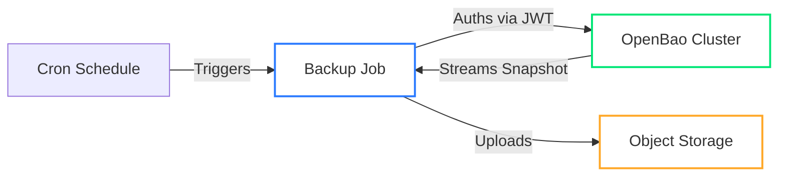

# Backups

The Operator provides a robust, Kubernetes-native backup system that streams Raft snapshots directly to object storage.

> **Note:** For restore procedures, see [Restore from Backup](../../openbaorestore/restore.md).

## Architecture

Backups run as transient Kubernetes Jobs, triggered by a Cron schedule or manually.



## Prerequisites

- [ ] **Object Storage**: S3-compatible bucket (AWS, MinIO, GCS, Azure)
- [ ] **Credentials**: Write permissions for the bucket
- [ ] **Network**: Egress allowed to the S3 endpoint (Critical for `Hardened` profile)

## Configuration

Select your authentication method. **JWT Auth** is recommended for security (auto-rotating tokens).

=== "JWT Auth (Recommended)"

    This method uses a projected ServiceAccount token to authenticate with OpenBao.

    ??? abstract "One-time Setup: Configure JWT Auth"
        Before creating the cluster, ensure OpenBao is configured to accept the Kubernetes JWT token.
        
        **Using Self-Init:**
        ```yaml
        spec:
          selfInit:
            requests:
              # 1. Enable JWT Auth
              - name: enable-jwt-auth
                operation: update
                path: sys/auth/jwt
                authMethod: { type: jwt }
              # 2. Configure JWT Validation
              - name: configure-jwt-auth
                operation: update
                path: auth/jwt/config
                data:
                  bound_issuer: "https://kubernetes.default.svc"
                  jwt_validation_pubkeys: ["<K8S_JWT_PUBLIC_KEY>"]
              # 3. Create Backup Policy
              - name: create-backup-policy
                operation: update
                path: sys/policies/acl/backup
                policy:
                  policy: |
                    path "sys/storage/raft/snapshot" { capabilities = ["read"] }
              # 4. Create Role bound to ServiceAccount
              - name: create-backup-jwt-role
                operation: update
                path: auth/jwt/role/backup
                data:
                  role_type: jwt
                  bound_audiences: ["openbao-internal"]
                  bound_claims:
                    kubernetes.io/namespace: openbao
                    kubernetes.io/serviceaccount/name: backup-cluster-backup-serviceaccount
                  token_policies: backup
                  ttl: 1h
        ```

    !!! note "JWT audience"
        The backup Job uses the audience from `OPENBAO_JWT_AUDIENCE` (default: `openbao-internal`).
        Set the same value in the OpenBao role `bound_audiences` and pass the env var to the operator
        (`controller.extraEnv` and `provisioner.extraEnv` in Helm).

    **Cluster Configuration:**

    ```yaml
    apiVersion: openbao.org/v1alpha1
    kind: OpenBaoCluster
    metadata:
      name: backup-cluster
    spec:
      backup:
        schedule: "0 3 * * *"  # Daily at 3 AM
        executorImage: "openbao/backup-executor:v0.1.0"
        jwtAuthRole: backup    # Matches the role name above
        
        target:
          endpoint: "https://s3.amazonaws.com"
          bucket: "openbao-backups"
          region: "us-east-1"
          pathPrefix: "clusters/backup-cluster"
          credentialsSecretRef:
            name: s3-credentials
    ```

=== "Static Token (Legacy)"

    This method uses a static OpenBao token stored in a Kubernetes Secret.

    !!! note "Same-Namespace Requirement"
        All secret references must exist in the **same namespace** as the `OpenBaoCluster`. Cross-namespace references are not allowed for security reasons.

    ??? abstract "Prerequisite: Create Token Secret"
        1. Generate a generic token in OpenBao with snapshot read permissions.
        2. Store it in a Secret:
           ```sh
           kubectl create secret generic backup-token \
             --from-literal=token=hvs.yourtoken...
           ```

    **Cluster Configuration:**

    ```yaml
    apiVersion: openbao.org/v1alpha1
    kind: OpenBaoCluster
    metadata:
      name: backup-cluster
    spec:
      backup:
        schedule: "0 3 * * *"
        executorImage: "openbao/backup-executor:v0.1.0"
        tokenSecretRef:
          name: backup-token  # Must be in the same namespace as the OpenBaoCluster
        
        target:
          endpoint: "https://s3.amazonaws.com"
          bucket: "openbao-backups"
          credentialsSecretRef:
            name: s3-credentials
    ```

## Advanced Configuration

### Retention Policy

Automatically clean up old backups from object storage.

```yaml
spec:
  backup:
    retention:
      maxCount: 7      # Keep last 7 backups
      maxAge: "168h"   # Keep backups for 7 days
```

### Performance Tuning

Tune multipart upload settings for large datasets or specific network conditions.

| Parameter | Default | Description |
| :--- | :--- | :--- |
| `partSize` | `10MB` | Size of each upload chunk. Increase for high-bandwidth networks. |
| `concurrency` | `3` | Parallel uploads. Increase for throughput, decrease for memory constraints. |

```yaml
spec:
  backup:
    target:
      partSize: 20971520  # 20MB
      concurrency: 5
```

### Pre-Upgrade Snapshots

Ensure safety during upgrades by taking a snapshot immediately before the rolling update or blue/green deployment begins.

```yaml
spec:
  upgrade:
    preUpgradeSnapshot: true
  backup:
    # Backup config must be present!
    target: { ... }
```

## Operations

**Check Status:**

```sh
kubectl get openbaocluster my-cluster -o jsonpath='{.status.backup}'
```

**Trigger Manual Backup:**

```sh
kubectl create job --from=cronjob/my-cluster-backup manual-backup-1
```
