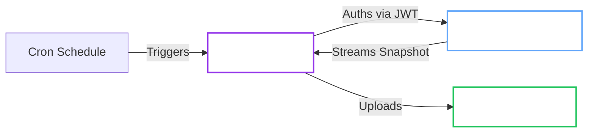

# Backups

The Operator provides a robust, Kubernetes-native backup system that streams Raft snapshots directly to object storage.

> **Note:** For restore procedures, see [Restore from Backup](../../openbaorestore/restore.md).

## Architecture

Backups run as transient Kubernetes Jobs, triggered by a Cron schedule or manually.



## Prerequisites

- [ ] **Object Storage**: Configured bucket or container in one of the supported providers:
  - **S3**: AWS S3 or S3-compatible storage (MinIO, Ceph, etc.)
  - **GCS**: Google Cloud Storage bucket
  - **Azure**: Azure Blob Storage container
- [ ] **Credentials**: Write permissions for the bucket/container
- [ ] **Network**: Egress allowed to the storage endpoint (Critical for `Hardened` profile)

## Configuration

Select your authentication method. **JWT Auth** is recommended for security (auto-rotating tokens).

=== "JWT Auth (Recommended)"

    This method uses a projected ServiceAccount token to authenticate with OpenBao.

    !!! success "Automated Setup"
        When `spec.selfInit.oidc.enabled` is `true`, the Operator automatically configures:
        1. JWT Auth Method (`auth/jwt-operator`)
        2. OIDC Discovery
        3. Backup Policy (`openbao-operator-backup`)
        4. Backup Role (`openbao-operator-backup`)

        No manual configuration is required.

    **Cluster Configuration:**

    Ensure OIDC is enabled in your cluster:

    ```yaml
    spec:
      selfInit:
        enabled: true
        oidc:
          enabled: true
    ```

    !!! note "JWT audience"
        The backup Job uses the audience from `OPENBAO_JWT_AUDIENCE` (default: `openbao-internal`).
        Set the same value in the OpenBao role `bound_audiences` and pass the env var to the operator
        (`controller.extraEnv` and `provisioner.extraEnv` in Helm).

    **Cluster Configuration:**

    Select your storage provider:

    === "S3 (AWS, MinIO, etc.)"

        ```yaml
        apiVersion: openbao.org/v1alpha1
        kind: OpenBaoCluster
        metadata:
          name: backup-cluster
        spec:
          backup:
            schedule: "0 3 * * *"  # Daily at 3 AM
            # image: inferred from operator version
            # jwtAuthRole: inferred from selfInit (openbao-operator-backup)
            
            target:
              provider: s3  # Default, can be omitted
              endpoint: "https://s3.amazonaws.com"
              bucket: "openbao-backups"
              region: "us-east-1"
              pathPrefix: "clusters/backup-cluster"
              usePathStyle: false  # Set true for MinIO/S3-compatible
              credentialsSecretRef:
                name: s3-credentials
        ```

        !!! note "S3 Credentials Secret"
            Create a Secret with keys:
            - `accessKeyId`: AWS access key ID
            - `secretAccessKey`: AWS secret access key
            - `sessionToken`: (optional) Temporary session token
            - `region`: (optional) Override region
            - `caCert`: (optional) Custom CA certificate for self-signed endpoints

    === "GCS (Google Cloud Storage)"

        ```yaml
        apiVersion: openbao.org/v1alpha1
        kind: OpenBaoCluster
        metadata:
          name: backup-cluster
        spec:
          backup:
            schedule: "0 3 * * *"
            image: "ghcr.io/dc-tec/openbao-backup:0.1.0"
            jwtAuthRole: backup
            
            target:
              provider: gcs
              bucket: "openbao-backups"
              pathPrefix: "clusters/backup-cluster"
              gcs:
                project: "my-gcp-project"  # Optional if using ADC
              credentialsSecretRef:
                name: gcs-credentials
        ```

        !!! note "GCS Credentials"
            **Option 1: Service Account Key (Recommended)**
            Create a Secret with key `credentials.json` containing the service account JSON key:
            ```sh
            kubectl create secret generic gcs-credentials \
              --from-file=credentials.json=/path/to/service-account-key.json
            ```

            **Option 2: Application Default Credentials (ADC)**
            If running on GKE or with Workload Identity, omit `credentialsSecretRef` to use ADC.

    === "Azure Blob Storage"

        ```yaml
        apiVersion: openbao.org/v1alpha1
        kind: OpenBaoCluster
        metadata:
          name: backup-cluster
        spec:
          backup:
            schedule: "0 3 * * *"
            image: "ghcr.io/dc-tec/openbao-backup:0.1.0"
            jwtAuthRole: backup
            
            target:
              provider: azure
              bucket: "openbao-backups"  # Container name
              pathPrefix: "clusters/backup-cluster"
              azure:
                storageAccount: "mystorageaccount"
                container: "openbao-backups"  # Optional, uses bucket if omitted
              credentialsSecretRef:
                name: azure-credentials
        ```

        !!! note "Azure Credentials Secret"
            Create a Secret with **one** of the following:
            - `accountKey`: Storage account access key
            - `connectionString`: Full Azure connection string

            For managed identity (AKS), omit `credentialsSecretRef` and ensure the pod identity is configured.

=== "Static Token (Legacy)"

    This method uses a static OpenBao token stored in a Kubernetes Secret.

    !!! note "Same-Namespace Requirement"
        All secret references must exist in the **same namespace** as the `OpenBaoCluster`. Cross-namespace references are not allowed for security reasons.

    ??? abstract "Prerequisite: Create Token Secret"
        1. Generate a generic token in OpenBao with snapshot read permissions.
        2. Store it in a Secret:
           ```sh
           kubectl create secret generic backup-token \
             --from-literal=token=hvs.yourtoken...
           ```

    **Cluster Configuration:**

    === "S3"

        ```yaml
        apiVersion: openbao.org/v1alpha1
        kind: OpenBaoCluster
        metadata:
          name: backup-cluster
        spec:
          backup:
            schedule: "0 3 * * *"
            image: "ghcr.io/dc-tec/openbao-backup:0.1.0"
            tokenSecretRef:
              name: backup-token
            target:
              provider: s3
              endpoint: "https://s3.amazonaws.com"
              bucket: "openbao-backups"
              region: "us-east-1"
              credentialsSecretRef:
                name: s3-credentials
        ```

    === "GCS"

        ```yaml
        apiVersion: openbao.org/v1alpha1
        kind: OpenBaoCluster
        metadata:
          name: backup-cluster
        spec:
          backup:
            schedule: "0 3 * * *"
            image: "ghcr.io/dc-tec/openbao-backup:0.1.0"
            tokenSecretRef:
              name: backup-token
            target:
              provider: gcs
              bucket: "openbao-backups"
              gcs:
                project: "my-gcp-project"
              credentialsSecretRef:
                name: gcs-credentials
        ```

    === "Azure"

        ```yaml
        apiVersion: openbao.org/v1alpha1
        kind: OpenBaoCluster
        metadata:
          name: backup-cluster
        spec:
          backup:
            schedule: "0 3 * * *"
            image: "ghcr.io/dc-tec/openbao-backup:0.1.0"
            tokenSecretRef:
              name: backup-token
            target:
              provider: azure
              bucket: "openbao-backups"
              azure:
                storageAccount: "mystorageaccount"
              credentialsSecretRef:
                name: azure-credentials
        ```

## Advanced Configuration

### Provider-Specific Options

=== "S3 Options"

    | Option | Default | Description |
    | :--- | :--- | :--- |
    | `region` | `us-east-1` | AWS region or any value for S3-compatible stores |
    | `usePathStyle` | `false` | Set `true` for MinIO and S3-compatible stores |
    | `roleArn` | - | IAM role ARN for Web Identity (IRSA) |

    ```yaml
    spec:
      backup:
        target:
          provider: s3
          region: "eu-west-1"
          usePathStyle: true  # Required for MinIO
          roleArn: "arn:aws:iam::123456789012:role/backup-role"  # Optional IRSA
    ```

=== "GCS Options"

    | Option | Description |
    | :--- | :--- |
    | `project` | GCP project ID (optional if using ADC or credentials include project) |
    | `endpoint` | Custom endpoint (useful for emulators like fake-gcs-server) |

    ```yaml
    spec:
      backup:
        target:
          provider: gcs
          endpoint: "http://fake-gcs-server:4443"  # Optional emulator endpoint
          gcs:
            project: "my-gcp-project"
    ```

=== "Azure Options"

    | Option | Description |
    | :--- | :--- |
    | `storageAccount` | Azure storage account name (required) |
    | `container` | Container name (optional, uses `bucket` if omitted) |
    | `endpoint` | Custom endpoint (useful for Azurite emulator) |

    ```yaml
    spec:
      backup:
        target:
          provider: azure
          endpoint: "http://127.0.0.1:10000"  # Optional Azurite endpoint
          azure:
            storageAccount: "mystorageaccount"
            container: "backups"  # Optional
    ```

!!! tip "Emulator Support"
    GCS and Azure support custom endpoints for local testing with emulators (fake-gcs-server, Azurite). For self-signed certificates, include the CA certificate in the credentials Secret.

### Retention Policy

Automatically clean up old backups from object storage.

```yaml
spec:
  backup:
    retention:
      maxCount: 7      # Keep last 7 backups
      maxAge: "168h"   # Keep backups for 7 days
```

### Performance Tuning

Tune multipart upload settings for large datasets or specific network conditions.

| Parameter | Default | Description |
| :--- | :--- | :--- |
| `partSize` | `10MB` | Size of each upload chunk. Increase for high-bandwidth networks. |
| `concurrency` | `3` | Parallel uploads. Increase for throughput, decrease for memory constraints. |

```yaml
spec:
  backup:
    target:
      partSize: 20971520  # 20MB
      concurrency: 5
```

### Pre-Upgrade Snapshots

Ensure safety during upgrades by taking a snapshot immediately before the rolling update or blue/green deployment begins.

```yaml
spec:
  upgrade:
    preUpgradeSnapshot: true
  backup:
    # Backup config must be present!
    target: { ... }
```

## Operations

**Check Status:**

```sh
kubectl get openbaocluster my-cluster -o jsonpath='{.status.backup}'
```

**Trigger Manual Backup:**

```sh
kubectl create job --from=cronjob/my-cluster-backup manual-backup-1
```
