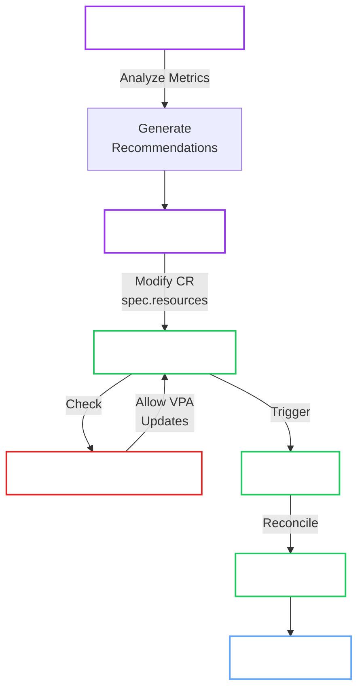

# VPA Autoscaling

The OpenBao Operator supports Kubernetes [VerticalPodAutoscaler (VPA)](https://github.com/kubernetes/autoscaler/tree/master/vertical-pod-autoscaler) for automatic resource (CPU/memory) optimization of OpenBao clusters.

## Prerequisites

- [ ] **VPA Installed**: VPA components must be deployed to your cluster
- [ ] **Resource Requests**: OpenBaoCluster must have `spec.resources` set
- [ ] **Metrics Server**: Required for VPA recommendations (usually pre-installed)

### Installing VPA

VPA is not installed by default in most Kubernetes distributions. Install it using the official manifests:

```bash
# Install VPA v1.2.0 (adjust version as needed)
kubectl apply -f https://github.com/kubernetes/autoscaler/releases/download/vertical-pod-autoscaler-1.2.0/vpa-v1.2.0.yaml

# Verify VPA components are running
kubectl get pods -n kube-system | grep vpa
```

Expected output:

```
vpa-admission-controller-xxx   1/1     Running   0          1m
vpa-recommender-xxx            1/1     Running   0          1m
vpa-updater-xxx                1/1     Running   0          1m
```

## Configuration

### Basic CPU and Memory Optimization

=== "Auto Mode (Recommended)"

    VPA automatically applies recommendations to the CR, and the Operator updates the pods:

    ```yaml
    apiVersion: autoscaling.k8s.io/v1
    kind: VerticalPodAutoscaler
    metadata:
      name: openbao-vpa
      namespace: tenant-ns
    spec:
      targetRef:
        apiVersion: openbao.org/v1alpha1
        kind: OpenBaoCluster
        name: my-cluster  # (1)!
      updatePolicy:
        updateMode: "Auto"  # (2)!
      resourcePolicy:
        containerPolicies:
        - containerName: openbao  # (3)!
          minAllowed:
            cpu: 250m
            memory: 256Mi
          maxAllowed:
            cpu: 4000m
            memory: 8Gi
          controlledResources:  # (4)!
          - cpu
          - memory
    ```

    1. Target the **OpenBaoCluster** CR (not the StatefulSet)
    2. `Auto` mode updates the CR `spec.resources` automatically
    3. Must match the container name (typically `openbao`)
    4. Specify which resources VPA should manage

=== "Recreate Mode"

    Similar to Auto but relies on Operator reconciliation:

    ```yaml
    apiVersion: autoscaling.k8s.io/v1
    kind: VerticalPodAutoscaler
    metadata:
      name: openbao-vpa
      namespace: tenant-ns
    spec:
      targetRef:
        apiVersion: openbao.org/v1alpha1
        kind: OpenBaoCluster
        name: my-cluster
      updatePolicy:
        updateMode: "Recreate"  # (1)!
      resourcePolicy:
        containerPolicies:
        - containerName: openbao
          minAllowed:
            cpu: 500m
            memory: 512Mi
          maxAllowed:
            cpu: 4000m
            memory: 8Gi
    ```

    1. Functionally similar to Auto when targeting CRs, as the Operator handles the rollout

=== "Off Mode (Recommendations Only)"

    VPA provides recommendations without applying them:

    ```yaml
    apiVersion: autoscaling.k8s.io/v1
    kind: VerticalPodAutoscaler
    metadata:
      name: openbao-vpa
      namespace: tenant-ns
    spec:
      targetRef:
        apiVersion: openbao.org/v1alpha1
        kind: OpenBaoCluster
        name: my-cluster
      updatePolicy:
        updateMode: "Off"  # (1)!
      resourcePolicy:
        containerPolicies:
        - containerName: openbao
          minAllowed:
            cpu: 500m
            memory: 512Mi
          maxAllowed:
            cpu: 8000m
            memory: 16Gi
    ```

    1. `Off` mode only generates recommendations - useful for analysis before enabling auto-update

!!! tip "Start with Off Mode"
    Deploy VPA in `Off` mode initially to review recommendations before enabling automatic updates. This allows you to validate min/max bounds are appropriate for your workload.

### Controlling Update Velocity

Combine VPA with PodDisruptionBudgets to control how quickly pods are updated:

```yaml
apiVersion: policy/v1
kind: PodDisruptionBudget
metadata:
  name: my-cluster-pdb
  namespace: tenant-ns
spec:
  maxUnavailable: 1  # (1)!
  selector:
    matchLabels:
      app.kubernetes.io/instance: my-cluster
      app.kubernetes.io/name: openbao
```

1. Allow maximum 1 pod disruption at a time, preventing multiple concurrent pod restarts

## Operations

**Check VPA Recommendations:**

```sh
kubectl get vpa openbao-vpa -n tenant-ns -o yaml
```

Look for the `status.recommendation` field:

```yaml
status:
  recommendation:
    containerRecommendations:
    - containerName: openbao
      lowerBound:
        cpu: 750m
        memory: 1Gi
      target:
        cpu: 1000m
        memory: 1.5Gi
      upperBound:
        cpu: 2000m
        memory: 3Gi
```

**Verify Resources Applied:**

```sh
# Check CR first
kubectl get openbaocluster my-cluster -n tenant-ns -o jsonpath='{.spec.resources}'

# Then check StatefulSet
kubectl get statefulset my-cluster -n tenant-ns \
  -o jsonpath='{.spec.template.spec.containers[0].resources}'
```

**Monitor Pod Recreations:**

```sh
kubectl get events -n tenant-ns --field-selector involvedObject.kind=Pod
```

## Best Practices

1. **Set Conservative Min/Max Bounds**: Start with wide bounds and narrow them based on observed recommendations
2. **Use PodDisruptionBudgets**: Control update velocity to maintain quorum during pod recreations
3. **Monitor Recommendations First**: Deploy in `Off` mode for a week to understand workload patterns
4. **Coordinate with Upgrades**: Pause VPA during operator-managed upgrades to avoid conflicts
5. **Review Regularly**: VPA recommendations evolve with workload - review monthly

## Architecture

VPA modifies the `OpenBaoCluster` CR, which the Operator then reconciles:



The operator's ValidatingAdmissionPolicy allows VPA Updater to modify **only** the `spec.resources` field of the `OpenBaoCluster` CR, while blocking modification of other critical fields (version, image, replicas, profile).

## Troubleshooting

??? failure "VPA not generating recommendations"
    **Symptom:** `status.recommendation` is empty or missing

    **Causes:**
    
    1. VPA Recommender not running
    2. Insufficient metrics history
    3. TargetRef is incorrect (must target `OpenBaoCluster`)
    
    **Solutions:**
    
    ```sh
    # 1. Verify VPA components
    kubectl get pods -n kube-system | grep vpa
    
    # 2. Check VPA logs
    kubectl logs -n kube-system -l app=vpa-recommender
    
    # 3. Ensure targetRef points to OpenBaoCluster
    kubectl get vpa openbao-vpa -o jsonpath='{.spec.targetRef.kind}'
    # Should output: OpenBaoCluster
    ```

??? failure "VPA recommendations not applied"
    **Symptom:** Recommendations exist but CR/StatefulSet resources unchanged

    **Causes:**
    
    1. `updateMode: "Off"` (recommendations only)
    2. VPA Updater not running
    3. Recommendations within current resource allocation
    
    **Solutions:**
    
    ```sh
    # Check update mode
    kubectl get vpa openbao-vpa -o jsonpath='{.spec.updatePolicy.updateMode}'
    
    # Verify VPA Updater is running
    kubectl get pods -n kube-system -l app=vpa-updater
    
    # Check VPA Updater logs
    kubectl logs -n kube-system -l app=vpa-updater
    ```
    
    Change to Auto mode if desired:
    
    ```sh
    kubectl patch vpa openbao-vpa --type=merge -p '{"spec":{"updatePolicy":{"updateMode":"Auto"}}}'
    ```

??? failure "ValidatingAdmissionPolicy blocks VPA"
    **Symptom:** VPA Updater modifications rejected with admission error

    **Cause:** VPA Updater service account not recognized by VAP, or VPA trying to modify restricted fields
    
    **Solution:** Verify VPA is installed in expected namespace (`kube-system` or `vertical-pod-autoscaler`):
    
    ```sh
    # Check VPA Updater service account
    kubectl get sa -n kube-system vpa-updater
    kubectl get sa -n vertical-pod-autoscaler vpa-updater
    ```
    
    The VAP allows VPA Updater from these namespaces:
    - `system:serviceaccount:kube-system:vpa-updater`
    - `system:serviceaccount:vertical-pod-autoscaler:vpa-updater`
    
    If VPA is installed in a different namespace, update the VAP variable `is_vpa_updater`.

??? failure "Pods recreating too frequently"
    **Symptom:** VPA recreates pods multiple times per hour

    **Causes:**
    
    1. Min/max bounds too narrow
    2. No PodDisruptionBudget configured
    3. Workload has high variance
    
    **Solutions:**
    
    ```yaml
    # 1. Widen bounds
    resourcePolicy:
      containerPolicies:
      - containerName: openbao
        minAllowed:
          cpu: 250m      # Lower minimum
          memory: 256Mi
        maxAllowed:
          cpu: 8000m     # Higher maximum
          memory: 16Gi
    
    # 2. Add PodDisruptionBudget
    apiVersion: policy/v1
    kind: PodDisruptionBudget
    metadata:
      name: my-cluster-pdb
    spec:
      maxUnavailable: 1
      selector:
        matchLabels:
          app.kubernetes.io/instance: my-cluster
    ```

??? failure "VPA conflicts with operator upgrades"
    **Symptom:** Pods recreate during operator-managed upgrades

    **Cause:** VPA and operator both trying to update pods simultaneously
    
    **Solution:** Temporarily set VPA to `Off` mode during upgrades:
    
    ```sh
    # Before upgrade
    kubectl patch vpa openbao-vpa --type=merge \
      -p '{"spec":{"updatePolicy":{"updateMode":"Off"}}}'
    
    # Perform operator upgrade
    # ...
    
    # After upgrade
    kubectl patch vpa openbao-vpa --type=merge \
      -p '{"spec":{"updatePolicy":{"updateMode":"Auto"}}}'
    ```

## See Also

- [Kubernetes VPA Documentation](https://github.com/kubernetes/autoscaler/tree/master/vertical-pod-autoscaler)
- [VPA Design Proposal](https://github.com/kubernetes/design-proposals-archive/blob/main/autoscaling/vertical-pod-autoscaler.md)
- [OpenBao Performance Tuning](https://openbao.org/docs/internals/performance/)
