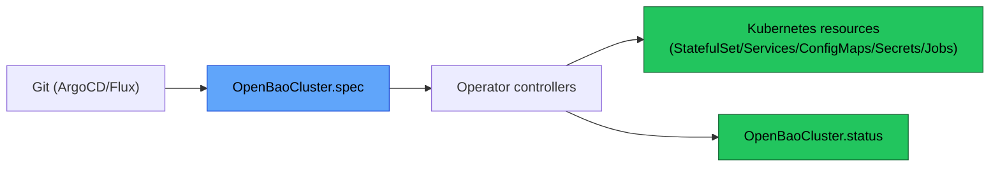

# OpenBaoCluster

`OpenBaoCluster` is the primary CRD that declaratively defines an OpenBao cluster on Kubernetes.

## GitOps Contract (Source of Truth)

- `spec`: Git-managed intent (the operator does not mutate `spec`).
- `status`: runtime/observed state (operator-written).
- `metadata.finalizers`: operator-written for safe deletion.

Next:

- [Getting Started](getting-started.md)
- Configuration:
  - [Security Profiles](configuration/security-profiles.md)
  - [Self-Initialization](configuration/self-init.md)
  - [Sentinel Drift Detection](configuration/sentinel.md)
- Operations:
  - [Upgrades](operations/upgrades.md)
  - [Backups](operations/backups.md)
