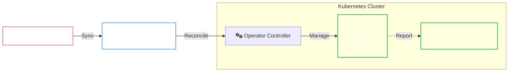

# OpenBaoCluster

`OpenBaoCluster` is the primary Custom Resource Definition (CRD) that declaratively defines a production-ready OpenBao cluster on Kubernetes.

It acts as a high-level abstraction over complex stateful infrastructure, managing the entire lifecycle of the cluster.

## Capabilities

<div class="grid cards" markdown>

- :material-shield-check: **Secure Defaults**

    ---

    :material-arrow-right: Automatic TLS certificate management

    :material-arrow-right: Secure-by-default configurations

    :material-arrow-right: [Security Profiles](configuration/security-profiles.md) for hardening

- :material-server-network: **infrastructure**

    ---

    :material-arrow-right: Managed StatefulSets and Services

    :material-arrow-right: Configurable [Storage](configuration/resources-storage.md) and PVCs

    :material-arrow-right: Automated resizing (Vertical Scaling)

- :material-autorenew: **Day 2 Operations**

    ---

    :material-arrow-right: Automated [Upgrades](operations/upgrades.md) (Rolling & Blue/Green)

    :material-arrow-right: Automated [Backups](operations/backups.md) to S3/GCS/Azure

    :material-arrow-right: Breakdown/Recovery automation

</div>

## GitOps Architecture

The Operator follows a strict **GitOps** contract. Your Git repository is the source of truth for the `spec` (Desired State), while the Operator reports the `status` (Observed State).



## Configuration Examples

=== ":material-code-json: Minimal (Dev)"

    Start small for local development or testing.

    ```yaml
    apiVersion: openbao.org/v1alpha1
    kind: OpenBaoCluster
    metadata:
      name: dev-cluster
      namespace: dev
    spec:
      version: "2.0.0"
      replicas: 1
      description: "Local dev cluster"
    ```

=== ":material-server: Production (HA)"

    A standard 3-node HA cluster with TLS and storage.

    ```yaml
    apiVersion: openbao.org/v1alpha1
    kind: OpenBaoCluster
    metadata:
      name: prod-cluster
      namespace: security
    spec:
      version: "2.0.0"
      replicas: 3
      description: "Production HA Cluster"
      
      resources:
        requests:
          memory: "1Gi"
          cpu: "500m"
          
      storage:
        size: "10Gi"
        storageClass: "gp3"
        
      tls:
        enabled: true
    ```

## Next Steps

<div class="grid cards" markdown>

- :material-cogs: **Configuration**

    ---

    Deep dive into customization options.

    [:material-arrow-right: Security Profiles](configuration/security-profiles.md)

    [:material-arrow-right: Self-Initialization](configuration/self-init.md)

- :material-wrench: **Operations**

    ---

    Manage upgrades and disaster recovery.

    [:material-arrow-right: Upgrades](operations/upgrades.md)

    [:material-arrow-right: Backups](operations/backups.md)

    [:material-arrow-right: Recovery](recovery/no-leader.md)

</div>
