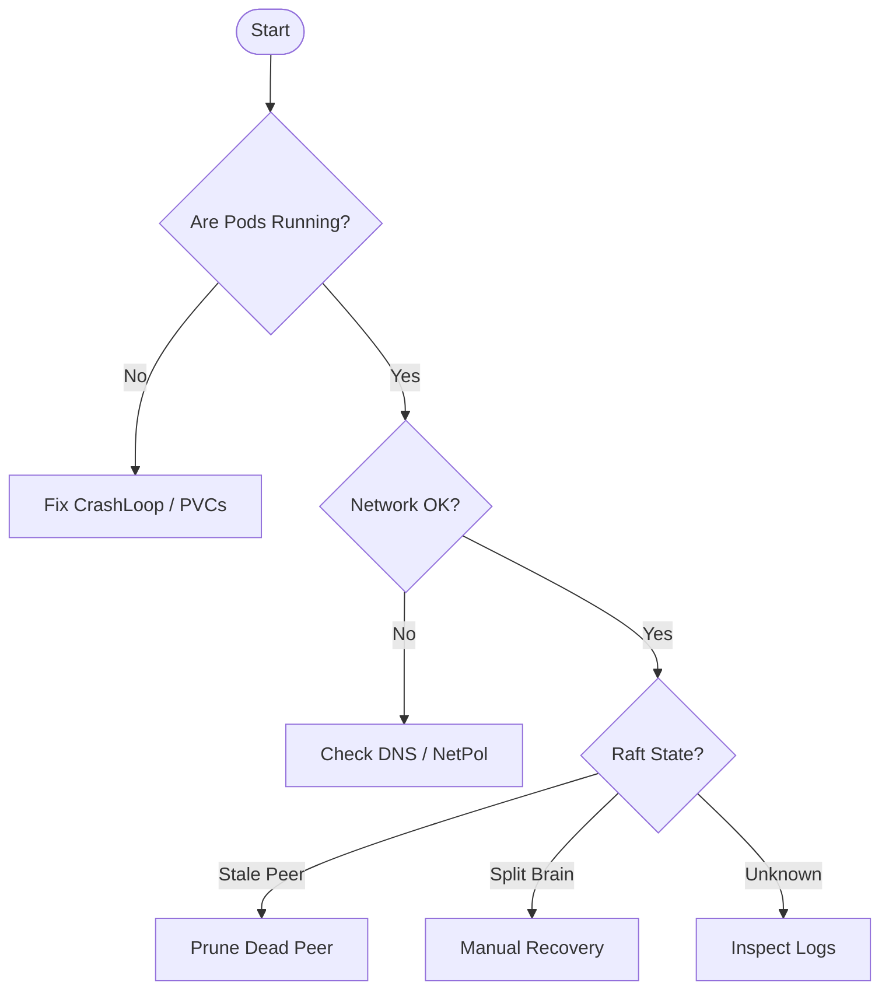

# Recovering From No Leader / No Quorum

This runbook applies when the OpenBao cluster cannot elect a leader due to network partitions, crash-looping pods, or loss of quorum (e.g., 2 out of 3 pods lost).

!!! failure "Symptoms"
    - `kubectl get openbaocluster` shows `Ready=False`.
    - Pod logs show `[WARN] raft: no known peers, aborting election`.
    - `bao status` returns `Sealed` or `Error checking seal status`.

## Troubleshooting Flow



---

## Phase 1: Diagnosis

First, identify if the pods are healthy enough to communicate.

### 1. Check Pod Status

```sh
kubectl -n security get pods -l openbao.org/cluster=prod-cluster -o wide
```

If pods are `CrashLoopBackOff`, check logs for configuration or storage errors distinct from Raft issues.

### 2. Inspect Raft Peers

Exec into **each** running pod and check its view of the cluster.

```sh
# Run this on pod-0, pod-1, and pod-2
kubectl -n security exec -it prod-cluster-0 -- bao operator raft list-peers
```

**Healthy Output:**

```text
Node      Address              State       Voter
----      -------              -----       -----
cluster-0 10.2.1.5:8201       leader      true
cluster-1 10.2.2.8:8201       follower    true
cluster-2 10.2.3.12:8201      follower    true
```

**Unhealthy Output:**

- `error: context deadline exceeded` (Network issue)
- `no leader elected` (Quorum issue)

---

## Phase 2: Network Verification

If `raft list-peers` hangs, verify connectivity. Raft requires TCP port **8201** (or configured `cluster_port`) to be open between pods.

```sh
# Test connectivity from pod-0 to pod-1
kubectl -n security exec -ti prod-cluster-0 -- nc -zv prod-cluster-1.prod-cluster-internal 8201
```

If this fails:

1. Check **NetworkPolicies** (ensure `openbao-cluster-isolation` allows ingress on 8201).
2. Check **DNS** resolution (`nslookup prod-cluster-1.prod-cluster-internal`).

---

## Phase 3: Recovery Options

Choose the scenario that matches your state.

### Scenario A: Removing a Stale Peer

If you replaced a node and the old IP allows ghosts to linger, the cluster might think it needs 4 votes instead of 3.

**Symptoms:**

- `raft list-peers` shows a node causing `(failed)` status.
- You have a functioning leader, or a node that *could* be leader if the ghost was gone.

**Action:**
Run the `remove-peer` command from a healthy node, targeting the **ID** of the failed node.

```sh
kubectl -n security exec -ti prod-cluster-0 -- \
  bao operator raft remove-peer -id "prod-cluster-lost-node"
```

### Scenario B: Manual Quorum Recovery (peers.json)

!!! danger "The Nuclear Option"
    Use this **only** if the cluster is completely down and cannot form a quorum automatically. This process manually forces a single pod to become a leader, potentially causing **data loss** if that pod was behind.

**Steps:**

1. **Scale Down**: Stop the operator to prevent it from interfering.

    ```sh
    kubectl -n openbao-operator-system scale deploy openbao-operator-controller-manager --replicas=0
    ```

2. **Identify Survivor**: Choose the pod with the most up-to-date data (usually the one with the largest `raft/raft.db` file, or the last known leader).

3. **Inject peers.json**: Create a `peers.json` file inside the survivor pod's data directory. This tells the pod: "You are the only member. Start a new cluster."

    ```bash
    # Content for peers.json (replace IP/Address/NodeID)
    cat <<EOF > peers.json
    [
      {
        "id": "prod-cluster-0",
        "address": "prod-cluster-0.prod-cluster-internal:8201",
        "non_voter": false
      }
    ]
    EOF
    
    # Copy to pod
    kubectl cp peers.json security/prod-cluster-0:/bao/data/raft/peers.json
    ```

4. **Restart Pod**: Delete the pod to force a restart. OpenBao will detect `peers.json` on boot and reset the Raft configuration.

    ```sh
    kubectl -n security delete pod prod-cluster-0
    ```

5. **Verify Leader**: Once running, check `bao status`. It should be sealed but have a leader. Unseal it.

6. **Join Others**: Delete the *other* pods (`prod-cluster-1`, `prod-cluster-2`). When they restart, they should automatically join the new leader via the Operator's auto-join mechanism (or you can manually join them).

7. **Resume Operator**:

    ```sh
    kubectl -n openbao-operator-system scale deploy openbao-operator-controller-manager --replicas=1
    ```

---

## Post-Mortem

After recovery, assume the Operator is in **Safe Mode** if it detected the failure.

Check and acknowledge:

```sh
kubectl -n security get openbaocluster prod-cluster -o jsonpath='{.status.breakGlass}'
```

See [Break Glass / Safe Mode](safe-mode.md) for details.
