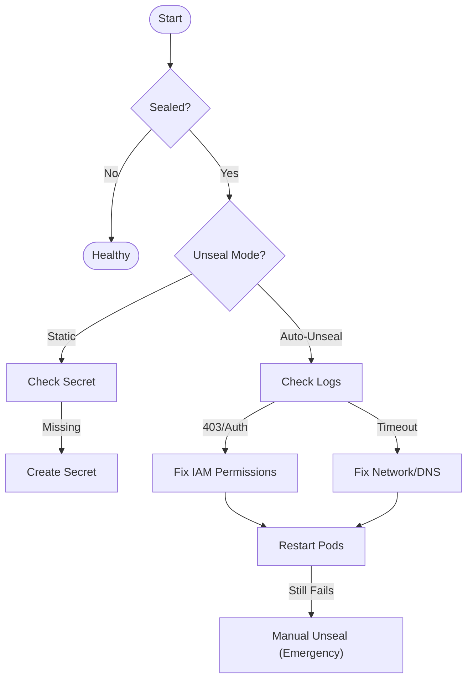

# Recovering From a Sealed Cluster

This runbook applies when OpenBao pods are running (`Running` state) but remain **sealed**, preventing the application from starting.

!!! failure "Symptoms"
    - `kubectl get openbaocluster` reports `Sealed=True`.
    - Pods are ready `0/1` in `kubectl get pods`.
    - `bao status` shows `Sealed: true`.

## Troubleshooting Flow



---

## Diagnostics by Mode

Identify your unseal mode in the `OpenBaoCluster` configuration:

```yaml
spec:
  unsealConfig:
    type: awskms # or static, gcpckms, etc.
```

=== "Static (Default)"

    In **Static** mode, the operator assumes a Kubernetes Secret named `<cluster-name>-unseal-key` contains the key.

    **Common Failure:** The Secret is missing or has the wrong key name.

    1.  **Verify Secret Existence**:
        ```sh
        kubectl -n security get secret prod-cluster-unseal-key
        ```
    2.  **Verify Key Format**:
        The Secret must have a key named `bao-root` (or as configured).
        ```sh
        kubectl -n security get secret prod-cluster-unseal-key -o jsonpath='{.data}'
        ```

    **Fix:**
    If missing, you must provide the unseal key (e.g., from a backup).
    ```sh
    kubectl -n security create secret generic prod-cluster-unseal-key --from-literal=bao-root=YOUR_UNSEAL_KEY
    ```

=== "Auto-Unseal (Cloud KMS)"

    In **Auto-Unseal** mode, OpenBao connects to a remote KMS (AWS, GCP, Azure, OCI). failures are usually due to **Identity** or **Network**.

    **1. Check OpenBao Logs**
    
    Inspect the logs for "failed to unseal" messages.

    ```sh
    kubectl -n security logs prod-cluster-0 | grep -i "unseal"
    ```

    **Common Errors:**

    | Log Message | Root Cause | Fix |
    | :--- | :--- | :--- |
    | `403 Forbidden` / `AccessDeniedPath` | The IAM Role / ServiceAccount lacks permission to `Decrypt`. | Grant `kms:Decrypt` (AWS) or `cloudkms.cryptoKeyVersions.useToDecrypt` (GCP) to the role. |
    | `context deadline exceeded` | Network connectivity to the KMS endpoint is blocked. | Check NetworkPolicies (`egress`), Istio Sidecars, or Firewall rules blocking HTTPS (443). |
    | `Internal (500)` | The Cloud Provider is experiencing an outage. | Check configured Region status. |

=== "Manual (Emergency)"

    !!! danger "Emergency Only"
        Use this only if automation is permanently broken and you need immediate access.

    If the Operator cannot unseal the pods, you can manually unseal them using the `bao` CLI (if you have the unseal keys/shares).

    1.  **Exec into Pod 0**:
        ```sh
        kubectl -n security exec -ti prod-cluster-0 -- sh
        ```
    2.  **Run Unseal**:
        ```sh
        bao operator unseal
        # Paste Unseal Key 1
        # Paste Unseal Key 2 (if shamir)
        ...
        ```
    3.  **Repeat**:
        You must perform this on **every** pod in the cluster (`prod-cluster-1`, `cluster-2`...).

---

## Post-Recovery

Once unsealed, verify the cluster is initialized and active.

```sh
kubectl -n security get openbaocluster prod-cluster
```

If the cluster unsealed successfully but assumes a **Standby** role (no active leader), check the [No Leader](no-leader.md) guide.
