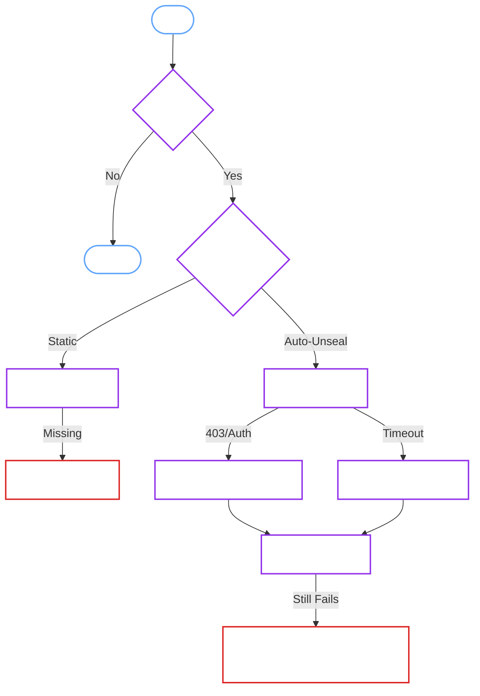

# Recovering From a Sealed Cluster

This runbook applies when OpenBao pods are running (`Running` state) but remain **sealed**, preventing the application from starting.

!!! failure "Symptoms"
    - `kubectl get openbaocluster` reports `Sealed=True`.
    - Pods are ready `0/1` in `kubectl get pods`.
    - `bao status` shows `Sealed: true`.

## Troubleshooting Flow


```mermaid
graph TD
    Start(["Start"]) --> CheckStatus{"Sealed?"}
    CheckStatus -- No --> Done(["Healthy"])
    CheckStatus -- Yes --> IdentifyMode{"Unseal Mode?"}
    
    IdentifyMode -- "Static" --> CheckSecret["Check Secret"]
    IdentifyMode -- "Auto-Unseal" --> CheckLogs["Check Logs"]
    
    CheckSecret -- "Missing" --> CreateSecret["Create Secret"]
    CheckLogs -- "403/Auth" --> FixIAM["Fix IAM Permissions"]
    CheckLogs -- "Timeout" --> FixNet["Fix Network/DNS"]
    
    FixIAM --> ManualTry["Restart Pods"]
    FixNet --> ManualTry
    
    ManualTry -- "Still Fails" --> ManualUnseal["Manual Unseal (Emergency)"]

    classDef read fill:transparent,stroke:#60a5fa,stroke-width:2px,color:#fff;
    classDef write fill:transparent,stroke:#22c55e,stroke-width:2px,color:#fff;
    classDef security fill:transparent,stroke:#dc2626,stroke-width:2px,color:#fff;
    classDef process fill:transparent,stroke:#9333ea,stroke-width:2px,color:#fff;

    class Start,Done read;
    class CheckStatus,IdentifyMode process;
    class CheckSecret,CheckLogs,FixIAM,FixNet,ManualTry process;
    class CreateSecret,ManualUnseal security;
```

---

## Check Conditions First

Inspect the operator-visible conditions before drilling into pod logs:

```sh
kubectl -n security get openbaocluster prod-cluster \
  -o jsonpath='{range .status.conditions[*]}{.type}={.status} {.reason}{"\n"}{end}'
```

Focus on:

- `OpenBaoSealed`
- `CloudUnsealIdentityReady` for cloud KMS backends
- `TLSReady` if the cluster cannot complete secure startup
- `GatewayIntegrationReady` only if self-reachability or ACME traffic depends on Gateway exposure

## Diagnostics by Mode

Identify your unseal mode in the `OpenBaoCluster` configuration:

```yaml
spec:
  unseal:
    type: awskms # or static, transit, gcpckms, azurekeyvault, ocikms, kmip, pkcs11
```

=== "Static (Default)"

    In **Static** mode, the operator assumes a Kubernetes Secret named `<cluster-name>-unseal-key` contains the key.

    **Common Failure:** The Secret is missing or has the wrong key name.

    1.  **Verify Secret Existence**:
        ```sh
        kubectl -n security get secret prod-cluster-unseal-key
        ```
    2.  **Verify Key Format**:
        The Secret must have a key named `bao-root` (or as configured).
        ```sh
        kubectl -n security get secret prod-cluster-unseal-key -o jsonpath='{.data}'
        ```

    **Fix:**
    If missing, you must provide the unseal key (e.g., from a backup).
    ```sh
    kubectl -n security create secret generic prod-cluster-unseal-key --from-literal=bao-root=YOUR_UNSEAL_KEY
    ```

=== "Transit"

    In **Transit** mode, OpenBao connects to another Bao cluster for unseal operations.

    Check first:

    - the credentials Secret referenced by `spec.unseal.credentialsSecretRef`
    - the transit CA / client cert material if you use custom TLS
    - connectivity from the cluster to the transit endpoint

    Common failures:

    | Signal | Root Cause | Fix |
    | :--- | :--- | :--- |
    | `permission denied` / auth failures | Transit token or auth path is wrong. | Replace the credentials Secret and verify transit policy/capabilities. |
    | `x509` or `certificate signed by unknown authority` | Transit CA or client mTLS files do not match the endpoint. | Reconcile the Secret contents and referenced TLS file paths. |
    | `context deadline exceeded` | Network or DNS path to the transit endpoint is blocked. | Check `spec.network.egressRules`, DNS, and the remote endpoint health. |

=== "Auto-Unseal (Cloud KMS)"

    In **Auto-Unseal** mode, OpenBao connects to a remote cloud KMS (AWS, GCP, Azure, OCI). Failures are usually due to **Identity** or **Network**.

    **1. Check OpenBao Logs**
    
    Inspect the logs for "failed to unseal" messages.

    ```sh
    kubectl -n security logs prod-cluster-0 | grep -i "unseal"
    ```

    **Common Errors:**

    | Log Message | Root Cause | Fix |
    | :--- | :--- | :--- |
    | `403 Forbidden` / `AccessDeniedPath` | The IAM Role / ServiceAccount lacks permission to `Decrypt`. | Grant `kms:Decrypt` (AWS) or `cloudkms.cryptoKeyVersions.useToDecrypt` (GCP) to the role. |
    | `context deadline exceeded` | Network connectivity to the KMS endpoint is blocked. | Check NetworkPolicies (`egress`), Istio Sidecars, or Firewall rules blocking HTTPS (443). |
    | `Internal (500)` | The Cloud Provider is experiencing an outage. | Check configured Region status. |

=== "KMIP / HSM"

    In **KMIP** or **PKCS#11** mode, treat failures as external trust or device-access problems first.

    Check first:

    - referenced client certificate / key / CA material
    - library or device mount paths for `pkcs11`
    - network reachability to the KMIP endpoint

    These paths do not use `CloudUnsealIdentityReady`; rely on pod logs and the rendered seal configuration when diagnosing failures.

=== "Manual (Emergency)"

    !!! danger "Emergency Only"
        Use this only if automation is permanently broken and you need immediate access.

    If the Operator cannot unseal the pods, you can manually unseal them using the `bao` CLI (if you have the unseal keys/shares).

    1.  **Exec into Pod 0**:
        ```sh
        kubectl -n security exec -ti prod-cluster-0 -- sh
        ```
    2.  **Run Unseal**:
        ```sh
        bao operator unseal
        # Paste Unseal Key 1
        # Paste Unseal Key 2 (if shamir)
        ...
        ```
    3.  **Repeat**:
        You must perform this on **every** pod in the cluster (`prod-cluster-1`, `cluster-2`...).

---

## Post-Recovery

Once unsealed, verify the cluster is initialized and active.

```sh
kubectl -n security get openbaocluster prod-cluster
```

If the cluster unsealed successfully but assumes a **Standby** role (no active leader), check the [No Leader](no-leader.md) guide.

## Official OpenBao Documentation

- [Seal Configuration Overview](https://openbao.org/docs/configuration/seal/)
- [Static Seal Configuration](https://openbao.org/docs/configuration/seal/static/)
- [Operator Unseal Command](https://openbao.org/docs/commands/operator/unseal/)
