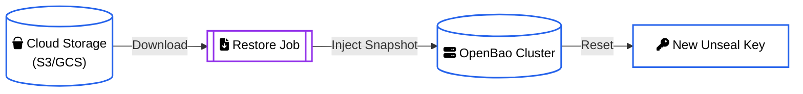

# OpenBaoRestore

`OpenBaoRestore` is an operational CRD used to request a detailed restore operation from object storage into an existing `OpenBaoCluster`.

It is designed to be **declarative** and **immutable**—once a restore is completed, the CR status captures the result for audit purposes.

## Restore Flow

The restore process involves downloading a specific snapshot from Cloud Storage and injecting it into the cluster's leader.



## Use Cases

<div class="grid cards" markdown>

- :material-ambulance: **Disaster Recovery**

    Recover from total cluster loss or data corruption by restoring from the latest healthy backup.

- :material-content-copy: **Environment Cloning**

    Clone a **Production** dataset into a **Staging** or **Dev** environment for realistic testing.

- :material-truck-fast: **Migration**

    Move data between Kubernetes clusters or regions by backing up Source and restoring Target.

</div>

!!! warning "Data Overwrite"
    A Restore operation **completely overwrites** the existing data in the target OpenBaoCluster. Ensure you are targeting the correct cluster.

## Configuration

```yaml
apiVersion: openbao.org/v1alpha1
kind: OpenBaoRestore
metadata:
  name: restore-job-001
  namespace: security
spec:
  # The cluster to overwrite
  cluster: prod-cluster
  
  # The source of the backup
  source:
    type: s3
    s3:
      bucket: my-backups
      region: us-east-1
      key: backup-2024-01-01.snap
```

## Next Steps

- [Performing a Restore](restore.md)
- [Backup Configuration](../openbaocluster/operations/backups.md)
