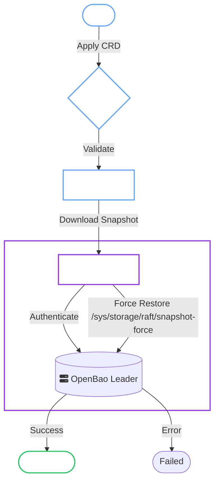

# Restore Operations

The OpenBao Operator supports restoring clusters from snapshots stored in object storage (S3, GCS, Azure) using the `OpenBaoRestore` CRD.

!!! danger "DATA OVERWRITE"
    A Restore operation **completely overwrites** the existing data in the target OpenBaoCluster.

    All secrets, policies, auth methods, and keys will be replaced by the snapshot's state. This is destructive and irreversible.

## 1. Prerequisites

!!! tip "Network Requirements"
    The target OpenBao cluster must be able to reach your Object Storage endpoint. Use `spec.network.egressRules` in your `OpenBaoCluster` configuration if you are running in a restricted environment.

- [x] A valid snapshot in your Object Storage bucket (see [Backups](../openbaocluster/operations/backups.md)).
- [x] The **Target Cluster** must exist and be initialized (even if it's just a fresh, empty cluster).
- [x] Authentication credentials (JWT Role or Admin Token) to perform the restore.

---

## 2. Restore Workflow

The restore process involves multiple phases to validate, download, and inject the snapshot.



---

## 3. Configuration

### Source Configuration

Define where your snapshot is located. The `BackupTarget` structure supports S3, GCS, and Azure storage providers.

=== "S3 (AWS/MinIO)"

    ```yaml
    source:
      target:
        provider: s3  # Optional, defaults to "s3"
        endpoint: https://s3.amazonaws.com
        bucket: openbao-backups
        region: us-east-1
        usePathStyle: false  # Set to true for MinIO
        credentialsSecretRef:
          name: s3-credentials
      key: clusters/prod/snapshot-latest.snap
    ```

    !!! note "Credentials Secret"
        The Secret must contain:
        - `accessKeyId`: AWS access key ID
        - `secretAccessKey`: AWS secret access key
        - `region`: (optional) AWS region
        - `sessionToken`: (optional) For temporary credentials
        - `caCert`: (optional) Custom CA certificate

=== "GCS (Google Cloud Storage)"

    ```yaml
    source:
      target:
        provider: gcs
        endpoint: https://storage.googleapis.com  # Optional, defaults to googleapis.com
        bucket: my-gcs-backups
        gcs:
          project: my-gcp-project-id  # Optional if included in credentials JSON
        credentialsSecretRef:
          name: gcs-credentials
      key: clusters/prod/snapshot-latest.snap
    ```

    !!! note "Credentials Secret"
        The Secret must contain:
        - `credentials.json`: GCS service account JSON key file

    !!! tip "Emulator Support"
        For local testing with `fake-gcs-server`, set the endpoint to your emulator URL:
        ```yaml
        endpoint: http://fake-gcs-server:4443
        ```

=== "Azure Blob Storage"

    ```yaml
    source:
      target:
        provider: azure
        endpoint: https://myaccount.blob.core.windows.net  # Optional, auto-derived from storageAccount
        bucket: my-container  # Container name
        azure:
          storageAccount: myaccount
          container: my-container  # Optional, uses bucket if not specified
        credentialsSecretRef:
          name: azure-credentials
      key: clusters/prod/snapshot-latest.snap
    ```

    !!! note "Credentials Secret"
        The Secret must contain one of:
        - `accountKey`: Azure storage account access key
        - `connectionString`: Full Azure Storage connection string

    !!! tip "Azurite Emulator"
        For local testing with Azurite, set the endpoint to your emulator URL:
        ```yaml
        endpoint: http://azurite:10000
        provider: azure
        azure:
          storageAccount: devstoreaccount1
        ```

### Authentication

How the Restore Job authenticates to the OpenBao cluster leader.

=== "JWT Auth (Recommended)"

    Uses a short-lived Kubernetes ServiceAccount token. Requires `sys/auth/jwt` to be enabled on the target.

    ```yaml
    spec:
      jwtAuthRole: restore  # Must match the role configured in OpenBao
    ```

    ??? example "OpenBao Config for JWT Auth"
        Run this in OpenBao to configure the role:
        ```bash
        bao write auth/jwt/role/restore \
            role_type=jwt \
            bound_audiences=openbao-internal \
            bound_subject="system:serviceaccount:openbao:prod-cluster-restore-serviceaccount" \
            token_policies=restore \
            ttl=1h
        ```

    !!! note "JWT audience"
        The restore Job uses the audience from `OPENBAO_JWT_AUDIENCE` (default: `openbao-internal`).
        Set the same value in the OpenBao role `bound_audiences` and pass the env var to the operator
        (`controller.extraEnv` and `provisioner.extraEnv` in Helm).

    !!! note "JWT bootstrap"
        When `spec.selfInit.bootstrapJWTAuth` is enabled, the OpenBao Operator can create a restore role
        bound to the restore ServiceAccount. Enable it on the cluster with `spec.restore.jwtAuthRole`,
        then set `spec.jwtAuthRole` on the `OpenBaoRestore` to the same role name.

=== "Static Token"

    Uses a long-lived OpenBao token stored in a Kubernetes Secret.

    !!! note "Same-Namespace Requirement"
        The token Secret must exist in the **same namespace** as the `OpenBaoRestore` resource. Cross-namespace references are not allowed for security reasons.

    ```yaml
    spec:
      tokenSecretRef:
        name: restore-token  # Must be in the same namespace as the OpenBaoRestore
    ```

---

## 4. Full Examples

=== "S3 Example"

    ```yaml
    apiVersion: openbao.org/v1alpha1
    kind: OpenBaoRestore
    metadata:
      name: dr-restore-001
      namespace: security
    spec:
      cluster: prod-cluster
      force: true
      
      source:
        target:
          provider: s3
          endpoint: https://s3.amazonaws.com
          bucket: openbao-backups
          region: us-east-1
          credentialsSecretRef:
            name: s3-creds
        key: clusters/prod/backup-2024.snap
      
      jwtAuthRole: restore
    ```

=== "GCS Example"

    ```yaml
    apiVersion: openbao.org/v1alpha1
    kind: OpenBaoRestore
    metadata:
      name: dr-restore-001
      namespace: security
    spec:
      cluster: prod-cluster
      force: true
      
      source:
        target:
          provider: gcs
          bucket: openbao-backups
          gcs:
            project: my-gcp-project
          credentialsSecretRef:
            name: gcs-creds
        key: clusters/prod/backup-2024.snap
      
      jwtAuthRole: restore
    ```

=== "Azure Example"

    ```yaml
    apiVersion: openbao.org/v1alpha1
    kind: OpenBaoRestore
    metadata:
      name: dr-restore-001
      namespace: security
    spec:
      cluster: prod-cluster
      force: true
      
      source:
        target:
          provider: azure
          bucket: openbao-backups
          azure:
            storageAccount: myaccount
            container: openbao-backups
          credentialsSecretRef:
            name: azure-creds
        key: clusters/prod/backup-2024.snap
      
      jwtAuthRole: restore
    ```

---

## 5. Operations

### Monitoring Status

Check the phases (`Pending` -> `Running` -> `Completed`).

```bash
kubectl get OBrestore -w
```

*(Shortname `OBrestore` available)*

### Troubleshooting

| Phase | Common Error | Resolution |
| :--- | :--- | :--- |
| `Validating` | `cluster not found` | Ensure `spec.cluster` matches a valid `OpenBaoCluster` in the same namespace. |
| `Validating` | `snapshot not found` | Verify the `key` path is correct and the snapshot exists in the bucket/container. |
| `Running` | `403 Forbidden` | The Authentication (JWT Role/Token) lacks permission to `sys/storage/raft/snapshot-force`. |
| `Running` | `checksum mismatch` | The snapshot size/hash changed during download. Check network stability. |
| `Running` | `storage account is required` | For Azure, ensure `azure.storageAccount` is set in the target configuration. |
| `Running` | `failed to create storage client` | Verify credentials Secret exists and contains the correct keys for your provider. |
| `Failed` | `context deadline exceeded` | The restore operation timed out. Check `spec.network.egressRules` to ensure egress to storage endpoint is allowed. |
| `Failed` | `No usable temporary directory` | Internal error in restore executor. Check executor image version and pod logs. |

---

## 6. Safety Mechanics

### Operation Lock

The Operator ensures **Mutal Exclusion**. You cannot run a Restore while an Upgrade or Backup is in progress.

### Break Glass

If the cluster is stuck in a locked state (e.g., a failed upgrade) and you MUST restore:

```yaml
spec:
  force: true
  overrideOperationLock: true # (1)!
```

1. Bypasses the safety lock. Events will appear as Warnings.
