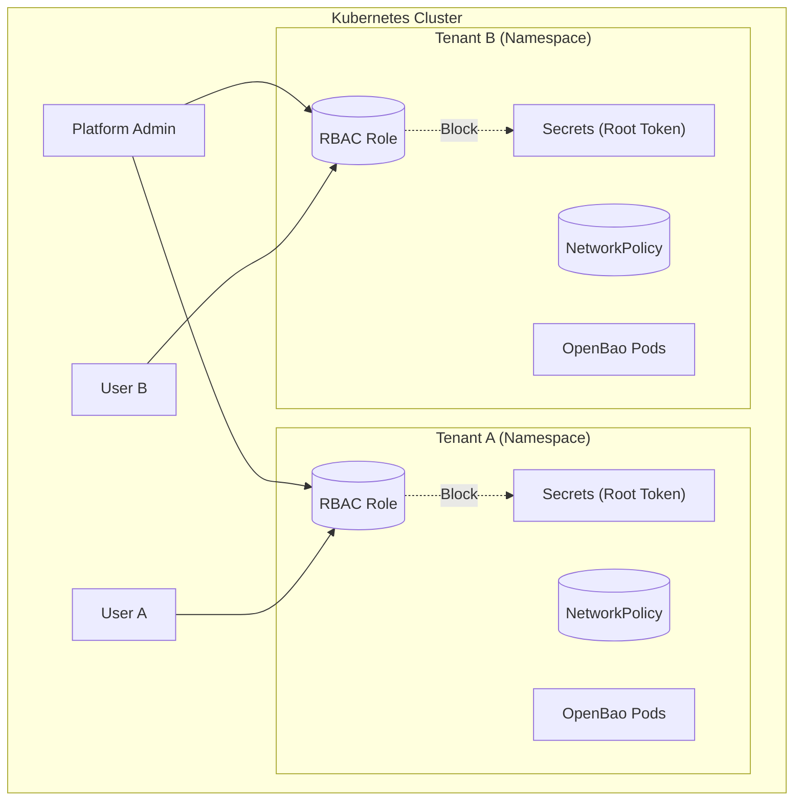

# Multi-Tenancy Security

Running multiple `OpenBaoCluster` resources in a shared Kubernetes cluster requires strict isolation layers. This guide outlines how to secure tenants using RBAC, Network Policies, and Resource Quotas.

## Isolation Model

The Operator facilitates a **Zero Trust** model where each tenant is isolated by default.



## Security Layers

Configure isolation across four key layers:

=== ":material-security: 1. Identity (RBAC)"

    The most critical layer is Identity. You must prevent tenants from accessing the "Keys to the Kingdom" (Root Tokens and Unseal Keys).

    ### Tenant Roles
    Use the provided ClusterRoles to granularly grant permissions.

    | Role | Scope | Description |
    | :--- | :--- | :--- |
    | `openbaocluster-admin-role` | Cluster | Full control. Reserved for Platform Engineers. |
    | `openbaocluster-editor-role` | Namespace | Manage Clusters, **CANNOT** read Secrets. |
    | `openbaotenant-editor-role` | Namespace | Self-service onboarding via `OpenBaoTenant`. |

    ### Blocking Secret Access
    !!! danger "Critical Restriction"
        Tenants with `get secrets` permission can read the **Root Token** and **Unseal Key**, effectively becoming admins of their OpenBao cluster.

    Use a **Policy Engine** (Kyverno/Gatekeeper) to enforce this restriction.

    ```yaml title="Kyverno Policy: Block Sensitive Secrets"
    apiVersion: kyverno.io/v1
    kind: ClusterPolicy
    metadata:
      name: block-openbao-sensitive-secrets
    spec:
      validationFailureAction: Enforce
      rules:
        - name: block-root-token-access
          match:
            any:
              - resources:
                  kinds:
                    - Secret
                  names:
                    - "*-root-token"
                    - "*-unseal-key"
          exclude:
            any:
              - subjects:
                  - kind: ServiceAccount
                    name: openbao-operator-controller
                    namespace: openbao-operator-system
          validate:
            message: "Access to OpenBao root token and unseal key is restricted."
            deny: {}
    ```

=== ":material-server-network-outline: 2. Network"

    By default, the Operator creates a `NetworkPolicy` that implements a **Default Deny** posture for Ingress.

    ### Default Behavior
    - **Ingress**: Only allows traffic from within the cluster (OpenBao-to-OpenBao) and the generic Ingress Controller.
    - **Egress**: Allows DNS, API Server, and cluster-internal traffic.
    - **Backup Jobs**: Excluded from default policy to allow S3 access.

    ### Custom Restrictions
    If you need strict egress control for backup jobs, apply a dedicated policy.

    ```yaml title="Backup Job Isolation"
    apiVersion: networking.k8s.io/v1
    kind: NetworkPolicy
    metadata:
      name: backup-job-strict
      namespace: tenant-a
    spec:
      podSelector:
        matchLabels:
          openbao.org/component: backup
      policyTypes: [Egress]
      egress:
        - to: # Allow S3
            - ipBlock: { cidr: 0.0.0.0/0 }
          ports: [{ port: 443, protocol: TCP }]
    ```

=== ":material-harddisk: 3. Storage & Quota"

    Prevent "Noisy Neighbor" issues where one tenant consumes all cluster resources.

    ### Resource Quotas
    Limit the number of nodes and storage a tenant can provision.

    ```yaml
    apiVersion: v1
    kind: ResourceQuota
    metadata:
      name: openbao-quota
      namespace: tenant-a
    spec:
      hard:
        pods: "10"
        requests.storage: "100Gi"
        requests.cpu: "4"
        requests.memory: "8Gi"
    ```

    ### S3 Bucket Isolation
    When using shared object storage for backups, ensure each tenant uses a unique **Prefix** and has credentials scoped *only* to that prefix.

    ```json title="AWS IAM Policy Example"
    {
      "Effect": "Allow",
      "Action": ["s3:PutObject", "s3:GetObject"],
      "Resource": "arn:aws:s3:::my-backups/tenant-a/*"
    }
    ```

=== ":material-account-file-text: 4. Compliance"

    Ensure all workloads meet your organization's security baseline.

    ### Pod Security Standards
    The Operator is compatible with the **Restricted** profile.

    ```yaml
    apiVersion: v1
    kind: Namespace
    metadata:
      name: tenant-a
      labels:
        # Enforce restricted profile
        pod-security.kubernetes.io/enforce: restricted
        pod-security.kubernetes.io/audit: restricted
    ```

    ### Audit Logging
    Enable Kubernetes Audit Logging to track who accesses the `OpenBaoCluster` CRD and related Secrets.

---

## Production Checklist

Verify these items for every tenant namespace.

<div class="grid cards" markdown>

- :material-account-lock: **RBAC Isolation**

    Ensure users are bound to `openbaocluster-editor-role` (or stricter) and cannot read `*-root-token`.

- :material-network-off: **Network Policy**

    Verify that cross-tenant traffic is blocked (Test: try `curl` from Tenant A to Tenant B).

- :material-harddisk: **Storage Quota**

    Confirm `ResourceQuota` is active to prevent storage exhaustion.

- :material-bucket: **S3 Isolation**

    Verify backup credentials cannot list or read other tenants' prefixes.

- :material-clipboard-check: **Global Checklist**

    See the [Production Readiness Checklist](../openbaocluster/operations/production-checklist.md) for cluster-level requirements.

</div>

*[PSS]: Pod Security Standards
*[RBAC]: Role-Based Access Control
*[CNI]: Container Network Interface
