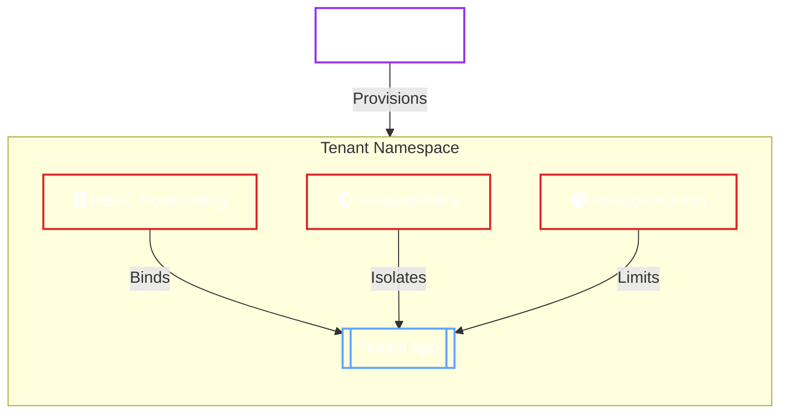

# OpenBaoTenant

`OpenBaoTenant` is the governance and onboarding CRD. It authorizes the Operator to manage OpenBao resources in a target namespace by provisioning tenant-scoped isolation.

It is the key to **Multi-Tenancy**, ensuring that different teams can safely share a Kubernetes cluster without accessing each other's secrets.

## Tenant Isolation Model

When you apply an `OpenBaoTenant`, the Operator creates a "Sandbox" around the target namespace.

## Features

- :material-account-key: **Identity & Access**

    Automatically provisions Kubernetes **RoleBindings** to efficiently manage permissions for the Tenant.

- :material-network-off: **Network Isolation**

    Enforces **NetworkPolicies** to block cross-tenant traffic, ensuring strict isolation between namespaces.

- :material-chart-pie: **Resource Quotas**

    Applies **ResourceQuotas** to prevent a single tenant from consuming all cluster storage or compute. Limits are configurable via the `OpenBaoTenant` spec.

## Governance Models

Choose the onboarding model that fits your organization.

- :material-account-check: **Self-Service**

    ---

     Developers create their own `OpenBaoTenant` in their own namespace.

    *Best for: High-trust, low-friction environments.*

    [:material-arrow-right: Self-Service Guide](onboarding.md#self-service-onboarding)

- :material-police-badge: **Centralized Admin**

    ---

    Platform team creates `OpenBaoTenant` resources for teams.

    *Best for: Strict compliance and audit trails.*

    [:material-arrow-right: Admin Guide](onboarding.md#centralized-admin-onboarding)

## Next Steps

- [Multi-Tenancy Security Guide](multi-tenancy.md)
