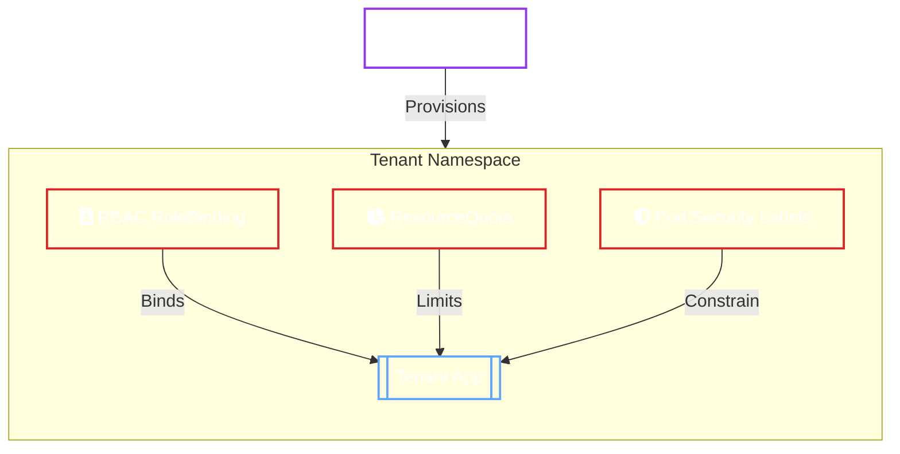

# OpenBaoTenant

`OpenBaoTenant` is the governance and onboarding CRD. It authorizes the Operator to manage OpenBao resources in a target namespace by provisioning tenant-scoped isolation.

It is the key to **Multi-Tenancy**, ensuring that different teams can safely share a Kubernetes cluster without accessing each other's secrets.

<Callout type="note" title="API Contract">

`spec.targetNamespace` is immutable after creation.

</Callout>

## Tenant Isolation Model

When you apply an `OpenBaoTenant`, the Operator creates a tenant governance boundary around the target namespace.

```mermaid
graph TD
    subgraph Namespace ["Tenant Namespace"]
        direction TB
        RBAC["fa:fa-id-badge RBAC RoleBinding"]
        Quota["fa:fa-chart-pie ResourceQuota"]
        PSS["fa:fa-shield-halved Pod Security Labels"]
        
        App[["Tenant App"]]
        
        RBAC -->|Binds| App
        Quota -->|Limits| App
        PSS -->|Constrain| App
    end
    
    Op["fa:fa-gears Operator"] -->|Provisions| Namespace
    
    classDef read fill:transparent,stroke:#60a5fa,stroke-width:2px,color:#fff;
    classDef write fill:transparent,stroke:#22c55e,stroke-width:2px,color:#fff;
    classDef security fill:transparent,stroke:#dc2626,stroke-width:2px,color:#fff;
    classDef process fill:transparent,stroke:#9333ea,stroke-width:2px,color:#fff;

    class Op process;
    class App read;
    class RBAC,Quota,PSS security;
```

## Features

- **Identity & Access**

    Automatically provisions Kubernetes **RoleBindings** to efficiently manage permissions for the Tenant.

- **Resource Quotas**

    Applies operator-managed **ResourceQuotas** and **LimitRanges** to prevent a single tenant from consuming all cluster storage or compute. Self-service tenants use the default guardrails; custom values are reserved for centrally managed onboarding.

- **Namespace Guardrails**

    Applies Pod Security Standards labels and reserves quota customization for centrally managed onboarding paths.

## Governance Models

Choose the onboarding model that fits your organization.

- **Self-Service**

    ---

     Developers create their own `OpenBaoTenant` in their own namespace.

    *Best for: High-trust, low-friction environments.*

    [Self-Service Guide](onboarding.md#self-service-onboarding)

- **Centralized Admin**

    ---

    Platform team creates `OpenBaoTenant` resources for teams.

    *Best for: Strict compliance and audit trails.*

    [Admin Guide](onboarding.md#centralized-admin-onboarding)

## Next Steps

- [Multi-Tenancy Security Guide](multi-tenancy.md)
