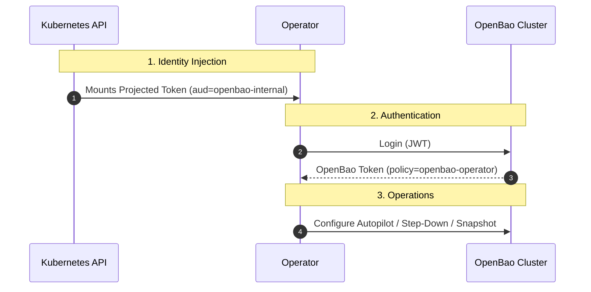

# Operator Authentication

The OpenBao Operator employs a **Zero Trust** security model by default. It avoids long-lived credentials (like root tokens) in favor of short-lived, automatically rotated credentials bound to specific identities.

## Zero Trust Architecture

The Operator authenticates to managed OpenBao clusters using **Kubernetes Service Account Tokens** (Projected Volumes) via OIDC.



### Benefits

1. **No Secrets:** The operator does not need a `root-token` Secret to perform Day 2 operations.
2. **Automatic Rotation:** Kubernetes rotates the projected token automatically (default every hour).
3. **Audience Binding:** Tokens are scoped to `openbao-internal`, preventing them from being replayable against the Kubernetes API or other services.
4. **Least Privilege:** The `openbao-operator` role grants only the specific permissions needed for operator tasks (e.g., `sys/storage/raft/autopilot`), not full admin access.

## Self-Initialization Integration

When using **Self-Initialization** (`spec.selfInit.enabled: true`), the relationship is bootstrapped automatically:

1. **Bootstrap:** The operator uses `spec.selfInit.oidc.enabled: true` or manual requests to configure the JWT auth method.
2. **Role Creation:** It creates a policy and role named `openbao-operator`.
3. **Binding:** This role is bound to the operator's ServiceAccount in the operator's namespace.

!!! success "Recommended Configuration"
    For production environments, we strongly recommend using **Hardened Profile** with **Self
    Initialization**. This ensures no root token is ever persisted to a Kubernetes Secret.

## Troubleshooting

### "Permission Denied" Errors

If you see errors indicating the operator cannot authenticate or lacks permission to configure Autopilot:

```text
failed to create authenticated OpenBao client: ... permission denied
```

**Check the following:**

1. **Projected Volume Mounted:** Ensure the operator Deployment has the projected volume mounted at `/var/run/secrets/tokens/openbao-token`.
2. **Audience Matching:** The `aud` (audience) in the mounted token must match the `bound_audiences` in the OpenBao JWT role. The default is `openbao-internal`.
3. **Self-Init Status:** If the cluster was manually initialized, you must manually create the `openbao-operator` role and binding.

### Manual Role Configuration

If you are **not** using Self-Initialization (e.g., Brownfield adoption), you must manually configure the operator's access:

```bash
# Enable JWT Auth
bao auth enable -path=auth/jwt-operator jwt

# Configure OIDC Discovery (point to your K8s API)
bao write auth/jwt-operator/config \
    oidc_discovery_url="https://kubernetes.default.svc.cluster.local" \
    oidc_discovery_ca_pem=@/var/run/secrets/kubernetes.io/serviceaccount/ca.crt

# Create Operator Policy
bao policy write openbao-operator - <<EOF
path "sys/storage/raft/autopilot/*" {
  capabilities = ["read", "update"]
}
path "sys/health" {
  capabilities = ["read"]
}
EOF

# Create Operator Role
bao write auth/jwt-operator/role/openbao-operator \
    role_type="jwt" \
    bound_audiences="openbao-internal" \
    user_claim="sub" \
    bound_service_account_names="openbao-operator-controller" \
    bound_service_account_namespaces="openbao-operator-system" \
    token_policies="openbao-operator" \
    token_ttl="1h"
```
