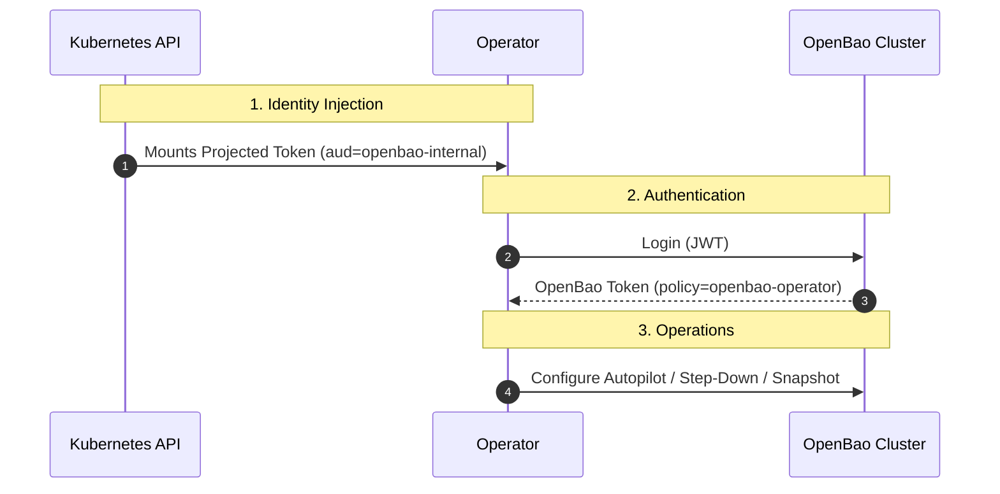

# Operator Authentication

The OpenBao Operator employs a **Zero Trust** security model by default. It avoids long-lived credentials (like root tokens) in favor of short-lived, automatically rotated credentials bound to specific identities.

## Zero Trust Architecture

The Operator authenticates to managed OpenBao clusters using **Kubernetes Service Account Tokens** (Projected Volumes) via OIDC.


```mermaid
sequenceDiagram
    autonumber
    participant K8s as Kubernetes API
    participant Op as Operator
    participant Bao as OpenBao Cluster

    Note over K8s, Op: 1. Identity Injection
    K8s->>Op: Mounts Projected Token (aud=openbao-internal)
    
    Note over Op, Bao: 2. Authentication
    Op->>Bao: Login (JWT)
    Bao-->>Op: OpenBao Token (policy=openbao-operator)
    
    Note over Op, Bao: 3. Operations
    Op->>Bao: Configure Autopilot / Step-Down / Snapshot
```

### Benefits

1. **No Secrets:** The operator does not need a `root-token` Secret to perform Day 2 operations.
2. **Automatic Rotation:** Kubernetes rotates the projected token automatically (default every hour).
3. **Audience Binding:** Tokens are scoped to `openbao-internal`, preventing them from being replayable against the Kubernetes API or other services.
4. **Least Privilege:** The `openbao-operator` role grants only the specific permissions needed for operator tasks (e.g., `sys/storage/raft/autopilot`), not full admin access.

## Self-Initialization Integration

When using **Self-Initialization** (`spec.selfInit.enabled: true`), the relationship is bootstrapped automatically:

1. **Bootstrap:** The operator uses `spec.selfInit.oidc.enabled: true` or manual requests to configure the JWT auth method.
2. **Role Creation:** It creates a policy and role named `openbao-operator`.
3. **Binding:** This role is bound to the operator's ServiceAccount in the operator's namespace.

!!! note "Operator Auth vs Human Auth"
    `spec.selfInit.oidc.enabled: true` bootstraps operator authentication only. It does not create a human login path by itself. Watch `UserAccessBootstrap` on the cluster if you rely on `spec.selfInit.requests` to create JWT, OIDC, `userpass`, or other operator-facing auth mounts.

!!! success "Recommended Configuration"
    For production environments, we strongly recommend using **Hardened Profile** with **Self
    Initialization**. This ensures no root token is ever persisted to a Kubernetes Secret.

## Custom Install Checklist

Use this checklist when you install the operator with raw manifests, a custom namespace, or a `namePrefix`.

1. Confirm the controller ServiceAccount name and namespace from the rendered manifest.
2. Confirm the controller Deployment still mounts the projected token used for OpenBao auth.
3. Confirm the operator ServiceAccount can GET `/.well-known/openid-configuration` and `/openid/v1/jwks` from the Kubernetes API server.
4. Confirm the JWT role in OpenBao binds to the rendered controller ServiceAccount name and namespace, not the default examples.
5. Confirm the JWT audience in OpenBao matches `OPENBAO_JWT_AUDIENCE` on the operator.

!!! warning "Custom Identity Installs"
    `spec.selfInit.oidc.enabled: true` does not infer your custom operator identity from the OpenBao side. If you manually configure JWT auth, the role binding in OpenBao must match the rendered controller ServiceAccount name and namespace exactly.

### Example: Custom Raw-Manifest Identity

This example uses `config/overlays/custom-identity` with:

- `namespace: platform-security`
- `namePrefix: demo-`

That render path produces a controller ServiceAccount named `demo-openbao-operator-controller` in namespace `platform-security`.

If you are not using operator-managed self-init bootstrap, configure the OpenBao JWT role against that rendered identity:

```bash
bao write auth/jwt-operator/role/openbao-operator \
    role_type="jwt" \
    bound_audiences="openbao-internal" \
    user_claim="sub" \
    bound_service_account_names="demo-openbao-operator-controller" \
    bound_service_account_namespaces="platform-security" \
    token_policies="openbao-operator" \
    token_ttl="1h"
```

To verify the rendered identity before applying manifests:

```bash
kubectl kustomize config/overlays/custom-identity
```

Check the rendered `ServiceAccount`, the controller `Deployment`, and any RoleBinding or admission-policy subject that references the controller identity.

## Troubleshooting

### "Permission Denied" Errors

If you see errors indicating the operator cannot authenticate or lacks permission to configure Autopilot:

```text
failed to create authenticated OpenBao client: ... permission denied
```

**Check the following:**

1. **Projected Volume Mounted:** Ensure the operator Deployment has the projected volume mounted at `/var/run/secrets/tokens/openbao-token`.
2. **Audience Matching:** The `aud` (audience) in the mounted token must match the `bound_audiences` in the OpenBao JWT role. The default is `openbao-internal`.
3. **Self-Init Status:** If the cluster was manually initialized, you must manually create the `openbao-operator` role and binding.
4. **OIDC Discovery RBAC:** Ensure the operator ServiceAccount can GET `/.well-known/openid-configuration` and `/openid/v1/jwks`.
5. **Rendered Identity Match:** If you customized the raw-manifest install namespace or `namePrefix`, ensure the JWT role binds to the rendered controller ServiceAccount name and namespace rather than the defaults.

If OIDC discovery or operator identity bootstrap is miswired, the cluster surfaces `OIDCBootstrapConfigurationInvalid`.

If the operator cannot recognize a human login path from `spec.selfInit.requests`, the cluster surfaces `UserAccessBootstrap=Unknown` with reason `UserAccessUnverified`. This is a warning signal, not a hard block.

### Manual Role Configuration

If you are **not** using Self-Initialization, you must manually configure the operator's access:

If you customized the raw-manifest install namespace or name prefix, substitute your controller ServiceAccount name and operator namespace in the role binding below.

```bash
# Enable JWT Auth
bao auth enable -path=auth/jwt-operator jwt

# Configure OIDC Discovery (point to your K8s API)
bao write auth/jwt-operator/config \
    oidc_discovery_url="https://kubernetes.default.svc.cluster.local" \
    oidc_discovery_ca_pem=@/var/run/secrets/kubernetes.io/serviceaccount/ca.crt

# Create Operator Policy
bao policy write openbao-operator - <<EOF
path "sys/storage/raft/autopilot/*" {
  capabilities = ["read", "update"]
}
path "sys/health" {
  capabilities = ["read"]
}
EOF

# Create Operator Role
bao write auth/jwt-operator/role/openbao-operator \
    role_type="jwt" \
    bound_audiences="openbao-internal" \
    user_claim="sub" \
    bound_service_account_names="openbao-operator-controller" \
    bound_service_account_namespaces="openbao-operator-system" \
    token_policies="openbao-operator" \
    token_ttl="1h"
```

## Official OpenBao Documentation

- [JWT/OIDC Auth Method](https://openbao.org/docs/auth/jwt/)
- [Kubernetes Auth Method](https://openbao.org/docs/auth/kubernetes/)
- [Token Concepts](https://openbao.org/docs/concepts/tokens/)
