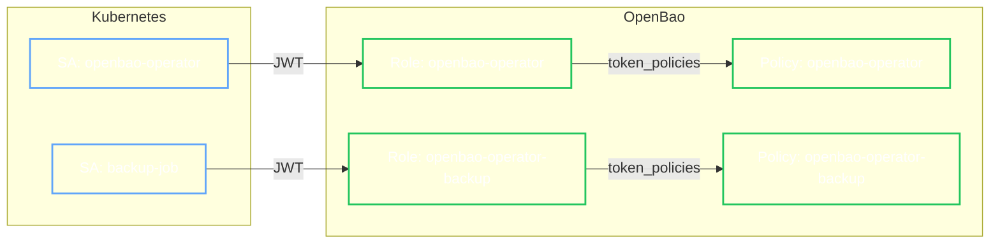

# Operator Authorization

The OpenBao Operator uses the **Principle of Least Privilege** when interacting with managed clusters. It creates distinct **Policies** and **JWT Roles** for different lifecycle capabilities, ensuring that identities (like the backup job or the operator controller itself) only have the permissions necessary to perform their specific tasks.

## Default Policies

When using **Self-Initialization** (`spec.selfInit.enabled: true`), the Operator automatically creates the following policies and roles.

### `openbao-operator`

This policy is bound to the Operator Controller. It grants permission to perform cluster maintenance tasks.

=== "Permissions"

    | Capability | Path | Permissions | Reason |
    | :--- | :--- | :--- | :--- |
    | **Health** | `sys/health` | `read` | Check cluster seal status and leadership. |
    | **Step-Down** | `sys/step-down` | `sudo`, `update` | Gracefully step down RS/Leader during upgrades or scale-down. |
    | **Autopilot** | `sys/storage/raft/autopilot/configuration` | `read`, `update` | Configure Raft Autopilot rules (dead server cleanup, etc). |

=== "Policy Definition"

    ```hcl
    path "sys/health" { capabilities = ["read"] }
    path "sys/step-down" { capabilities = ["sudo", "update"] }
    path "sys/storage/raft/autopilot/configuration" { capabilities = ["read", "update"] }
    ```

### `openbao-operator-backup`

This policy is created if `spec.backup` is configured. It is bound to the `openbao-operator-backup` role and the Backup Job ServiceAccount.

=== "Permissions"

    | Capability | Path | Permissions | Reason |
    | :--- | :--- | :--- | :--- |
    | **Snapshot** | `sys/storage/raft/snapshot` | `read` | Stream Raft snapshots to external storage (S3/GCS/Azure). |

=== "Policy Definition"

    ```hcl
    path "sys/storage/raft/snapshot" { capabilities = ["read"] }
    ```

### `openbao-operator-restore`

This policy is created if `spec.restore` is configured. It is bound to the `openbao-operator-restore` role and the Restore Job ServiceAccount.

=== "Permissions"

    | Capability | Path | Permissions | Reason |
    | :--- | :--- | :--- | :--- |
    | **Force Restore** | `sys/storage/raft/snapshot-force` | `update` | Overwrite the entire cluster state from a snapshot. |

    !!! danger "Security Risk"
        This capability is extremely powerful and destructive. It replaces all data, keys, and policies in the cluster. Ensure the `openbao-operator-restore` role is strictly bound to the restore job's identity.

=== "Policy Definition"

    ```hcl
    path "sys/storage/raft/snapshot-force" { capabilities = ["update"] }
    ```

### `openbao-operator-upgrade`

This policy is created if `spec.upgrade` is configured. It is bound to the `openbao-operator-upgrade` role and the Upgrade Job ServiceAccount (used for rolling or blue/green upgrades depending on strategy).

=== "Permissions (Rolling)"

    Used for standard semantic version updates.

    | Capability | Path | Permissions |
    | :--- | :--- | :--- |
    | **Step-Down** | `sys/step-down` | `sudo`, `update` |
    | **Autopilot** | `sys/storage/raft/autopilot/state` | `read` |

=== "Permissions (Blue/Green)"

    Used for complex upgrades involving unseal key rotation or storage migration.

    | Capability | Path | Permissions |
    | :--- | :--- | :--- |
    | **Join** | `sys/storage/raft/join` | `update` |
    | **Configuration** | `sys/storage/raft/configuration` | `read`, `update` |
    | **Peers** |Remove/Promote/Demote Peers | `update` |

=== "Policy Definition"

    **Rolling Strategy:**

    ```hcl
    path "sys/health" { capabilities = ["read"] }
    path "sys/step-down" { capabilities = ["sudo", "update"] }
    path "sys/storage/raft/snapshot" { capabilities = ["read"] }
    path "sys/storage/raft/autopilot/state" { capabilities = ["read"] }
    ```

    **Blue/Green Strategy:**

    ```hcl
    path "sys/health" { capabilities = ["read"] }
    path "sys/step-down" { capabilities = ["sudo", "update"] }
    path "sys/storage/raft/snapshot" { capabilities = ["read"] }
    path "sys/storage/raft/autopilot/state" { capabilities = ["read"] }
    path "sys/storage/raft/join" { capabilities = ["update"] }
    path "sys/storage/raft/configuration" { capabilities = ["read", "update"] }
    path "sys/storage/raft/remove-peer" { capabilities = ["update"] }
    path "sys/storage/raft/promote" { capabilities = ["update"] }
    path "sys/storage/raft/demote" { capabilities = ["update"] }
    ```

## RBAC Binding

The Operator uses Kubernetes JWT Auth to bind these policies to Kubernetes ServiceAccounts.


