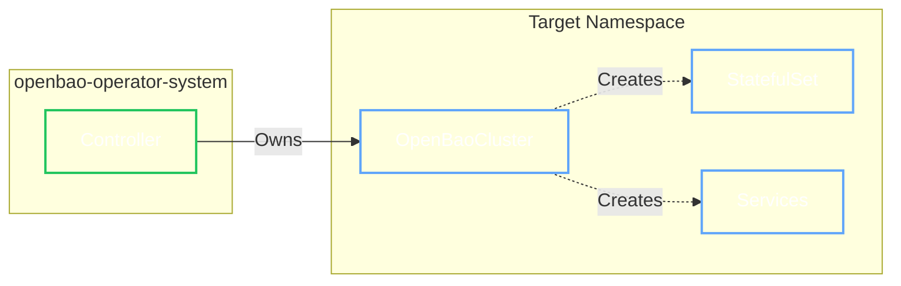

# Single-Tenant Mode
<!-- id: single-tenant-mode -->

Single-tenant mode deploys only the Controller component, optimized for individual teams managing their own OpenBao cluster without multi-namespace orchestration.

## Overview

<div class="grid cards" markdown>

- :material-target: **Target Audience**

    ---

    Individual teams deploying OpenBao for their application.

- :material-speedometer: **Performance**

    ---

    Event-driven reconciliation with namespace-scoped caching.

- :material-shield-check: **Simplicity**

    ---

    Controller only—no Provisioner or OpenBaoTenant required.

</div>

## Architecture

In single-tenant mode, the Controller directly manages resources in a single namespace using efficient event-driven watches.



## Comparison

| Feature | Multi-Tenant (Default) | Single-Tenant |
| :--- | :--- | :--- |
| **Components** | Controller + Provisioner | Controller only |
| **RBAC Model** | Per-namespace via OpenBaoTenant | Direct RoleBinding |
| **Reconciliation** | Polling (cluster-wide) | Event-driven (cached) |
| **Use Case** | Platform teams, shared infrastructure | Individual teams, dedicated clusters |

## Installation

=== ":material-package: Helm (Recommended)"

    Deploy with tenancy mode set to `single`:

    ```bash
    helm install openbao-operator oci://ghcr.io/dc-tec/charts/openbao-operator \
      --namespace openbao-operator-system \
      --create-namespace \
      --set tenancy.mode=single \
      --set tenancy.targetNamespace=openbao  # (1)!
    ```

    1. The namespace where you will deploy your OpenBaoCluster. Defaults to the release namespace if not specified.

    ### Configuration Options

    | Parameter | Description | Default |
    | :--- | :--- | :--- |
    | `tenancy.mode` | Set to `single` for single-tenant mode | `multi` |
    | `tenancy.targetNamespace` | Target namespace for the controller | `""` (release namespace) |
    | `controller.replicas` | Controller replica count | `1` |
    | `controller.resources` | Resource requests/limits | See values.yaml |
    | `admissionPolicies.enabled` | Enable ValidatingAdmissionPolicies | `true` |

    !!! note "Provisioner Excluded"
        In single-tenant mode, the Provisioner deployment, its ServiceAccounts, and related RBAC are automatically excluded.

=== ":material-file-document-multiple-outline: YAML Manifests"

    For manual deployment without Helm:

    **1. Apply CRDs**

    ```bash
    kubectl apply -f https://github.com/dc-tec/openbao-operator/releases/latest/download/crds.yaml
    ```

    **2. Apply ClusterRole**

    ```bash
    kubectl apply -f https://raw.githubusercontent.com/dc-tec/openbao-operator/main/config/rbac/single_tenant_clusterrole.yaml
    ```

    **3. Create Namespace and RoleBinding**

    ```yaml
    apiVersion: v1
    kind: Namespace
    metadata:
      name: openbao
    ---
    apiVersion: rbac.authorization.k8s.io/v1
    kind: RoleBinding
    metadata:
      name: openbao-operator-controller
      namespace: openbao  # (1)!
    roleRef:
      apiGroup: rbac.authorization.k8s.io
      kind: ClusterRole
      name: openbao-operator-single-tenant
    subjects:
    - kind: ServiceAccount
      name: openbao-operator-controller
      namespace: openbao-operator-system
    ```

    1. The target namespace where OpenBaoCluster will be deployed.

    **4. Patch Controller Deployment**

    Add the `WATCH_NAMESPACE` environment variable:

    ```bash
    kubectl set env deployment/openbao-operator-controller \
      -n openbao-operator-system \
      WATCH_NAMESPACE=openbao
    ```

## Verify Installation

```bash
kubectl get pods -n openbao-operator-system
```

Expected output (single-tenant mode):

```
NAME                                              READY   STATUS    RESTARTS   AGE
openbao-operator-controller-xxxxxxxxxx-xxxxx      1/1     Running   0          1m
```

!!! success "Ready"
    Only the Controller is running. No Provisioner pod should be present.

## Environment Variables

| Variable | Description |
| :--- | :--- |
| `WATCH_NAMESPACE` | **Required for manual deployments.** Target namespace. Enables caching and event-driven reconciliation. Helm sets this automatically when `tenancy.mode=single`. |

## Migration

=== "Multi-Tenant → Single-Tenant"

    1. **Backup OpenBaoCluster manifests**

        ```bash
        kubectl get openbaocluster -A -o yaml > clusters-backup.yaml
        ```

    2. **Upgrade Helm release**

        ```bash
        helm upgrade openbao-operator oci://ghcr.io/dc-tec/charts/openbao-operator \
          --namespace openbao-operator-system \
          --set tenancy.mode=single \
          --set tenancy.targetNamespace=openbao
        ```

    3. **Cleanup OpenBaoTenants**

        ```bash
        kubectl delete openbaotenants --all
        ```

    !!! warning "RBAC Changes"
        After migration, the Controller operates with direct namespace access instead of per-tenant RBAC.

=== "Single-Tenant → Multi-Tenant"

    1. **Upgrade Helm release**

        ```bash
        helm upgrade openbao-operator oci://ghcr.io/dc-tec/charts/openbao-operator \
          --namespace openbao-operator-system \
          --set tenancy.mode=multi
        ```

    2. **Create OpenBaoTenants**

        Onboard namespaces using `OpenBaoTenant` resources:

        ```yaml
        apiVersion: openbao.org/v1alpha1
        kind: OpenBaoTenant
        metadata:
          name: openbao-tenant
          namespace: openbao-operator-system
        spec:
          targetNamespace: openbao
        ```

    3. **Cleanup manual RoleBindings**

        ```bash
        kubectl delete rolebinding openbao-operator-controller -n openbao
        ```

## Next Steps

<div class="grid cards" markdown>

- :material-rocket-launch: **Deploy a Cluster**

    ---

    Create your OpenBaoCluster in the target namespace.

    [:material-arrow-right: Getting Started](../openbaocluster/getting-started.md)

- :material-book-open-page-variant: **Configuration**

    ---

    Configure TLS, storage, and security profiles.

    [:material-arrow-right: Configuration](../openbaocluster/configuration/server.md)

</div>
