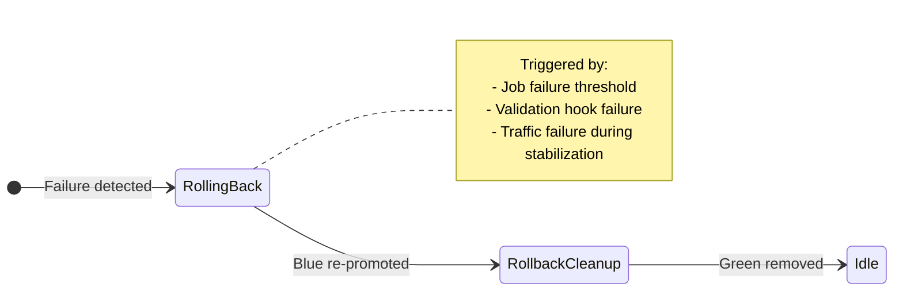

# Cluster Upgrades

## Prerequisites

- **Running Cluster**: An initialized `OpenBaoCluster`
- **Permissions**: RBAC to patch the CR and creating Jobs (for Blue/Green)

## Upgrade Strategies

The OpenBao Operator supports two upgrade strategies:

| Strategy | Description | Use Case |
| :--- | :--- | :--- |
| **RollingUpdate** (default) | Updates pods one-by-one with leader step-down | Standard upgrades, minimal resource usage |
| **BlueGreen** | Creates a parallel "Green" cluster before switching traffic | Zero-downtime upgrades, safer rollback path |

Configure the strategy in your `OpenBaoCluster` spec:

```yaml
spec:
  updateStrategy:
    type: BlueGreen  # or RollingUpdate (default)
    blueGreen:
      autoPromote: true          # Automatically promote after sync (default: true)
      preUpgradeSnapshot: true   # Create backup before upgrade starts
      preCleanupSnapshot: true   # Create backup before removing Blue
      verification:
        minSyncDuration: "30s"   # Wait before promotion (optional)
      autoRollback:
        enabled: true
        onJobFailure: true
        stabilizationSeconds: 60
```

---

## Upgrade Authentication

Upgrade operations that require OpenBao permissions run in Kubernetes Jobs (upgrade executor). These Jobs authenticate to OpenBao via JWT using a projected ServiceAccount token.

The upgrade executor requires:

- `spec.upgrade.executorImage`
- `spec.upgrade.jwtAuthRole`

### JWT Auth (Preferred)

Configure JWT Auth for upgrade operations:

1. **Create the JWT Auth role in OpenBao:**

```yaml
apiVersion: openbao.org/v1alpha1
kind: OpenBaoCluster
metadata:
  name: upgrade-cluster
spec:
  profile: Development
  selfInit:
    enabled: true
    requests:
      # Create upgrade policy
      - name: create-upgrade-policy
        operation: update
        path: sys/policies/acl/upgrade
        policy:
          policy: |
            path "sys/health" {
              capabilities = ["read"]
            }
            path "sys/step-down" {
              capabilities = ["update"]
            }
            path "sys/storage/raft/snapshot" {
              capabilities = ["read"]
            }
      # Create JWT Auth role for upgrades
      - name: create-upgrade-jwt-role
        operation: update
        path: auth/jwt/role/upgrade
        data:
          role_type: jwt
          bound_audiences: ["openbao-internal"]
          bound_claims:
            kubernetes.io/namespace: openbao
            kubernetes.io/serviceaccount/name: upgrade-cluster-upgrade-serviceaccount
          token_policies: upgrade
          ttl: 1h
  upgrade:
    executorImage: openbao/upgrade-executor:v0.1.0
    jwtAuthRole: upgrade
    preUpgradeSnapshot: true
```

1. **Configure the upgrade manager to use the role:**

```yaml
spec:
  upgrade:
    executorImage: openbao/upgrade-executor:v0.1.0
    jwtAuthRole: upgrade
```

---

## Upgrade ServiceAccount

The operator automatically creates `<cluster-name>-upgrade-serviceaccount` when upgrade authentication is configured. This ServiceAccount:

- Is used by upgrade executor Jobs for JWT Auth (via projected ServiceAccount token)
- Is mounted into the Job Pod via a projected token volume with audience `openbao-internal`
- Is owned by the OpenBaoCluster for automatic cleanup

---

## Performing Upgrades

To upgrade an OpenBao cluster, update the `spec.version` field:

```sh
kubectl -n security patch openbaocluster dev-cluster \
  --type merge -p '{"spec":{"version":"2.5.0"}}'
```

### Rolling Update Strategy

The upgrade manager will:

1. Validate the target version
2. Perform pre-upgrade validation (cluster health, quorum, leader detection)
3. Create a pre-upgrade snapshot (if `spec.upgrade.preUpgradeSnapshot` is enabled)
4. Perform a rolling upgrade, pod-by-pod, with leader step-down handling
5. Update `Status.CurrentVersion` when complete

### Blue/Green Upgrade Strategy

The Blue/Green upgrade follows a multi-phase process with safety checkpoints.

#### Phase Flow

```mermaid
stateDiagram-v2
    direction LR
    [*] --> Idle
    Idle --> DeployingGreen: Version change detected
    DeployingGreen --> JoiningMesh: Pods ready
    JoiningMesh --> Syncing: Non-voters joined
    Syncing --> Promoting: Data synced
    Promoting --> TrafficSwitching: Voters promoted
    TrafficSwitching --> DemotingBlue: Stabilization passed
    DemotingBlue --> Cleanup: Blue demoted
    Cleanup --> Idle: Complete
    
    state "Pre-Upgrade Snapshot" as PreSnap
    Idle --> PreSnap: preUpgradeSnapshot=true
    PreSnap --> DeployingGreen
    
    state "Pre-Cleanup Snapshot" as PreCleanup
    DemotingBlue --> PreCleanup: preCleanupSnapshot=true
    PreCleanup --> Cleanup
```



#### Rollback Flow



#### Phase Details

| Phase | Description |
| :--- | :--- |
| **Idle** | No upgrade in progress. Pre-upgrade snapshot taken if configured. |
| **DeployingGreen** | Creating Green StatefulSet with new version, waiting for pods to be ready and unsealed |
| **JoiningMesh** | Green pods join the Raft cluster as non-voters |
| **Syncing** | Green pods replicate data from Blue leader. Pre-promotion hook runs (if configured). |
| **Promoting** | Green pods promoted to voters |
| **TrafficSwitching** | Service selectors point to Green. Stabilization period monitors health. |
| **DemotingBlue** | Blue pods demoted to non-voters |
| **Cleanup** | Pre-cleanup snapshot taken (if configured). Blue pods removed from Raft, Blue StatefulSet deleted. |

---

## Advanced Blue/Green Configuration

### Snapshots

Create automatic backups during upgrades:

```yaml
spec:
  updateStrategy:
    blueGreen:
      preUpgradeSnapshot: true   # Backup before any changes
      preCleanupSnapshot: true   # Backup before removing Blue (point of no return)
  backup:                         # Required for snapshots
    executorImage: openbao/backup-executor:v0.1.0
    jwtAuthRole: backup
    target:
      endpoint: http://rustfs-svc.rustfs.svc:9000
      bucket: openbao-backups
```

### Pre-Promotion Validation Hook

Run custom validation before promoting Green:

```yaml
spec:
  updateStrategy:
    blueGreen:
      verification:
        prePromotionHook:
          image: busybox:latest
          command: ["sh", "-c"]
          args: ["curl -fs https://green-cluster:8200/v1/sys/health"]
          timeoutSeconds: 300
```

### Auto-Rollback Configuration

Configure automatic rollback on failure:

```yaml
spec:
  updateStrategy:
    blueGreen:
      maxJobFailures: 3           # Max failures before rollback (default: 5)
      autoRollback:
        enabled: true
        onJobFailure: true       # Rollback on job failures
        onValidationFailure: true # Rollback if hook fails
        onTrafficFailure: true   # Rollback if Green fails during stabilization
        stabilizationSeconds: 60 # Observation period during TrafficSwitching
```

### Traffic Switching

The `TrafficSwitching` phase provides a safety window:

1. Service selectors are updated to point to Green pods
2. Green is monitored for `stabilizationSeconds` (default: 60s)
3. If Green remains healthy, upgrade proceeds to DemotingBlue
4. If Green fails and `onTrafficFailure` is true, automatic rollback is triggered

---

## Monitoring Upgrades

Monitor upgrade progress:

```sh
kubectl -n security get openbaocluster dev-cluster -o yaml
```

Check `Status.BlueGreen` for Blue/Green upgrade progress:

```yaml
status:
  blueGreen:
    phase: TrafficSwitching
    blueRevision: "e8983038c519c718"
    greenRevision: "269c4f7ba494030d"
    startTime: "2024-01-15T10:30:00Z"
    trafficSwitchedTime: "2024-01-15T10:35:00Z"
    preUpgradeSnapshotJobName: "dev-cluster-preupgrade-snapshot-1705315800"
    jobFailureCount: 0
```

Check `Status.Conditions` for upgrade state:

```sh
kubectl -n security get openbaocluster dev-cluster -o jsonpath='{.status.conditions}' | jq
```

### Rollback Status

If a rollback is triggered:

```yaml
status:
  blueGreen:
    phase: RollingBack
    rollbackReason: "job failure threshold exceeded"
    rollbackStartTime: "2024-01-15T10:36:00Z"
```

If rollback automation cannot proceed safely (for example, a failed consensus repair), the operator may enter break glass mode and halt further quorum-risk actions:

- [Break Glass / Safe Mode](recovery-safe-mode.md)
