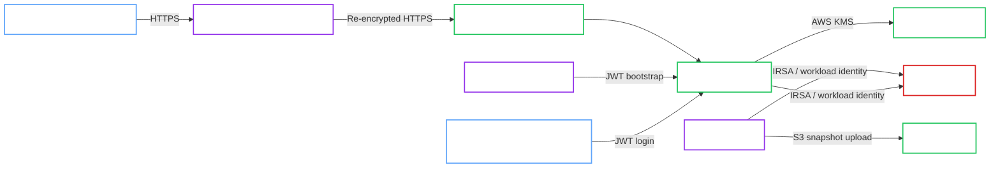

# Amazon EKS Development with AWS KMS and S3 Backups

!!! note "Classification"
    Cloud reference architecture. This is a realistic cloud validation and bring-up topology, but it is intentionally a `Development` profile lane rather than a production target.

This validated architecture describes the development and manual-validation lane exercised on Amazon EKS for OpenBao Operator.

It is the reference shape for:

- `spec.profile: Development`
- AWS KMS auto-unseal
- JWT bootstrap for Operator access and human admin access
- a shared terminating Gateway API edge
- scheduled and manual backups to S3

!!! success "Validation status"
    This architecture was manually validated in the project Amazon EKS environment on March 14-15, 2026. The validated path covered bootstrap, KMS unseal, JWT login, Gateway exposure, and successful S3 backups.

!!! warning "Not a production architecture"
    This page documents a validated development topology. It is useful for bring-up, demos, CI-adjacent cloud checks, and operator validation, but it is not a production-ready posture.

## Intended use

Use this architecture when you want a low-friction cloud validation lane with real AWS integrations and controlled external reachability.

Do not use it as your production reference if you require:

- `ProductionReady=True`
- OpenBao-managed ACME
- end-to-end TLS passthrough
- a fully hardened admission and image-verification posture

## Topology

## Architecture decisions

### Edge model

The validated EKS development lane used a shared terminating Gateway API edge.

That means:

- the Gateway terminates the public certificate
- traffic is re-encrypted to OpenBao
- the OpenBao endpoint can stay behind the same shared edge as other development tools

This keeps the topology simple and avoids ACME passthrough requirements during bring-up.

### Identity model

The architecture separates the AWS and OpenBao identity surfaces:

- the main OpenBao Pods use a workload identity for KMS unseal
- backup Jobs use a separate workload identity for S3 access
- the Operator bootstraps its own JWT auth path from Kubernetes issuer discovery
- human admin access is bootstrapped through a dedicated `ServiceAccount` JWT role

### Backup model

Backups are written to S3 with a separate execution identity. This keeps KMS unseal permissions and backup write permissions distinct.

## Required invariants

Keep these assumptions if you want to stay on the validated path:

- Use `spec.profile: Development`.
- Keep the edge in Gateway termination mode, not passthrough.
- Keep separate AWS identities for unseal and backup.
- Keep JWT bootstrap enabled for Operator access and admin access.
- Provide a working KMS key and S3 bucket in the same AWS lane.

## Validated operations

The manual EKS validation covered these behaviors:

- cluster bootstrap completed successfully
- AWS KMS auto-unseal worked on the running OpenBao Pods
- JWT bootstrap for the Operator worked on EKS
- JWT login for a human admin `ServiceAccount` worked
- Gateway API exposure through the shared terminating edge worked
- backup Jobs authenticated and wrote snapshots to S3 successfully

## Known constraints

- `ProductionReady` is expected to remain false because this is a `Development` profile topology.
- Public DNS can exist while actual reachability is still source-restricted at the shared edge.
- This architecture deliberately does not exercise OpenBao-managed ACME.

## Related recipe

Use the deployment flow in [Amazon EKS Development + AWS KMS + S3](../../recipes/cloud/amazon-eks-development-awskms-s3.md).
