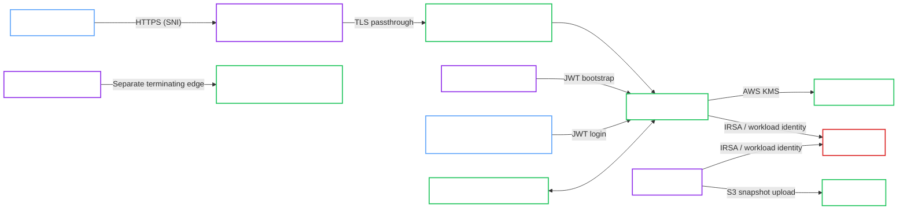

# Amazon EKS Hardened with AWS KMS, Gateway API Passthrough, and ACME

!!! note "Classification"
    Cloud reference architecture. This is the current production-style Amazon EKS reference shape validated by the project.

This validated architecture describes the hardened Amazon EKS topology exercised during manual cloud validation for OpenBao Operator.

It is the reference shape for:

- `spec.profile: Hardened`
- AWS KMS auto-unseal
- `spec.tls.mode: ACME`
- Gateway API TLS passthrough
- signed helper images under Hardened policy
- S3 backups with a separate backup identity

!!! success "Validation status"
    This architecture was manually validated in the project Amazon EKS environment on March 14-15, 2026. The validated path covered bootstrap, OpenBao-managed ACME certificate issuance, Gateway passthrough, JWT bootstrap on EKS, KMS unseal, and successful S3 backups.

!!! warning "Public ACME requires a public OpenBao endpoint"
    A public ACME CA such as Let's Encrypt must reach the hardened hostname on port `443`. This architecture is not compatible with source-restricting the hardened passthrough hostname to a single client IP.

## Intended use

Use this architecture when you want a production-style Amazon EKS reference that keeps OpenBao as the TLS endpoint and validates Hardened-profile cloud integrations.

Use a different architecture if you need:

- a source-restricted public endpoint for OpenBao itself
- Gateway-side TLS termination for the OpenBao hostname
- DNS01- or externally managed certificates instead of OpenBao-managed ACME

## Topology

## Architecture decisions

### Dedicated passthrough edge

The hardened hostname uses a dedicated public passthrough edge instead of the shared terminating edge used for admin tools.

That separation is part of the validated design because it avoids two common problems:

- breaking the shared Gateway with passthrough-specific listener behavior
- coupling public ACME validation requirements to ArgoCD and monitoring ingress

### OpenBao-managed ACME

OpenBao remains the TLS endpoint and performs ACME issuance itself.

That means:

- the Gateway must use passthrough, not termination
- the OpenBao hostname must be publicly reachable on `443`
- the topology needs a shared ACME cache for multi-replica safety

### Hardened image verification

The validated path assumes Hardened policy with signed helper images. The production-style claim depends on using helper images that satisfy the Operator's verification contract.

### Identity separation

The architecture keeps these identities separate:

- main OpenBao workload identity for AWS KMS
- backup execution identity for S3
- Kubernetes JWT identities for the Operator and human admin access

## Required invariants

Keep these assumptions if you want to stay on the validated path:

- Use `spec.profile: Hardened`.
- Keep the OpenBao hostname on a dedicated passthrough Gateway.
- Keep the hardened hostname publicly reachable on port `443`.
- Use `spec.tls.mode: ACME`.
- Provide a shared RWX cache for ACME.
- Use signed helper images compatible with Hardened verification.
- Keep backup and unseal identities separate.

## Validated operations

The manual EKS validation covered these behaviors:

- cluster bootstrap completed successfully
- AWS KMS auto-unseal worked on the running OpenBao Pods
- OpenBao obtained a public ACME certificate successfully
- Gateway API passthrough exposed the OpenBao hostname successfully
- JWT bootstrap for the Operator worked on EKS
- JWT login for a human admin `ServiceAccount` worked
- backup Jobs authenticated and wrote snapshots to S3 successfully

## Known constraints

- If the hardened hostname must be source-restricted, use externally managed TLS or DNS01-driven issuance instead of this architecture.
- The selected Gateway controller must support `TLSRoute`.
- The dedicated passthrough edge is part of the architecture, not just an implementation detail.

## Related recipe

Use the deployment flow in [Amazon EKS Hardened + AWS KMS + ACME](../../recipes/cloud/amazon-eks-hardened-awskms-acme.md).
