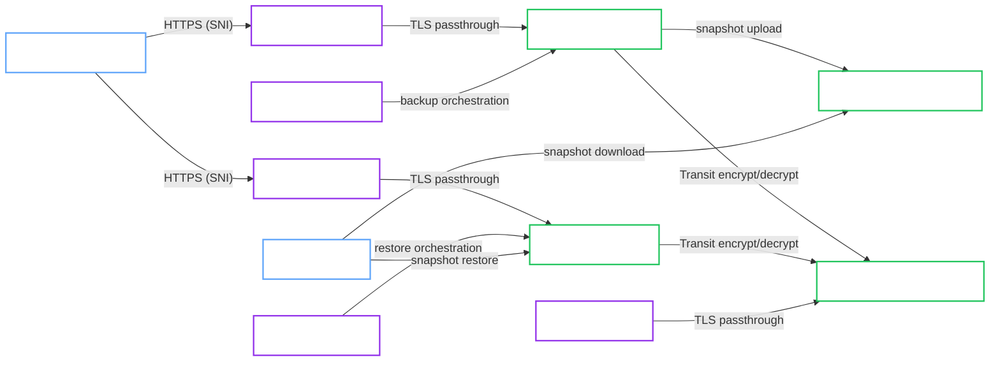

# k3d Cross-Cluster DR with Shared Transit and RustFS

!!! note "Classification"
    Local reference architecture for DR rehearsal. k3d is not a production target, but this page documents a realistic multi-cluster recovery model that exercises the important disaster-recovery invariants before moving to a cloud DR pair.

This validated architecture describes the local multi-cluster disaster recovery lane used to prove restore across a real cluster boundary.

It is the reference shape for:

- one infra k3d cluster hosting shared trust services
- one source `OpenBaoCluster`
- one target `OpenBaoCluster`
- shared Transit auto-unseal through a shared external OpenBao service
- shared RustFS object storage for snapshot transfer
- Gateway API TLS passthrough on the infra, source, and target clusters

!!! success "Validation status"
    This architecture was manually validated on March 16, 2026 in the project validation environment. The proof completed source backup to RustFS, restore into the target cluster, target unseal with the shared Transit key, and post-restore verification that `source-demo-password` worked on the target while `target-demo-password` failed and the `dr-control` marker changed to `phase1-source`.

## Intended use

Use this architecture when you want to rehearse disaster recovery locally before moving to a cloud DR pair.

It is useful for:

- proving that backup and restore work across a real cluster boundary
- validating that the target cluster can unseal restored data with a shared external seal root of trust
- rehearsing manual DR cutover and post-restore verification

## Topology

## Architecture decisions

### Shared external seal root of trust is required

The validated DR topology uses one shared Transit key, `openbao-dr-shared-unseal`, for both the source and target clusters.

This is the important DR invariant. A restore can copy snapshot data into the target cluster, but the restored cluster cannot unseal unless the target uses the same external seal root of trust as the source.

### Separate infra cluster hosts the shared Transit dependency

The local proving ground uses a third k3d cluster for shared trust services. That keeps the seal provider independent from both the source and target clusters and makes the boundary closer to a real external dependency.

### Object storage is the transfer boundary

RustFS is the shared S3-compatible transfer layer. The source cluster uploads snapshots, and the target cluster restores from the exact object key selected by the operator or administrator.

### Gateway API passthrough remains part of the design

The validated lane exposes the source, target, and shared trust services endpoints through dedicated Gateway API TLS passthrough listeners. That keeps the OpenBao TLS boundary inside OpenBao while still validating cluster-to-cluster reachability over real ingress edges.

### Cutover is manual

This architecture does not claim automatic failover. The validated path is:

1. Create a source backup.
2. Restore that snapshot into the target cluster.
3. Verify the restored target state.
4. Perform manual client or DNS cutover.

## Required invariants

Keep these assumptions if you want to stay on the validated path:

- The source and target clusters use the same Transit address, CA bundle, SNI, and Transit key name.
- The source and target clusters use the same OpenBao version for the restore event.
- The target cluster exists before restore and exposes `spec.restore.jwtAuthRole`.
- Shared object storage is reachable from both clusters.
- The target restore flow uses an explicit restore image or an equivalent cluster-level backup image configuration.
- Cutover happens only after verifying restored credentials and application data.

## Validated operations

This architecture is now validated for:

- bootstrap of the infra, source, and target clusters
- source cluster backup to RustFS
- restore into a separate target cluster
- target unseal after restore with shared Transit auto-unseal
- post-restore validation over the target passthrough endpoint

## Known constraints

- This is a local proving architecture, not the final cloud DR reference.
- The object store is host-exposed RustFS, not a managed cloud bucket.
- The validated path is manual restore and manual cutover only.
- The local Gateway API experimental bundle is part of the working topology. Treat actual `Gateway` programming and live endpoint behavior as the primary ingress acceptance signal.

## Related recipes

- [k3d Cross-Cluster DR Bootstrap](../../recipes/local/k3d-cross-cluster-dr-bootstrap.md)
- [Cross-Cluster DR Restore with RustFS](../../runbooks/cross-cluster-dr-restore-rustfs.md)
