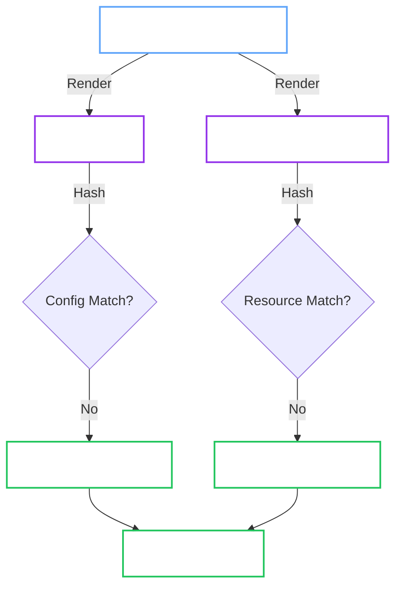
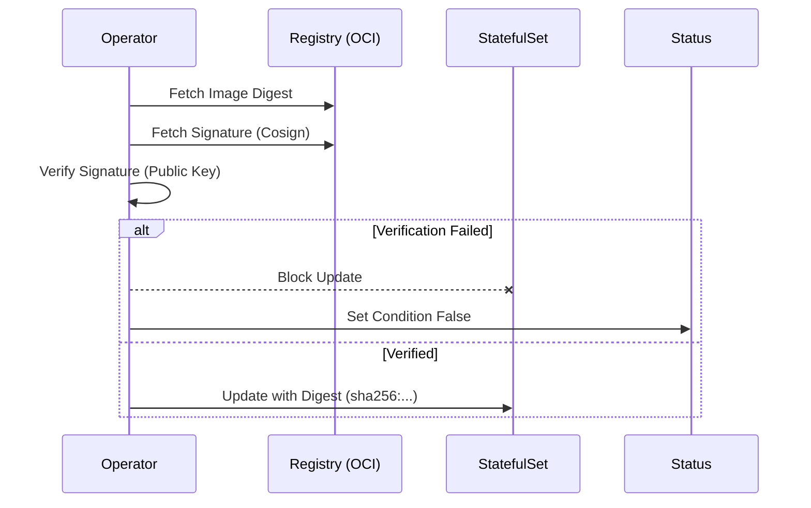

# InfrastructureManager (Config & StatefulSet)

**Responsibility:** The "Heart" of the operator. It translates the high-level `OpenBaoCluster` spec into a running `StatefulSet` with a valid `config.hcl`.

## 1. Architectural Placement

Infrastructure reconciliation belongs to the workload orchestration path:

1. `internal/controller/openbaocluster` (workload reconciler) receives the reconcile event.
2. It delegates to `internal/app/openbaocluster` facade functions.
3. The app layer invokes workload orchestration, which calls `internal/service/infra` for rendered resources and apply logic.

This preserves controller thinness and keeps StatefulSet/config domain logic in the infrastructure manager layer.

## 2. Reconciliation Pipeline

The Manager follows a strict **Render-Then-Apply** pipeline to ensure configuration consistency.



Config changes are tracked via the `openbao.org/config-hash` annotation on the StatefulSet Pod template, which triggers a safe rollout.

## 3. Configuration Generation

We do not use a static ConfigMap. We generate it dynamically from the Spec.

```hcl
ui = true

listener "tcp" {
  address = "0.0.0.0:8200"
  cluster_address = "0.0.0.0:8201"
  
  # Injected: Points to Secret mounts
  tls_cert_file = "/etc/bao/tls/tls.crt" # (1)!
  tls_key_file  = "/etc/bao/tls/tls.key"
}

storage "raft" {
  path = "/bao/data"
  node_id = "${HOSTNAME}"

  retry_join {
    # Injected: Discovery via Kubernetes Labels
    auto_join = "provider=k8s label_selector=\"openbao.org/cluster=prod-cluster\"" # (2)!
    leader_tls_servername = "openbao-cluster-prod-cluster.local"
  }
}

service_registration "kubernetes" {} # (3)!
```

1. Paths are automatically adjusted based on `spec.tls.mode` (e.g., ACME mode removes these).
2. Enables automatic peer discovery without manual `join` commands.
3. Ensures Pods register themselves as endpoints.

## 4. Auto-Unseal Integration

The Manager automatically configures the `seal` stanza based on `spec.unseal`.

<Tabs groupId="static-default-external-kms">

<TabItem value="static-default" label="Static (Default)">

If `spec.unseal` is omitted, the operator manages the unseal keys.

1.  **Generate:** Creates 32 random bytes.
2.  **Store:** Saves to `Secret/<cluster>-unseal-key`.
3.  **Mount:** Mounts at `/etc/bao/unseal/key`.
4.  **Config:**
    ```hcl
    seal "static" {
      current_key    = "file:///etc/bao/unseal/key"
      current_key_id = "operator-generated-v1"
    }
    ```

</TabItem>

<TabItem value="external-kms" label="External KMS">

If `spec.unseal.type` is set (e.g., `awskms`, `gcpckms`), the operator delegates to the provider.

1.  **No Secret:** Does NOT create an unseal key Secret.
2.  **Mount Creds:** Mounts `spec.unseal.credentialsSecretRef` to `/etc/bao/seal-creds`.
3.  **Config:** Renders the specific seal block:
    ```hcl
    seal "awskms" {
      region     = "us-east-1"
      kms_key_id = "alias/my-key"
    }
    ```

</TabItem>

</Tabs>

## 5. Image Verification (Cosign)

When image verification is enabled (or implicitly enabled by the Hardened profile when verification blocks are omitted),
we enforce supply chain security.



| Policy | Behavior |
| :--- | :--- |
| `Block` (Default) | **Stops** reconciliation. No unsafe image runs. |
| `Warn` | Logs error, emits Event, but **Allows** the update. |

## 6. Reconciliation Semantics

- **OwnerReferences**: All resources (ConfigMaps, Services, StatefulSets) are owned by the `OpenBaoCluster` CR. Deleting the CR deletes the cluster.
- **Least Privilege**: In multi-tenant mode, the controller avoids list/watch on tenant resources and uses direct API reads plus requeue-based polling for child objects.
- **Discovery**: Uses `leader_tls_servername` to support strict mTLS verification between peers.

