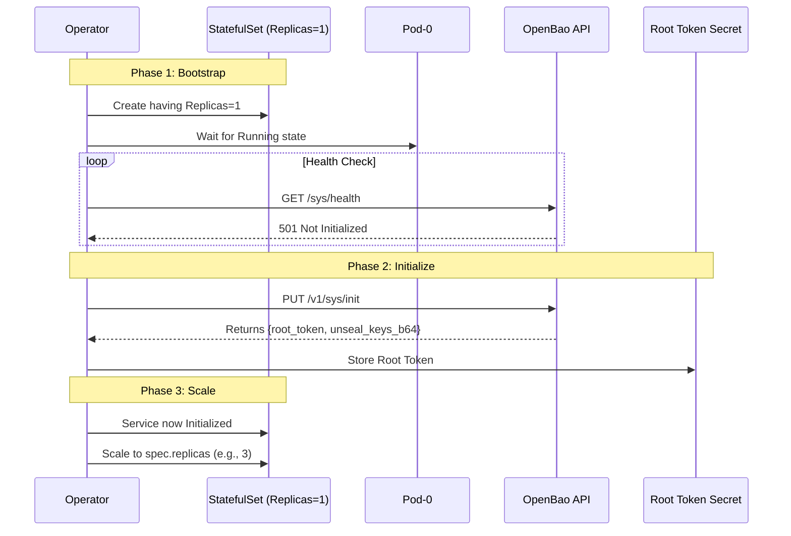

# InitManager (Cluster Initialization)

<Callout type="abstract" title="Responsibility">

Automate the "Day 1" bootstrap of a new cluster.

</Callout>

To avoid split-brain scenarios during initial formation, the Operator enforces a **Single-Pod Bootstrap** pattern.

## 1. Workflow

The InitManager coordinates the first start of the cluster.



## 2. Execution Phases

<Tabs groupId="phase-1-bootstrap-phase-2-initialize-phase-3-scale-up">

<TabItem value="phase-1-bootstrap" label="Phase 1: Bootstrap">

**Goal:** Start a single, stable node.

Regardless of `spec.replicas`, a new cluster **always starts with 1 replica**.

-   **Why?** Raft requires a stable leader to form a cluster. Starting 3 uninitialized nodes simultaneously can lead to race conditions on who becomes the first leader.
-   **Mechanism:** The InfrastructureManager caps `replicas: 1` as long as `status.initialized` is `false`.

</TabItem>

<TabItem value="phase-2-initialize" label="Phase 2: Initialize">

**Goal:** Bootstrap the Raft cluster and generate root material.

Once `pod-0` is running, the InitManager takes over:

1.  **Detection:** Checks internal status. If it finds `openbao-initialized=true` label or receives `200 OK` from `/sys/health`, it treats the cluster as already initialized and skips the init call.
2.  **Execution:** If uninitialized, it calls `PUT /v1/sys/init`.
3.  **Security:**
    -   The root token is stored immediately in a Secret (`<cluster>-root-token`) and is never written to logs.
    -   The auto-unseal key is handled separately by the InfrastructureManager (for `spec.unseal.type=static`).
    -   !!! warning "Security"
        The initialization response is held in memory only for the duration of the request and is **NEVER logged**.

</TabItem>

<TabItem value="phase-3-scale-up" label="Phase 3: Scale Up">

**Goal:** Expand to High Availability.

Once initialization is confirmed (and the root token is safely stored):

1.  The Operator sets `status.initialized = true`.
    When self-init is enabled, it also sets `status.selfInitialized = true` and no root token Secret exists (the root token was auto-revoked).
2.  The InfrastructureManager observes this and updates the StatefulSet to the full `spec.replicas`.
3.  New pods join the existing leader (Pod-0) via the `retry_join` configuration.

</TabItem>

</Tabs>

---

## 3. Reconciliation Semantics

- **One-Time Operation:** The InitManager is designed to be **idempotent** but typically runs only once in the cluster's lifecycle.
- **Failure Handling:** If `sys/init` fails (network, timeout), the operator retries. The cluster remains at `replicas: 1` until success.
- **Already Initialized Clusters:** If the operator detects the cluster is already initialized, it skips the init call and proceeds with the initialized-cluster path. This is recovery behavior for operator-managed clusters. It is not a generic import workflow for arbitrary unmanaged OpenBao clusters.

---

## 4. Autopilot Configuration

After successful initialization, the InitManager configures **Raft Autopilot** for automatic dead server cleanup and quorum safety defaults.

<Callout type="note" title="Default Behavior">

Autopilot configuration is reconciled for every initialized cluster. Dead server cleanup defaults to `true`, but the operator forces it to `false` for small clusters when `min_quorum < 3` and the user did not explicitly override `cleanupDeadServers`. This keeps the rendered configuration valid for OpenBao.

</Callout>

### Default Configuration

| Setting | Default Value | Description |
| :--- | :--- | :--- |
| `cleanup_dead_servers` | `true` by default; forced to `false` when `min_quorum < 3` and the user did not explicitly override it | Enable automatic removal of failed peers only when OpenBao accepts the configuration |
| `dead_server_last_contact_threshold` | `5m` | Time before a server is considered dead |
| `last_contact_threshold` | `10s` | Maximum acceptable heartbeat delay before a peer is considered unhealthy |
| `server_stabilization_time` | `10s` | Required stabilization period before a server is considered stable |
| `max_trailing_logs` | `1000` | Maximum replication lag before Autopilot considers a server unhealthy |
| `min_quorum` | `Hardened`: `3`, or `replicas` when `replicas > 3`; other profiles: `max(1, replicas)` | Minimum cluster size required before dead-server cleanup can proceed |

### Customization

Override defaults via `spec.configuration.raft.autopilot`:

```yaml
spec:
  configuration:
    raft:
      autopilot:
        cleanupDeadServers: true
        deadServerLastContactThreshold: "5m"
        minQuorum: 3
```

<Callout type="warning" title="Cleanup Requires `minQuorum >= 3`">

OpenBao requires `cleanupDeadServers=true` to be paired with `minQuorum >= 3`. If you intentionally set a lower `minQuorum`, also set `cleanupDeadServers: false`.

</Callout>

### Disabling Autopilot Cleanup

To disable automatic dead server cleanup:

```yaml
spec:
  configuration:
    raft:
      autopilot:
        cleanupDeadServers: false
```

<Callout type="warning" title="Manual Cleanup Required">

When disabled, you must manually remove dead Raft peers via `bao operator raft remove-peer`.

</Callout>

