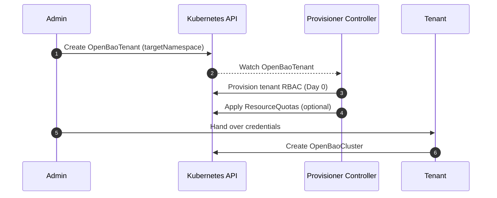

# Day 0: Tenant Provisioning

Day 0 operations focus on onboarding tenants and ensuring they have the necessary permissions and resources to manage their own OpenBao clusters. This phase uses the **Provisioner Controller**.

<Callout type="tip" title="User Guide">

For practical instructions on setting up tenants, see the [Tenant Onboarding Guide](../../user-guide/openbaotenant/onboarding.md) and [Multi-Tenancy Guide](../../user-guide/openbaotenant/multi-tenancy.md).

</Callout>

## 1. Namespace & RBAC Creation

- A cluster admin (or a namespace owner in self-service mode) creates an `OpenBaoTenant` resource.
- The Provisioner Controller reconciles `OpenBaoTenant` and provisions the target namespace with the required tenant-scoped RBAC so the operator can manage OpenBao resources there.
  This includes creating namespaced `Role` and `RoleBinding` resources that grant permissions to the operator's Controller ServiceAccount.

## 2. Resource Quotas

- Default `ResourceQuota` and `LimitRange` objects are applied to the tenant namespace to prevent noisy neighbor issues.
- Self-service tenants use the operator defaults. Custom values are reserved for centrally managed `OpenBaoTenant` requests created from the operator namespace.

## 3. Tenant Onboarding

- The tenant receives their authentication credentials (e.g., Kubeconfig limited to their namespace).
- The tenant verifies access by listing resources in their namespace.

## See Also

- [Provisioner Manager](../provisioner-manager.md)

## Sequence Diagram

