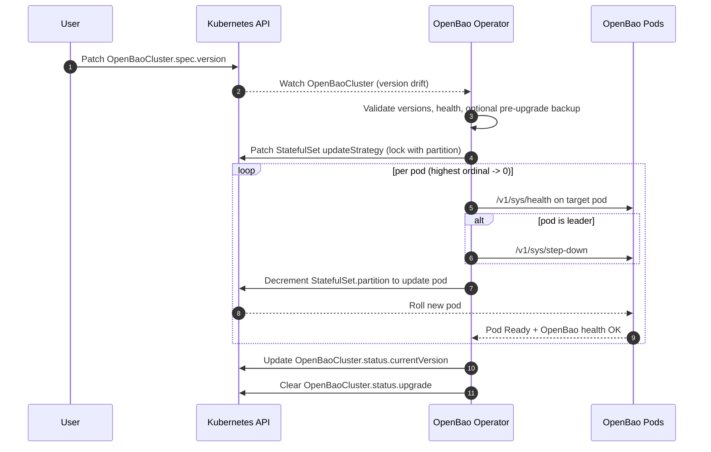
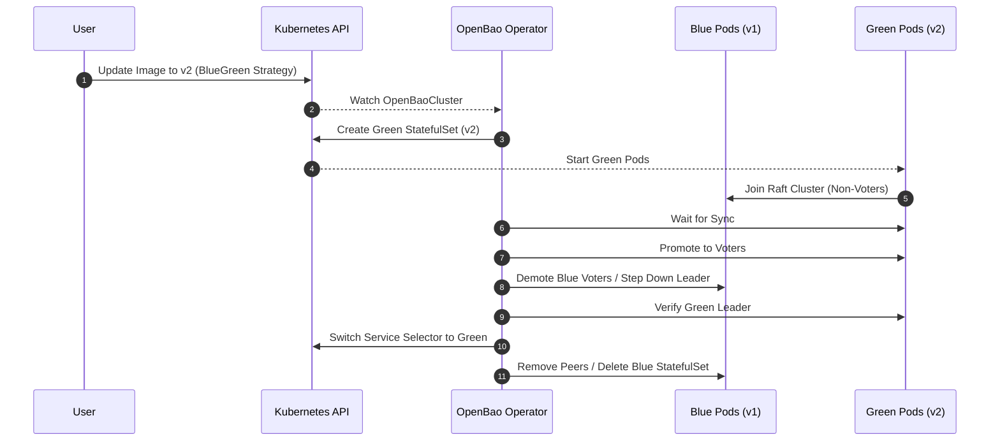

# Day 2: Operations & Upgrades

Day 2 operations cover the ongoing management of the cluster, including version upgrades and maintenance.

<Callout type="tip" title="User Guide">

See the [Upgrade Guide](../../user-guide/openbaocluster/operations/upgrades.md) for detailed upgrade strategies (Rolling vs Blue/Green).

</Callout>

## Cluster Operations / Upgrades

<Tabs groupId="rolling-update-default-blue-green-upgrade">

<TabItem value="rolling-update-default" label="Rolling Update (Default)">

1. User ensures upgrade prerequisites:
   - Set `spec.version` to the target semantic version.
   - Configure JWT auth for upgrade executor Jobs (`spec.upgrade.jwtAuthRole`), or enable `spec.selfInit.oidc.enabled=true` so the default role can be bootstrapped.
   - If `spec.image` is set with a semver tag, keep it aligned with `spec.version`.
   - If `spec.upgrade.preUpgradeSnapshot=true`, configure `spec.backup` and backup authentication.
2. User updates `spec.version` and optionally `spec.image` (strategy is configured via `spec.upgrade.strategy`).
3. Upgrade Manager (adminops controller) detects version drift and performs pre-upgrade validation:
   - Validates semantic versioning and blocks downgrades.
   - Rejects provable semver image/version mismatches.
   - Verifies all pods are Ready and quorum is healthy.
   - Optionally triggers a pre-upgrade snapshot using `spec.backup` if `spec.upgrade.preUpgradeSnapshot` is enabled.
4. Upgrade Manager orchestrates Raft-aware rolling updates:
   - Locks StatefulSet updates using partitioning.
   - Iterates pods in reverse ordinal order.
   - Runs an upgrade Job to perform leader step-down before updating the leader pod.
   - Waits for pod Ready, OpenBao health, and Raft sync after each update.
5. If a rolling step fails, progress remains in `status.upgrade` and the operator waits for `spec.upgrade.requests.retry` to change before retrying.
6. On completion, `status.currentVersion` is updated and `status.upgrade` is cleared (rolling), or `status.blueGreen.phase` returns to `Idle` (blue/green).

<Callout type="note" title="Upgrade Policy">

Upgrades are designed to be safe and resumable. Downgrades are blocked by default. Rolling upgrades wait for an explicit retry signal after failure. Blue/Green can abort or roll back automatically when `spec.upgrade.blueGreen.autoRollback.enabled=true`. Root tokens are not used for upgrade operations.

</Callout>

### Sequence Diagram (Rolling Updates)

</TabItem>

<TabItem value="blue-green-upgrade" label="Blue/Green Upgrade">

Blue/Green upgrades provide zero-downtime updates by creating a parallel "Green" standby cluster and advancing it through explicit consensus phases.

1. **Drift Detection:** User updates `OpenBaoCluster` spec with a new version or image, using the Blue/Green strategy.
2. **Optional Snapshot:** If `spec.upgrade.preUpgradeSnapshot=true` or `spec.upgrade.blueGreen.preUpgradeSnapshot=true`, the operator blocks until a pre-upgrade snapshot succeeds.
3. **Green Creation:** The operator creates a new Green StatefulSet with the new version.
4. **Join as Non-Voters:** Green pods start and join the existing Blue Raft cluster as non-voters.
5. **Sync and Validate:** The operator waits for Green replication to converge, honors optional `verification.minSyncDuration`, and runs `verification.prePromotionHook` when configured.
6. **Manual Hold or Promotion:** If `autoPromote=false` when the upgrade starts, the upgrade holds in `Syncing` until the user sets `spec.upgrade.requests.promote`. Changing `autoPromote` mid-upgrade affects only future upgrades. Otherwise, the operator promotes Green pods to voters.
7. **Demote Blue and Verify Leader:** The operator demotes Blue voters, forces leadership transfer when needed, and waits until a Green leader is observed.
8. **Cutover During Cleanup:** The operator switches the Service selector to Green, removes Blue peers, and deletes the Blue StatefulSet. Rollback remains possible until irreversible cleanup completes.
9. **Break Glass:** If rollback consensus repair fails, the operator sets `status.breakGlass` and halts risky rollback automation until `spec.breakGlassAck` matches the issued nonce.

### Sequence Diagram (Blue/Green)

</TabItem>

</Tabs>

## Maintenance / Manual Recovery

There are two related (but distinct) mechanisms:

1. **Pause reconciliation** (`spec.paused=true`): stops all controllers for the cluster from mutating resources.
   This is intended for manual intervention or recovery workflows.
2. **Maintenance annotation mode** (`spec.maintenance.enabled=true`): keeps reconciliation running, but annotates
   managed resources with `openbao.org/maintenance=true` so admission policies can allow controlled deletes/restarts.
   The operator also uses this gate for disruptive-but-automatable operations (for example, completing filesystem
   expansion when a PVC reports `FileSystemResizePending` after increasing `spec.storage.size`).

For manual recovery:

1. User sets `spec.paused=true`.
2. Reconcilers short-circuit and stop mutating resources, allowing manual actions (e.g., manual restore from snapshot).
3. If an upgrade was in progress, it is paused but state is preserved in `status.upgrade` or `status.blueGreen`.
4. After maintenance, user sets `spec.paused=false` to resume normal reconciliation (including any paused upgrade).

## Official OpenBao Documentation

- [Upgrade Guide](https://openbao.org/docs/upgrading/)
- [Operator Step-Down Command](https://openbao.org/docs/commands/operator/step-down/)
- [Operator Raft Command](https://openbao.org/docs/commands/operator/raft/)
- [Recovery Mode Concepts](https://openbao.org/docs/concepts/recovery-mode/)

