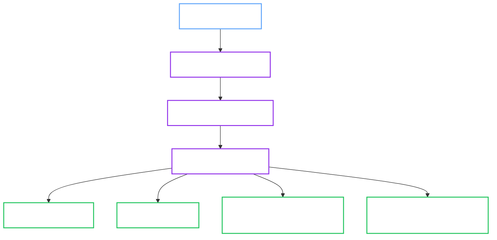

# Provisioner Manager (Tenant Onboarding)

`internal/service/provisioner` owns tenant namespace provisioning for `OpenBaoTenant` resources. It applies the namespace-scoped RBAC, Secret allowlists, Pod Security labels, and quota defaults that let the OpenBao Operator manage `OpenBaoCluster` resources safely in tenant namespaces.

## 1. Architectural Placement

Provisioning follows the dedicated tenant-controller path:

1. `internal/controller/provisioner` receives the reconcile event for `OpenBaoTenant`.
2. It delegates orchestration to `internal/app/provisioner`.
3. The app layer invokes `internal/service/provisioner` to apply tenant namespace RBAC and lifecycle guardrails.

This keeps the Provisioner controller focused on reconcile plumbing while the provisioner manager owns namespace onboarding and cleanup behavior.

## 2. Responsibilities

The Provisioner Manager is responsible for:

- Creating and updating tenant `Role` and `RoleBinding` resources for the operator ServiceAccount.
- Reconciling writer and reader Secret allowlists derived from `OpenBaoCluster` references in the tenant namespace.
- Applying Pod Security Standards labels to the target namespace.
- Reconciling `ResourceQuota` and `LimitRange` defaults from `OpenBaoTenant.spec`.
- Cleaning up provisioned tenant RBAC resources after the tenant is deleted and no managed clusters remain.

## 3. Reconcile Flow

## 4. Security Guardrails

<Callout type="note" title="Namespace Targeting Rules">

Self-service tenants may only target their own namespace. Cross-namespace provisioning is reserved for trusted operator-managed namespaces.

</Callout>

The app and service layers enforce several guardrails before provisioning succeeds:

- Wait for admission dependencies before provisioning self-service tenant RBAC.
- Avoid OwnerReferences on tenant RBAC, so deleting a single cluster cannot garbage-collect shared namespace permissions.
- Keep tenant Secret access reduced to explicit allowlists derived from `OpenBaoCluster` references.

## 5. Deletion Semantics

`OpenBaoTenant` deletion uses a finalizer-driven flow:

1. Keep tenant RBAC in place while `OpenBaoCluster` objects still exist in the target namespace.
2. Remove provisioned RBAC resources only after the namespace no longer contains managed clusters.
3. Remove the tenant finalizer and allow the resource to be deleted.

## 6. See Also

- [Day 0: Tenant Provisioning](lifecycle/day0-provisioning.md)
- [Component Design](components.md)

