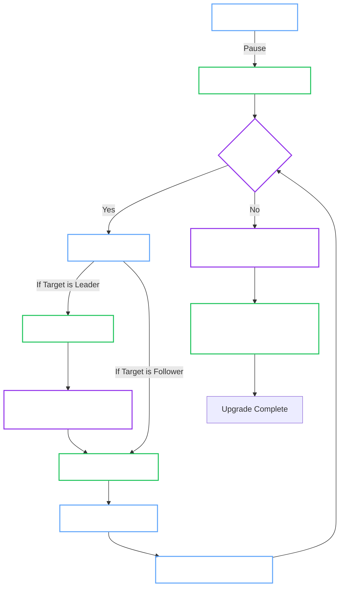
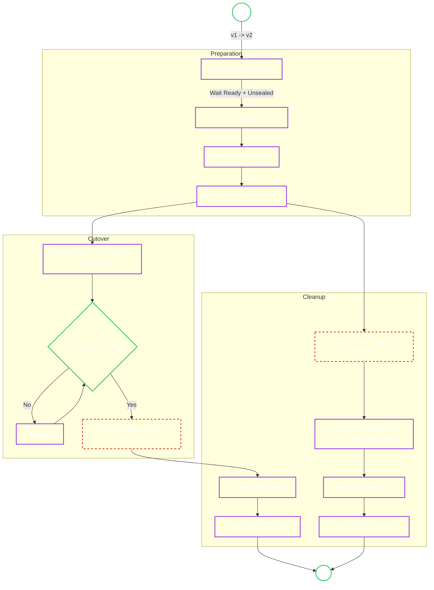

# UpgradeManager (Rolling & Blue/Green)

<Callout type="tip" title="User Guide">

For operational instructions, see the [Upgrades User Guide](../user-guide/openbaocluster/operations/upgrades.md).

</Callout>

**Responsibility:** Orchestrate safe version updates while maintaining Raft consensus.

## 1. Architectural Placement

Upgrade execution belongs to the AdminOps orchestration path:

1. `internal/controller/openbaocluster` (adminops reconciler) receives the reconcile event.
2. It delegates to `internal/app/openbaocluster` facade functions.
3. The app layer calls `internal/app/openbaocluster/adminops`, which invokes rolling (`internal/service/upgrade/rolling`) or blue/green (`internal/service/upgrade/bluegreen`) manager flows.

This keeps controller code focused on reconcile wiring while the upgrade domain stays in dedicated manager packages.

## 2. Upgrade Strategies

The Manager supports two distinct strategies, controlled by `spec.upgrade.strategy`.

<Tabs groupId="rolling-update-default-blue-green">

<TabItem value="rolling-update-default" label="Rolling Update (Default)">

**Goal:** Update pods one-by-one with minimal downtime.

The Manager uses **StatefulSet Partitioning** to control the rollout.

1.  **Partitioning:** We pause Kubernetes updates by setting `partition` equal to `replicas`.
2.  **Reverse Ordinal:** We update from highest index (e.g., 2) down to 0.
3.  **Leader Safety:** Before updating the node that is currently the **Leader**, we send `PUT /sys/step-down` to force a leadership transfer. This prevents the cluster from crashing during the leader's restart.
4.  **Convergence before finalize:** We only finalize after StatefulSet and pod revisions/health fully converge.
5.  **Atomic finalization:** Rolling completion writes `status.upgrade=nil` and `status.currentVersion=<target>` together to avoid split state.

</TabItem>

<TabItem value="blue-green" label="Blue/Green">

**Goal:** Zero-downtime upgrades with deterministic phase transitions and controlled rollback boundaries.

<Callout type="warning" title="Resource Usage">

Requires **2x Storage** capacity during the transition (Blue volume + Green volume).

</Callout>

This strategy creates a parallel Green revision, joins it as non-voters, promotes it to voters, then cuts over traffic during `Cleanup`.

**Key phases (`status.blueGreen.phase`):**

| Phase | Description |
| :--- | :--- |
| `DeployingGreen` | Creates Green StatefulSet and waits for Ready + unsealed pods. |
| `JoiningMesh` | Adds Green pods as non-voters. |
| `Syncing` | Waits for sync, optional `minSyncDuration`, and optional pre-promotion hook. |
| `Promoting` | Promotes Green pods to voters. |
| `DemotingBlue` | Demotes Blue voters and verifies a Green leader is observed. |
| `Cleanup` | Switches service selector to Green, removes Blue peers, deletes Blue StatefulSet. |
| `RollingBack` | Executes rollback consensus repair (Blue voters, Green non-voters). |
| `RollbackCleanup` | Removes Green peers and deletes Green StatefulSet. |

<Callout type="note">

Blue/Green service traffic switches to Green only in `Cleanup`.

</Callout>

<Callout type="warning">

Rollback is possible until irreversible cleanup has completed.

</Callout>

</TabItem>

</Tabs>

## 3. Upgrade State Machine

### Resumability

Upgrades are designed to survive Operator restarts. All state is stored in `Status`:

- **Rolling:** Tracks `status.upgrade.currentPartition` and `status.upgrade.completedPods`.
- **Blue/Green:** Tracks `status.blueGreen.phase` and `status.blueGreen.jobFailureCount`.

If the Operator crashes, it reads the Status on startup and **resumes** exactly where it left off.

### Validation and policy guardrails

- **Shared version policy:** Rolling and Blue/Green both validate the target version through the same version-policy helper. Invalid semantic versions are rejected and downgrades are blocked before orchestration begins.
- **Admission guardrails:** The admission policy rejects downgrade requests before reconcile when the previous or in-flight target version makes the regression unambiguous.
- **Image/version alignment:** The workload and upgrade reconcilers reject semver-tagged `spec.image` values that conflict with `spec.version`. Digest-pinned images and custom non-semver tags remain allowed, but `spec.version` remains authoritative.
- **Snapshot prerequisites:** Pre-upgrade snapshots use `spec.backup` configuration and backup authentication. In the `Hardened` profile, explicit `spec.network.egressRules` are required so snapshot Jobs can reach object storage.

### Rolling completion semantics

- `status.upgrade` remains present until rollout convergence is verified.
- Finalization updates `status.upgrade` and `status.currentVersion` in a single status patch.
- The Status controller ignores observed pod-label version regressions, so transient stale observations do not restart a completed rolling upgrade.

### Rolling failure recovery

- Failed rolling upgrades persist `status.upgrade.lastErrorReason` and `status.upgrade.lastErrorMessage`.
- Recovery is explicit: the operator waits for `spec.upgrade.requests.retry` to change before clearing the failed state and retrying.
- If the desired target changes while a rolling upgrade is in progress, the controller clears rolling state and re-evaluates the new target from the live cluster state.

### Blue/Green holds and rollback safety

- `Syncing` can intentionally hold when `spec.upgrade.blueGreen.autoPromote=false`.
- Manual promotion for a held upgrade is requested via `spec.upgrade.requests.promote`.
- Changing `spec.upgrade.blueGreen.autoPromote` during an in-flight upgrade does not approve that upgrade; it only affects future upgrades.
- Manual abort or rollback of an active blue/green upgrade is requested via `spec.upgrade.requests.rollback`.
- A failing `verification.prePromotionHook` either holds in `Syncing` or triggers automatic abort/rollback, depending on `blueGreen.autoRollback.onValidationFailure`.
- If late rollback consensus repair fails, the operator enters `status.breakGlass` and halts risky rollback automation until `spec.breakGlassAck` matches the issued nonce.

### Image Verification

- `spec.imageVerification` applies to OpenBao workload images (StatefulSet pods).
- `spec.operatorImageVerification` applies to operator-managed helper images (for example, upgrade executor Jobs).
- Helper image verification does not fall back to `spec.imageVerification` when `spec.operatorImageVerification` is unset.

## 4. Reconciliation Semantics

- **Idempotency:** Re-running a phase multiple times does not cause side effects (e.g., "Join" checks if already joined).
- **Safety:** The OpenBao Operator prioritizes **Availability** over Progress. Rolling pauses/retries until healthy. Blue/Green aborts in early phases and rolls back in later phases.
- **OwnerReferences:** Executor jobs in Blue/Green are owned by the Cluster CR, ensuring easy cleanup.
- **Upgrade stability:** Autopilot config reconciliation is skipped while `status.upgrade` is present to reduce transient API pressure during rolling restarts.

