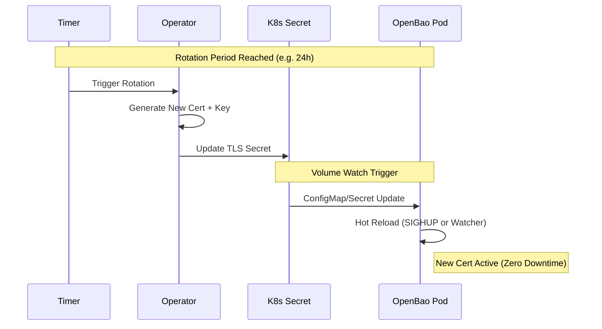

# TLS & Identity

<Callout type="abstract" title="Encryption in Transit">

When `spec.tls.enabled=true`, the Operator configures TLS for internal and external communication using one of three modes: **Operator Managed**, **External**, or **ACME**.
In production, keep TLS enabled, prefer TLS passthrough at the edge, and use a trusted certificate source.

</Callout>

## Certificate Rotation Flow

In the default **Operator Managed** mode, the operator handles the full lifecycle of the certificates, including rotation and hot-reloading.



## TLS Modes

<Tabs groupId="operator-managed-default-external-provider-acme-native">

<TabItem value="operator-managed-default" label="Operator Managed (Default)">

This is the "batteries included" mode. The Operator acts as an internal Certificate Authority (CA).

-   **Automated PKI:** Generates a self-signed Root CA and ephemeral leaf certificates.
-   **Strict Identity:** Certificates use strict **SANs** (Subject Alternative Names) matching the Service and Pod DNS.
-   **Rotation:** Automatically rotates certificates before expiry (configurable via `spec.tls.rotationPeriod`).
-   **Gateway Support:** Automatically manages a CA ConfigMap for ingress controllers.
-   **Security Posture:** Suitable for development or internal evaluation. It is not a supported Hardened production mode.

```yaml
spec:
  tls:
    mode: OperatorManaged
    rotationPeriod: 24h
```

</TabItem>

<TabItem value="external-provider" label="External Provider">

In this mode, the Operator delegates certificate management to an external system, such as **[cert-manager](https://cert-manager.io/)** or a corporate PKI.

-   **BYO-PKI:** Integrates with existing infrastructure.
-   **Expectation:** The Operator expects Secrets named `<cluster>-tls-ca` and `<cluster>-tls-server` to exist in the namespace.
-   **Hot Reload:** The Operator monitors these Secrets and triggers hot-reloads when the external provider updates them.

<Callout type="tip" title="Cert-Manager Integration">

You can use `cert-manager` to issue certificates signed by Let's Encrypt or Vault, and the Operator will consume them seamlessly.

</Callout>

```yaml
spec:
  tls:
    mode: External
```

</TabItem>

<TabItem value="acme-native" label="ACME (Native)">

OpenBao uses its built-in ACME client to fetch certificates directly from a provider like Let's Encrypt.

-   **Zero Trust:** The Operator **never** sees the private key. It is generated in-memory by the OpenBao process.
-   **No Secrets:** No Kubernetes Secrets are created for the server certificate.
-   **Automatic Rotation:** OpenBao handles its own rotation via the ACME protocol.

```yaml
spec:
  tls:
    mode: ACME
    acme:
      email: "admin@example.com"
      domain: "bao.example.com"
      directoryURL: "https://acme-v02.api.letsencrypt.org/directory"
```

</TabItem>

</Tabs>

## Comparison Matrix

| Feature | Operator Managed | External Provider | ACME (Native) |
| :--- | :--- | :--- | :--- |
| **Generator** | Operator (Internal CA) | External (e.g., cert-manager) | OpenBao (Built-in) |
| **Rotation** | Automatic | External responsibility | Automatic |
| **Private Key** | Kubernetes Secret | Kubernetes Secret | **In-Memory** (Secure) |
| **Best For** | Development, local evaluation | Enterprise PKI integration, internal or external production | Public-facing production with native ACME |

## Exposure Guidance

- Prefer **TLS passthrough** when exposing OpenBao through Gateway API or another edge proxy.
- Use **edge termination** only when you explicitly need policy enforcement or certificate management at the edge.
- `OperatorManaged` TLS is not a supported production path for the `Hardened` profile.

## See Also

- [Pod Security](workload-security.md)
- [Supply Chain](supply-chain.md)

## Official OpenBao Documentation

- [TCP Listener Configuration](https://openbao.org/docs/configuration/listener/tcp/)
- [ACME TLS Listener RFC](https://openbao.org/docs/rfcs/acme-tls-listeners/)

