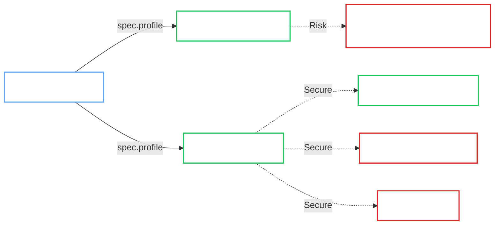

# Security Profiles

Configure the security posture of your OpenBao cluster.

<Callout type="danger" title="Production Readiness">

**Always** use the `Hardened` profile for production deployments. The `Development` profile is highly discouraged for production because it can store bootstrap material in Kubernetes Secrets.

</Callout>

## Profile Comparison

The Operator supports two distinct security profiles via `spec.profile`.

| Feature | Development | Hardened (Production) |
| :--- | :--- | :--- |
| **Use Case** | Local Testing, POC | **Production Workloads** |
| **Root Token** | Stored in a Secret when self-init is disabled | Auto-revoked (not stored in a Secret) |
| **Unseal** | Static (Kubernetes Secret) | **External KMS** (AWS, GCP, Azure, etc.) |
| **TLS** | Optional / Self-Signed | **Mandatory** (`External` or `ACME`) |
| **Image Verification** | Optional | Enforced guardrails; omitted blocks still verify |
| **Bootstrap** | Manual bootstrap or self-init | **Self-init required** |
| **Status** | `ConditionSecurityRisk=True` | Secure by Default |



## Configuration

<Tabs groupId="hardened-production-development">

<TabItem value="hardened-production" label="Hardened (Production)">

The `Hardened` profile enforces strict security best practices. It is the supported production profile for OpenBao Operator.

```yaml
apiVersion: openbao.org/v1alpha1
kind: OpenBaoCluster
metadata:
  name: prod-cluster
spec:
  profile: Hardened  # REQUIRED
  replicas: 3          # Minimum 3 for HA (Raft quorum)
  version: "2.4.4"
  tls:
    enabled: true
    mode: External   # Required (or ACME)
  unseal:
    type: awskms     # Required (External KMS)
    awskms:
      region: us-east-1
      kmsKeyID: alias/openbao-unseal
  selfInit:
    enabled: true    # Required
    requests:
      - name: enable-audit
        operation: update
        path: sys/audit/file
        auditDevice:
          type: file
          fileOptions:
            filePath: /tmp/audit.log
```

### Requirements

- **External TLS**: `spec.tls.mode` MUST be `External` or `ACME`. `OperatorManaged` TLS is rejected by `openbao-validate-openbaocluster`.
- **External KMS**: `spec.unseal.type` MUST use a cloud provider (`awskms`, `gcpckms`, `azurekeyvault`, `transit`).
- **Self-Initialization**: `spec.selfInit.enabled` MUST be `true`. This is the supported production bootstrap path and is enforced by `openbao-validate-openbaocluster`.
- **High Availability**: `spec.replicas` MUST be at least `3` for Raft quorum.
- **Secure Network**: If backups are enabled, explicit egress rules are required (fail-closed networking).
- **Supply Chain Guardrails**: `spec.imageVerification` and `spec.operatorImageVerification` cannot be disabled and cannot use `failurePolicy: Warn`.

If verification blocks are omitted in Hardened, or are present with `enabled: true` but no explicit trust
material, verification is still applied. For official release image repositories/tags, default GitHub keyless
identity values are used. For mirrored/private registries, provide explicit `publicKey` or keyless identity
fields in the verification config.

### Benefits

- **Zero Trust**: No root token Secret is created; initialization credentials are auto-revoked.
- **Identity**: When `spec.selfInit.oidc.enabled` is `true`, the operator bootstraps JWT auth and roles for operator jobs (backup/upgrade/restore).
- **Encryption**: Root of trust is delegated to a hardware-backed KMS, not Kubernetes etcd.

</TabItem>

<TabItem value="development" label="Development">

The `Development` profile allows relaxed security settings for rapid iteration and testing.

```yaml
apiVersion: openbao.org/v1alpha1
kind: OpenBaoCluster
metadata:
  name: dev-cluster
spec:
  profile: Development
  version: "2.4.4"
  # TLS and Self-Init are optional
```

### Characteristics

- **Relaxed TLS**: Allows `OperatorManaged` (self-signed) TLS.
- **Static Unseal**: Uses a simple Kubernetes Secret for the unseal key.
- **Root Token**: Generates and stores a root token in a Secret if self-init is disabled.
- **Risk Indicator**: Sets `ConditionSecurityRisk=True` on the CR status.

<Callout type="warning" title="Risk Acceptance">

By using this profile, you accept the risk of storing sensitive keys and root tokens in the cluster. Do not use it as a normal production posture.

</Callout>

</TabItem>

</Tabs>

## Workload Hardening (AppArmor)

AppArmor support is **opt-in** as it depends on the underlying Kubernetes node OS support.

To enable `RuntimeDefault` AppArmor profiles on all OpenBao Pods:

```yaml
spec:
  workloadHardening:
    appArmorEnabled: true
```

## Official OpenBao Documentation

- [Seal Configuration Overview](https://openbao.org/docs/configuration/seal/)
- [Static Seal Configuration](https://openbao.org/docs/configuration/seal/static/)
- [AWS KMS Seal Configuration](https://openbao.org/docs/configuration/seal/awskms/)
- [GCP KMS Seal Configuration](https://openbao.org/docs/configuration/seal/gcpckms/)
- [Azure Key Vault Seal Configuration](https://openbao.org/docs/configuration/seal/azurekeyvault/)
- [Transit Seal Configuration](https://openbao.org/docs/configuration/seal/transit/)
- [Self-Initialization](https://openbao.org/docs/configuration/self-init/)

