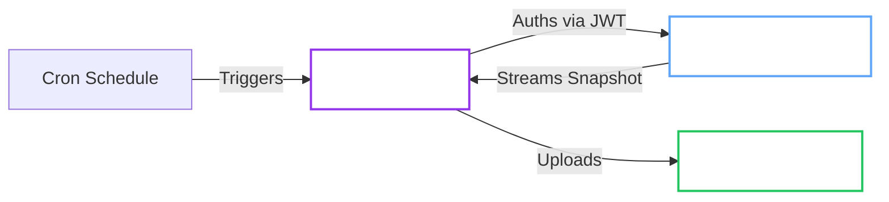

# Backups

The Operator provides a robust, Kubernetes-native backup system that streams Raft snapshots directly to object storage.

<Callout type="note">

For restore procedures, see [Restore from Backup](../../openbaorestore/restore.md).

</Callout>

## Architecture

Backups run as transient Kubernetes Jobs, triggered by a Cron schedule or manually.



## Prerequisites

- Configure a bucket or container in a supported provider:
  - S3: AWS S3 or S3-compatible storage such as MinIO or Ceph
  - GCS: Google Cloud Storage bucket
  - Azure: Azure Blob Storage container
- Grant write access to the bucket or container.
- Allow egress to the storage endpoint. This is required for the `Hardened` profile.

<Callout type="note" title="Separate Identity Surfaces">

The main OpenBao Pods and backup Jobs use different ServiceAccounts.
Cloud KMS unseal identity on the main workload does not automatically apply to backup or restore Jobs.
Check `CloudUnsealIdentityReady` for the main Pods and `BackupConfigurationReady` for the generated backup Job identity path.

</Callout>

## Configuration

Select an authentication method. Use JWT Auth for automatic token rotation.

<Tabs groupId="jwt-auth-recommended-static-token-legacy">

<TabItem value="jwt-auth-recommended" label="JWT Auth (Recommended)">

This method uses a projected ServiceAccount token to authenticate with OpenBao.

<Callout type="success" title="Automated Setup">

When `spec.selfInit.oidc.enabled` is `true`, the Operator automatically configures:
1. JWT Auth Method (`auth/jwt-operator`)
2. OIDC Discovery
3. Backup Policy (`openbao-operator-backup`)
4. Backup Role (`openbao-operator-backup`)

No manual configuration is required.

</Callout>

**Cluster Configuration:**

Ensure OIDC is enabled in your cluster:

```yaml
spec:
  selfInit:
    enabled: true
    oidc:
      enabled: true
```

<Callout type="note" title="JWT audience">

The backup Job uses the audience from `OPENBAO_JWT_AUDIENCE` (default: `openbao-internal`).
Set the same value in the OpenBao role `bound_audiences` and pass the env var to the operator
(`controller.extraEnv` and `provisioner.extraEnv` in Helm).

</Callout>

**Cluster Configuration:**

Select your storage provider:

<Tabs groupId="s3-aws-minio-etc-gcs-google-cloud-storage-azure-blob-storage">

<TabItem value="s3-aws-minio-etc" label="S3 (AWS, MinIO, etc.)">

```yaml
apiVersion: openbao.org/v1alpha1
kind: OpenBaoCluster
metadata:
  name: backup-cluster
spec:
  backup:
    schedule: "0 3 * * *"  # Daily at 3 AM
    # image: inferred from operator version
    # jwtAuthRole: inferred from selfInit (openbao-operator-backup)
    
    target:
      provider: s3  # Default, can be omitted
      endpoint: "https://s3.amazonaws.com"
      bucket: "openbao-backups"
      region: "us-east-1"
      pathPrefix: "clusters/backup-cluster"
      usePathStyle: false  # Set true for MinIO/S3-compatible
      # Optional explicit Web Identity flow managed by the operator:
      # roleArn: "arn:aws:iam::123456789012:role/openbao-backup"
      # Optional workload identity metadata for webhook-based integrations:
      # workloadIdentity:
      #   serviceAccountAnnotations:
      #     eks.amazonaws.com/role-arn: "arn:aws:iam::123456789012:role/openbao-backup"
      credentialsSecretRef:
        name: s3-credentials
```

<Callout type="note" title="S3 Credentials Secret">

Create a Secret with keys:
- `accessKeyId`: AWS access key ID
- `secretAccessKey`: AWS secret access key
- `sessionToken`: (optional) Temporary session token
- `region`: (optional) Override region
- `caCert`: (optional) Custom CA certificate for self-signed endpoints

You can also omit `credentialsSecretRef` and use:
- `roleArn` for the operator-managed Web Identity path
- ambient workload identity/default credentials (for example EKS Pod Identity)
- `workloadIdentity.serviceAccountAnnotations` when your platform integration is driven by ServiceAccount metadata

The operator reports `WorkloadIdentityConfigured` when it can see an explicit Job identity path such as `roleArn` or `target.workloadIdentity.*`.
It reports `AmbientIdentityAssumed` only when no storage Secret or explicit Job identity metadata is configured.

</Callout>

</TabItem>

<TabItem value="gcs-google-cloud-storage" label="GCS (Google Cloud Storage)">

```yaml
apiVersion: openbao.org/v1alpha1
kind: OpenBaoCluster
metadata:
  name: backup-cluster
spec:
  backup:
    schedule: "0 3 * * *"
    image: "ghcr.io/dc-tec/openbao-backup:X.Y.Z"
    jwtAuthRole: backup
    
    target:
      provider: gcs
      bucket: "openbao-backups"
      pathPrefix: "clusters/backup-cluster"
      gcs:
        project: "my-gcp-project"  # Optional if using ADC
      # Optional workload identity metadata for the generated ServiceAccount:
      # workloadIdentity:
      #   serviceAccountAnnotations:
      #     iam.gke.io/gcp-service-account: "backup@my-project.iam.gserviceaccount.com"
      credentialsSecretRef:
        name: gcs-credentials
```

<Callout type="note" title="GCS Credentials">

**Option 1: Service Account Key (Recommended)**
Create a Secret with key `credentials.json` containing the service account JSON key:
```sh
kubectl create secret generic gcs-credentials \
  --from-file=credentials.json=/path/to/service-account-key.json
```

**Option 2: Application Default Credentials (ADC)**
If running on GKE or with Workload Identity, omit `credentialsSecretRef` to use ADC.
When needed, set `target.workloadIdentity.serviceAccountAnnotations` so the generated backup/restore ServiceAccount carries the required provider annotation.
This is separate from any workload identity attached to the main OpenBao Pods for unseal.

</Callout>

</TabItem>

<TabItem value="azure-blob-storage" label="Azure Blob Storage">

```yaml
apiVersion: openbao.org/v1alpha1
kind: OpenBaoCluster
metadata:
  name: backup-cluster
spec:
  backup:
    schedule: "0 3 * * *"
    image: "ghcr.io/dc-tec/openbao-backup:X.Y.Z"
    jwtAuthRole: backup
    
    target:
      provider: azure
      bucket: "openbao-backups"  # Container name
      pathPrefix: "clusters/backup-cluster"
      azure:
        storageAccount: "mystorageaccount"
        container: "openbao-backups"  # Optional, uses bucket if omitted
      # Optional workload identity metadata:
      # workloadIdentity:
      #   serviceAccountAnnotations:
      #     azure.workload.identity/client-id: "00000000-0000-0000-0000-000000000000"
      #   podLabels:
      #     azure.workload.identity/use: "true"
      credentialsSecretRef:
        name: azure-credentials
```

<Callout type="note" title="Azure Credentials Secret">

Create a Secret with **one** of the following:
- `accountKey`: Storage account access key
- `connectionString`: Full Azure connection string

For managed identity or Azure Workload Identity, omit `credentialsSecretRef`.
If your cluster integration requires Kubernetes metadata, use:
- `target.workloadIdentity.serviceAccountAnnotations`
- `target.workloadIdentity.podLabels`

The operator treats both fields together as the explicit Azure workload identity path for backup and restore Jobs.

</Callout>

</TabItem>

</Tabs>

</TabItem>

<TabItem value="static-token-legacy" label="Static Token (Legacy)">

This method uses a static OpenBao token stored in a Kubernetes Secret.

<Callout type="note" title="Same-Namespace Requirement">

All secret references must exist in the **same namespace** as the `OpenBaoCluster`. Cross-namespace references are not allowed for security reasons.

</Callout>

<ExpandableCallout type="abstract" title="Prerequisite: Create Token Secret">

1. Generate a generic token in OpenBao with snapshot read permissions.
2. Store it in a Secret:
   ```sh
   kubectl create secret generic backup-token \
     --from-literal=token=hvs.yourtoken...
   ```

</ExpandableCallout>

**Cluster Configuration:**

<Tabs groupId="s3-gcs-azure">

<TabItem value="s3" label="S3">

```yaml
apiVersion: openbao.org/v1alpha1
kind: OpenBaoCluster
metadata:
  name: backup-cluster
spec:
  backup:
    schedule: "0 3 * * *"
    image: "ghcr.io/dc-tec/openbao-backup:X.Y.Z"
    tokenSecretRef:
      name: backup-token
    target:
      provider: s3
      endpoint: "https://s3.amazonaws.com"
      bucket: "openbao-backups"
      region: "us-east-1"
      credentialsSecretRef:
        name: s3-credentials
```

</TabItem>

<TabItem value="gcs" label="GCS">

```yaml
apiVersion: openbao.org/v1alpha1
kind: OpenBaoCluster
metadata:
  name: backup-cluster
spec:
  backup:
    schedule: "0 3 * * *"
    image: "ghcr.io/dc-tec/openbao-backup:X.Y.Z"
    tokenSecretRef:
      name: backup-token
    target:
      provider: gcs
      bucket: "openbao-backups"
      gcs:
        project: "my-gcp-project"
      credentialsSecretRef:
        name: gcs-credentials
```

</TabItem>

<TabItem value="azure" label="Azure">

```yaml
apiVersion: openbao.org/v1alpha1
kind: OpenBaoCluster
metadata:
  name: backup-cluster
spec:
  backup:
    schedule: "0 3 * * *"
    image: "ghcr.io/dc-tec/openbao-backup:X.Y.Z"
    tokenSecretRef:
      name: backup-token
    target:
      provider: azure
      bucket: "openbao-backups"
      azure:
        storageAccount: "mystorageaccount"
      credentialsSecretRef:
        name: azure-credentials
```

</TabItem>

</Tabs>

</TabItem>

</Tabs>

## Advanced Configuration

### Provider-Specific Options

<Tabs groupId="s3-options-gcs-options-azure-options">

<TabItem value="s3-options" label="S3 Options">

| Option | Default | Description |
| :--- | :--- | :--- |
| `region` | `us-east-1` | AWS region or any value for S3-compatible stores |
| `usePathStyle` | `false` | Set `true` for MinIO and S3-compatible stores |
| `roleArn` | - | IAM role ARN for the explicit AWS Web Identity flow |

```yaml
spec:
  backup:
    target:
      provider: s3
      region: "eu-west-1"
      usePathStyle: true  # Required for MinIO
      roleArn: "arn:aws:iam::123456789012:role/backup-role"  # Optional IRSA
```

</TabItem>

<TabItem value="gcs-options" label="GCS Options">

| Option | Description |
| :--- | :--- |
| `project` | GCP project ID (optional if using ADC or credentials include project) |
| `endpoint` | Custom endpoint (useful for emulators like fake-gcs-server) |

```yaml
spec:
  backup:
    target:
      provider: gcs
      endpoint: "http://fake-gcs-server:4443"  # Optional emulator endpoint
      gcs:
        project: "my-gcp-project"
```

</TabItem>

<TabItem value="azure-options" label="Azure Options">

| Option | Description |
| :--- | :--- |
| `storageAccount` | Azure storage account name (required) |
| `container` | Container name (optional, uses `bucket` if omitted) |
| `endpoint` | Custom endpoint (useful for Azurite emulator) |

```yaml
spec:
  backup:
    target:
      provider: azure
      endpoint: "http://127.0.0.1:10000"  # Optional Azurite endpoint
      azure:
        storageAccount: "mystorageaccount"
        container: "backups"  # Optional
```

</TabItem>

</Tabs>

### Workload Identity Metadata

Use `target.workloadIdentity` when your cloud identity integration needs ServiceAccount annotations or pod labels on the generated backup and restore workloads.

```yaml
spec:
  backup:
    target:
      workloadIdentity:
        serviceAccountAnnotations:
          iam.gke.io/gcp-service-account: "backup@my-project.iam.gserviceaccount.com"
          azure.workload.identity/client-id: "00000000-0000-0000-0000-000000000000"
        podLabels:
          azure.workload.identity/use: "true"
```

`serviceAccountAnnotations` are applied to the generated backup/restore ServiceAccounts.
`podLabels` are applied to backup/restore Job pods without overriding operator-managed labels.

<Callout type="tip" title="Emulator Support">

GCS and Azure support custom endpoints for local testing with emulators (fake-gcs-server, Azurite). For self-signed certificates, include the CA certificate in the credentials Secret.

</Callout>

### Retention Policy

Automatically clean up old backups from object storage.
Retention cleanup runs after successful backups and applies to all supported providers (S3, GCS, Azure).

```yaml
spec:
  backup:
    retention:
      maxCount: 7      # Keep last 7 backups
      maxAge: "168h"   # Keep backups for 7 days
```

### Performance Tuning

Tune multipart upload settings for large datasets or specific network conditions.

| Parameter | Default | Description |
| :--- | :--- | :--- |
| `partSize` | `10MB` | Size of each upload chunk. Increase for high-bandwidth networks. |
| `concurrency` | `3` | Parallel uploads. Increase for throughput, decrease for memory constraints. |

```yaml
spec:
  backup:
    target:
      partSize: 20971520  # 20MB
      concurrency: 5
```

### Pre-Upgrade Snapshots

Ensure safety during upgrades by taking a snapshot immediately before the rolling update or blue/green deployment begins.

```yaml
spec:
  upgrade:
    preUpgradeSnapshot: true
  backup:
    # Backup config must be present!
    target: { ... }
```

## Operations

**Check Status:**

```sh
kubectl get openbaocluster my-cluster -o jsonpath='{.status.backup}'
```

**Trigger Manual Backup:**

```sh
kubectl create job --from=cronjob/my-cluster-backup manual-backup-1
```

## Official OpenBao Documentation

- [OpenBao Backups](https://openbao.org/docs/concepts/storage/#backups)
- [Operator Raft Command](https://openbao.org/docs/commands/operator/raft/)
- [JWT/OIDC Auth Method](https://openbao.org/docs/auth/jwt/)
