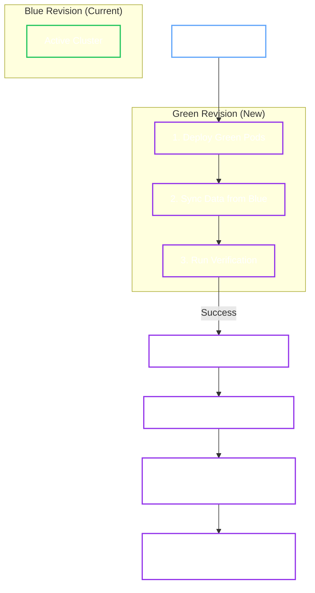

# Cluster Upgrades

Use cluster upgrades to move OpenBao to a newer semantic version while preserving Raft safety. The OpenBao Operator supports two strategies:

- **Rolling Update** as the default recommended strategy for routine production upgrades.
- **Blue/Green** for staged promotion, controlled cutover, and stronger rollback boundaries.

<Callout type="tip" title="Default Recommendation">

Use `RollingUpdate` for the default production path. Choose `BlueGreen` when you need parallel validation, manual promotion, or stronger isolation before cutover.

</Callout>

## Prerequisites

Before you patch `spec.version`, verify the following:

- The cluster is initialized and healthy.
- `spec.version` is set to the target semantic version. The operator validates semantic versioning and blocks downgrades.
- If you override `spec.image`, keep it aligned with `spec.version`:
  - A semver-style tag such as `:2.5.0` or `:v2.5.0` must match `spec.version`.
  - Digest-pinned images are allowed, but `spec.version` remains required and authoritative.
- Upgrade executor Jobs can authenticate with JWT auth:
  - If `spec.selfInit.oidc.enabled=true`, the operator can bootstrap and infer the default `openbao-operator-upgrade` role.
  - Otherwise, set `spec.upgrade.jwtAuthRole` to a role bound to `<cluster>-upgrade-serviceaccount`.
- If you enable pre-upgrade snapshots, configure `spec.backup` with a target and backup authentication.
- In the `Hardened` profile, set explicit `spec.network.egressRules` when snapshot Jobs must reach object storage.

<Callout type="note" title="Upgrade authentication">

Upgrade executor Jobs use JWT auth. Pre-upgrade snapshots use the backup configuration and backup authentication, not the upgrade executor credentials.

</Callout>

## Configuration

<Tabs groupId="jwt-via-selfinit-oidc-explicit-upgrade-role-upgrade-with-private-registry-image">

<TabItem value="jwt-via-selfinit-oidc" label="JWT via SelfInit OIDC">

```yaml
spec:
  selfInit:
    enabled: true
    oidc:
      enabled: true
  upgrade:
    strategy: RollingUpdate
```

</TabItem>

<TabItem value="explicit-upgrade-role" label="Explicit upgrade role">

```yaml
spec:
  upgrade:
    strategy: RollingUpdate
    jwtAuthRole: platform-upgrade
```

</TabItem>

<TabItem value="upgrade-with-private-registry-image" label="Upgrade with private registry image">

```yaml
spec:
  version: "2.5.0"
  image: "registry.example.com/openbao/openbao:2.5.0"
  upgrade:
    strategy: RollingUpdate
    jwtAuthRole: platform-upgrade
```

</TabItem>

</Tabs>

## Executing Upgrades

Patch `spec.version` to the target release. The strategy configured in `spec.upgrade.strategy` determines how the operator applies the change.

<Tabs groupId="rolling-update-default-recommended-blue-green-controlled-cutover">

<TabItem value="rolling-update-default-recommended" label="Rolling Update (Default Recommended)">

**Best for:** The default production path, routine version upgrades, and minimizing resource usage.

The Operator updates pods one by one, ensuring the active leader steps down gracefully before termination to maintain availability.

```yaml
spec:
  version: "2.4.4"
  upgrade:
    strategy: RollingUpdate
```

**How it works:**
1. **Validation**: Validates the target version, blocks downgrades, and rejects provable semver image/version mismatches.
2. **Snapshot** (Optional): Creates a pre-upgrade snapshot using `spec.backup`.
3. **Partitioned Rollout**: Locks StatefulSet partition, then updates pods in reverse ordinal order (for example, `2 -> 1 -> 0`).
4. **Leader Handling**: If the target pod is leader, runs a `sys/step-down` executor Job before restart.
5. **Convergence Gate**: Finalizes only after all pods are updated, Ready, and healthy.

<Callout type="note">

You can see multiple step-down Jobs during one rolling upgrade when leadership moves between different target pods. This is expected.

</Callout>

<Callout type="warning" title="Manual Retry">

If a rolling upgrade fails, the operator preserves `status.upgrade.lastErrorReason` and waits for a retry request. Set `spec.upgrade.requests.retry` to a new non-empty value after you fix the underlying issue:

```yaml
spec:
  upgrade:
    requests:
      retry: "2026-03-10T12:00:00Z"
```

</Callout>

</TabItem>

<TabItem value="blue-green-controlled-cutover" label="Blue/Green (Controlled Cutover)">

**Best for:** Major changes, staged validation, and production paths where controlled cutover is required.

The OpenBao Operator creates a **parallel** Green revision, syncs and validates it, promotes Green to voters, then shifts traffic during `Cleanup`.



**Blue/Green phases (`status.blueGreen.phase`):**
1. `DeployingGreen`
2. `JoiningMesh`
3. `Syncing`
4. `Promoting`
5. `DemotingBlue`
6. `Cleanup`
7. `RollingBack`
8. `RollbackCleanup`

**Configuration:**

```yaml
spec:
  version: "2.4.4"
  upgrade:
    strategy: BlueGreen
    preUpgradeSnapshot: true  # Optional: backup before starting (requires spec.backup)
    blueGreen:
      autoPromote: true  # Automatically switch traffic if healthy
      autoRollback:
        enabled: true
        onJobFailure: true
        onValidationFailure: true
```

</TabItem>

</Tabs>

## Advanced Upgrade Options

### Verification Hooks

Run a custom container to smoke-test the Green cluster before promotion.

```yaml
spec:
  upgrade:
    strategy: BlueGreen
    blueGreen:
      verification:
        prePromotionHook:
          image: curlimages/curl
          command: ["curl", "-f", "https://green-cluster:8200/v1/sys/health"]
```

If the hook fails:

- With `blueGreen.autoRollback.onValidationFailure=true`, the operator aborts or rolls back automatically, depending on the current phase.
- With `blueGreen.autoRollback.onValidationFailure=false`, the operator holds in `Syncing` until you fix the issue and reconcile again.

### Manual Promotion Hold

Set `autoPromote=false` to keep the upgrade in `Syncing` after Green is healthy and fully replicated.
Changing `autoPromote` during that in-flight upgrade does not approve it; use `spec.upgrade.requests.promote`.

```yaml
spec:
  upgrade:
    strategy: BlueGreen
    blueGreen:
      autoPromote: false
```

When you are ready to continue, patch the cluster and set `spec.upgrade.requests.promote` to a new non-empty value.

```yaml
spec:
  upgrade:
    blueGreen:
      autoPromote: false
    requests:
      promote: "2026-03-10T12:10:00Z"
```

### Auto-Rollback

If Green validation fails or executor jobs repeatedly fail, the OpenBao Operator can automatically recover:

- In early phases (`DeployingGreen`, `JoiningMesh`, `Syncing`), it aborts the upgrade and removes Green.
- In later phases (`Promoting`, `DemotingBlue`, `Cleanup`), it triggers rollback (`RollingBack`, `RollbackCleanup`).
- After Blue has been fully removed in `Cleanup`, rollback is no longer possible.

```yaml
spec:
  upgrade:
    strategy: BlueGreen
    blueGreen:
      autoRollback:
        enabled: true
        onJobFailure: true
        onValidationFailure: true
```

### Manual Rollback

To manually abort or roll back an active blue/green upgrade, set `spec.upgrade.requests.rollback`
to a new non-empty value.

```yaml
spec:
  upgrade:
    requests:
      rollback: "2026-03-10T12:20:00Z"
```

### Break Glass

If rollback consensus repair fails, the operator enters break glass mode and writes recovery guidance to `status.breakGlass`. Upgrade automation halts until you acknowledge the nonce in `spec.breakGlassAck`.

```sh
kubectl -n security get openbaocluster prod-cluster -o jsonpath='{.status.breakGlass}{"\n"}' | jq
kubectl -n security patch openbaocluster prod-cluster --type merge \
  -p '{"spec":{"breakGlassAck":"<nonce>"}}'
```

Use the recovery runbooks for that workflow:

- [Break Glass / Safe Mode](../recovery/safe-mode.md)
- [Failed Rollback Recovery](../recovery/failed-rollback.md)

### Gateway API and Blue/Green upgrades

When using **Gateway API**, the OpenBao Operator keeps the generated route stable and retargets the Service selector during `Cleanup`:

- `HTTPRoute` termination targets `<cluster>-public`
- `TLSRoute` passthrough with `tls.mode: ACME` targets `<cluster>-acme`
- other `TLSRoute` passthrough deployments target `<cluster>-public`

```yaml
spec:
  gateway:
    enabled: true
    tlsPassthrough: true
    hostname: bao.example.com
    gatewayRef:
      name: main-gateway
  upgrade:
    strategy: BlueGreen
    blueGreen:
      autoPromote: true
```

### Monitoring Progress

Track upgrade status directly on the CR:

<Tabs groupId="rolling-update-blue-green">

<TabItem value="rolling-update" label="Rolling Update">

```sh
kubectl get openbaocluster my-cluster -o jsonpath='{.status.currentVersion}{"\n"}{.status.upgrade}{"\n"}'
```

</TabItem>

<TabItem value="blue-green" label="Blue/Green">

```sh
kubectl get openbaocluster my-cluster -o jsonpath='{.status.blueGreen.phase}{"\n"}{.status.blueGreen.jobFailureCount}{"\n"}{.status.blueGreen.lastJobFailure}{"\n"}{.status.breakGlass.reason}{"\n"}'
```

</TabItem>

</Tabs>

## Official OpenBao Documentation

- [Upgrade Guide](https://openbao.org/docs/upgrading/)
- [HA Upgrade Guidance](https://openbao.org/docs/upgrading/ha-upgrade/)
- [Operator Step-Down Command](https://openbao.org/docs/commands/operator/step-down/)
- [Operator Raft Command](https://openbao.org/docs/commands/operator/raft/)
