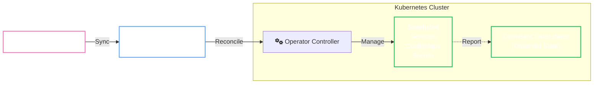

# OpenBaoCluster

`OpenBaoCluster` is the primary Custom Resource Definition (CRD) that declaratively defines a production-ready OpenBao cluster on Kubernetes.

It acts as a high-level abstraction over complex stateful infrastructure, managing the entire lifecycle of the cluster.

<Callout type="note" title="API Contract">

`spec.profile` must be explicitly set to `Hardened` or `Development`.

</Callout>

## Capabilities

<div class="grid cards" markdown>

- **Secure Defaults**

    ---

    Automatic TLS certificate management

    Secure-by-default configurations

    [Security Profiles](configuration/security-profiles.md) for hardening

- **Infrastructure**

    ---

    Managed StatefulSets and Services

    Configurable [Storage](configuration/resources-storage.md) and PVCs

    Automated resizing (Vertical Scaling)

- **Day 2 Operations**

    ---

    Automated [Upgrades](operations/upgrades.md) (Rolling & Blue/Green)

    Automated [Backups](operations/backups.md) to S3/GCS/Azure

    Breakdown/Recovery automation

</div>

## GitOps Architecture

The Operator follows a strict **GitOps** contract. Your Git repository is the source of truth for the `spec` (Desired State), while the Operator reports the `status` (Observed State).



## Configuration Examples

<Tabs groupId="minimal-dev-production-ha">

<TabItem value="minimal-dev" label="Minimal (Dev)">

Start small for local development or testing.

```yaml
apiVersion: openbao.org/v1alpha1
kind: OpenBaoCluster
metadata:
  name: dev-cluster
  namespace: dev
spec:
  version: "2.0.0"
  replicas: 1
  profile: Development
  description: "Local dev cluster"
```

</TabItem>

<TabItem value="production-ha" label="Production (HA)">

A standard 3-node HA cluster with TLS and storage.

```yaml
apiVersion: openbao.org/v1alpha1
kind: OpenBaoCluster
metadata:
  name: prod-cluster
  namespace: security
spec:
  version: "2.0.0"
  replicas: 3
  profile: Hardened
  description: "Production HA Cluster"
  
  resources:
    requests:
      memory: "1Gi"
      cpu: "500m"
      
  storage:
    size: "10Gi"
    storageClass: "gp3"
    
  tls:
    enabled: true
```

</TabItem>

</Tabs>

## Next Steps

<div class="grid cards" markdown>

- **Configuration**

    ---

    Deep dive into customization options.

    [Security Profiles](configuration/security-profiles.md)

    [Self-Initialization](configuration/self-init.md)

- **Operations**

    ---

    Manage upgrades and disaster recovery.

    [Upgrades](operations/upgrades.md)

    [Backups](operations/backups.md)

    [Recovery](recovery/no-leader.md)

</div>
