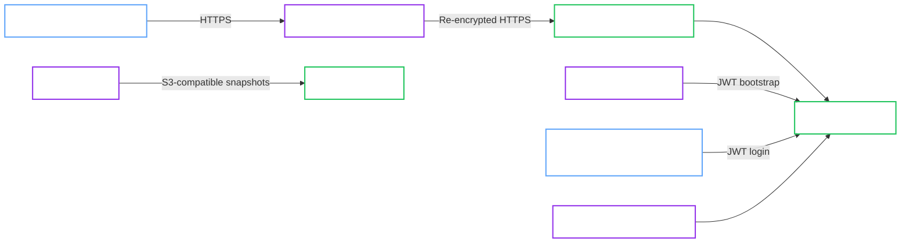

# k3d Development with Shared Edge and RustFS

<Callout type="note" title="Classification">

Local reference architecture. k3d is not a production target, but this page documents a realistic and repeatable local Kubernetes model for development, rehearsal, and operator validation.

</Callout>

This validated architecture describes the local k3d development lane used in the project validation environment.

It is the reference shape for:

- `spec.profile: Development`
- Operator-managed TLS
- JWT bootstrap for Operator access and human admin access
- a shared terminating Traefik Gateway API edge
- RustFS-backed S3-compatible backups
- blue/green upgrades in a local validation lane

<Callout type="success" title="Validation status">

This architecture is grounded in the local k3d validation environment and reinforced by the in-repo Development lifecycle, backup, and blue/green E2E coverage.

</Callout>

<Callout type="warning" title="Development only">

This is a low-friction local validation topology. It is not a production architecture.

</Callout>

## Intended use

Use this architecture when you want a repeatable local environment that exercises real routing, JWT bootstrap, and backup workflows without introducing cloud dependencies.

It is especially useful for:

- workstation-based operator validation
- UI and routing checks through a shared edge
- blue/green upgrade rehearsal in a non-production lane
- S3-compatible backup checks using a local object store

## Topology

## Architecture decisions

### Shared terminating edge

The local dev lane uses the shared `traefik-gateway` listener on `:443` with TLS terminated at the edge.

That keeps the development path simple and makes it easy to expose:

- OpenBao
- ArgoCD
- RustFS
- Grafana
- Prometheus

through the same local wildcard certificate.

### RustFS for backup validation

Backups are written to RustFS through its in-cluster S3-compatible endpoint. This gives the local lane a realistic backup target without needing cloud credentials.

### Blue/green in the dev lane

The local development app uses `upgrade.strategy: BlueGreen`. That makes the lane useful for exercising upgrade-specific behavior without requiring a hardened deployment first.

## Required invariants

Keep these assumptions if you want to stay on the validated path:

- Use `spec.profile: Development`.
- Keep the shared terminating Traefik Gateway in front of the cluster.
- Keep JWT bootstrap enabled for Operator access and human admin access.
- Keep the RustFS endpoint reachable from the OpenBao namespace.
- Disable AppArmor in the manifest if your k3d or k3s nodes do not support it.

## Validated operations

This local lane is used for:

- cluster bootstrap with self-init
- JWT login for a human admin `ServiceAccount`
- shared-edge Gateway exposure
- scheduled and manual backup flows to RustFS
- blue/green upgrade rehearsal in a local environment

## Known constraints

- This architecture intentionally keeps `spec.profile: Development`, so `ProductionReady` is not the goal.
- It relies on local wildcard hostnames under `*.example.com` and the shared test Gateway certificate.
- It is a direct local deployment lane, not a GitOps architecture.

## Related recipe

Use the deployment flow in [Development Profile with Self-Init and Userpass](../../recipes/local/development-self-init-userpass.md).

