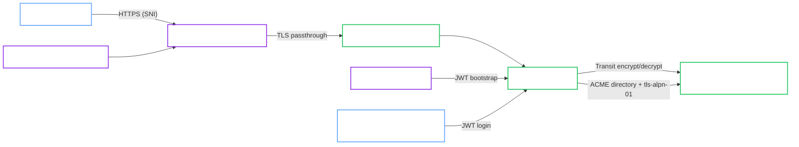

# k3d Hardened with Transit and Internal ACME

<Callout type="note" title="Classification">

Local reference architecture. k3d is not the production target, but this lane is the preferred validated local analogue for hardened deployments that keep TLS passthrough in OpenBao and use private trust services instead of public ACME.

</Callout>

This validated architecture describes the hardened local k3d lane that uses a shared external OpenBao service for both Transit auto-unseal and ACME issuance.

It is the reference shape for:

- `spec.profile: Hardened`
- Transit auto-unseal through a shared external OpenBao service
- `spec.tls.mode: ACME`
- OpenBao-managed certificate issuance from an internal ACME CA
- user-managed TCP passthrough through Traefik CRDs

<Callout type="success" title="Validation status">

This architecture matches the local ACME validation lane in the project validation environment and aligns with the native ACME lifecycle covered by the in-repo E2E suite.

</Callout>

## Intended use

Use this architecture when you want to validate the full OpenBao-native ACME flow locally without depending on a public ACME CA.

It is useful for:

- rehearsing ACME readiness and probe behavior locally
- validating the interaction between Transit unseal and ACME trust material
- testing passthrough without cloud load balancers

## Topology

## Architecture decisions

### Internal ACME CA

The local ACME lane uses a shared external OpenBao service as the ACME directory. That removes public internet dependency while still exercising OpenBao-native ACME issuance.

### ACME hostname resolution is required

The local ACME CA validates `tls-alpn-01` by dialing the configured hostname from inside the validation environment. The invariant is that the ACME hostname resolves back to the passthrough edge for the validator.

In the validated k3d lane, that behavior is implemented through a CoreDNS rewrite. Treat successful hostname resolution as the invariant and the rewrite rule as the local implementation detail.

### Passthrough remains user-managed

Like the external-TLS hardened lane, passthrough is expressed through Traefik CRDs instead of `spec.gateway`. That avoids conflicts with the shared terminating listener in the local test cluster.

## Required invariants

Keep these assumptions if you want to stay on the validated path:

- Use `spec.profile: Hardened`.
- Keep the shared trust services endpoint reachable for both Transit and the ACME directory.
- Keep ACME hostname resolution in place so the validator reaches the passthrough edge for the configured hostname.
- Keep the passthrough route targeting the ACME Service on port `443`.
- Disable AppArmor in the manifest if your k3d or k3s nodes do not support it.

## Validated operations

This local lane is used for:

- Hardened cluster bootstrap with self-init
- Transit auto-unseal through a shared external OpenBao service
- OpenBao-managed ACME issuance from an internal CA
- JWT login for a human admin `ServiceAccount`
- passthrough access to the OpenBao ACME endpoint

## Known constraints

- This architecture is intentionally local and depends on ACME hostname resolution that sends the validator back to the passthrough edge. In the validated k3d lane, that behavior is implemented with CoreDNS rewrite rules.
- `GatewayIntegrationReady` is not the primary success signal because the passthrough route is user-managed.
- The certificate trust model is private and local to the validation environment.

## Related recipe

Use the deployment flow in [Hardened Transit with ACME TLS](../../recipes/local/hardened-transit-acme-tls.md).

