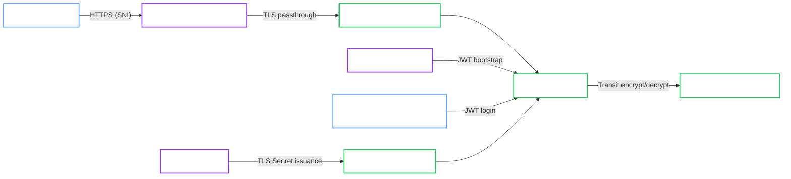

# k3d Hardened with Transit and External TLS

<Callout type="note" title="Classification">

Local reference architecture. k3d is not the target runtime for production, but this lane is the closest validated local analogue to a hardened deployment with an external seal provider and externally managed certificates.

</Callout>

This validated architecture describes the hardened local k3d lane that uses Transit auto-unseal and externally managed TLS Secrets.

It is the reference shape for:

- `spec.profile: Hardened`
- Transit auto-unseal through a shared external OpenBao service
- `spec.tls.mode: External`
- user-managed TCP passthrough through Traefik CRDs
- JWT bootstrap for Operator access and human admin access

<Callout type="success" title="Validation status">

This architecture matches the hardened local validation lane in the project validation environment and aligns with the Hardened external-TLS lifecycle covered by the in-repo E2E suite.

</Callout>

## Intended use

Use this architecture when you want a production-style local topology that exercises:

- Hardened admission and runtime posture
- Transit auto-unseal
- externally provisioned TLS Secrets
- passthrough access without depending on cloud services

## Topology

## Architecture decisions

### Transit dependency stays external

The hardened local lane uses a shared external OpenBao service as the Transit provider so the unseal flow is realistic without needing a cloud KMS.

### External TLS stays separate from the Operator

TLS is supplied through Secrets created outside the `OpenBaoCluster` spec. In the validated local lane, cert-manager provisions those Secrets with a local CA.

### Passthrough is user-managed

This architecture uses a Traefik `IngressRouteTCP` instead of `spec.gateway`. That keeps the TLS passthrough path isolated from the shared terminating listener already used by other local apps.

## Required invariants

Keep these assumptions if you want to stay on the validated path:

- Use `spec.profile: Hardened`.
- Keep the shared Transit provider reachable.
- Keep `tls.mode: External`.
- Provide the expected CA and server Secrets before or alongside the cluster.
- Keep the passthrough route managed outside `spec.gateway`.
- Disable AppArmor in the manifest if your k3d or k3s nodes do not support it.

## Validated operations

This local lane is used for:

- Hardened cluster bootstrap with self-init
- Transit auto-unseal through a shared external OpenBao service
- JWT login for a human admin `ServiceAccount`
- passthrough external access with externally managed TLS Secrets

## Known constraints

- This architecture depends on the shared Transit provider being present and reachable.
- `GatewayIntegrationReady` is not the primary success signal because the passthrough path is user-managed.
- It is a local validation architecture, not a cloud or GitOps reference.

## Related recipe

Use the deployment flow in [Hardened Transit with External TLS](../../recipes/local/hardened-transit-external-tls.md).

